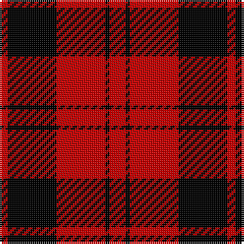

In pattern [RKRKR](/patterns/rkrkr/).

This was sourced from register-of-tartans.  It is a [5 stripes tartan](/stripes/stripes5/).

Original link https://www.tartanregister.gov.uk/tartanDetails.aspx?ref=5030

## Attestations

This cloth appears in 2 source records; the oldest owns this page.

- 01/01/1750 — Campbell of Armaddie (register-of-tartans, [record](https://www.tartanregister.gov.uk/tartanDetails.aspx?ref=5030))
- 1750 — Campbell of Armaddie (Clan) (tartans-authority, [record](http://www.tartansauthority.com/tartan-ferret/display/3800/))

## Thread count
R/4 K24 R24 K2 R/8

## Palette
Each colour and its ΔE from the base-6 reference it is a variant of.

| Colour | Shade | Base | ΔE (OKLab) |
|---|---|---|---|
| K | <code style="background-color:#000000;">#000000</code> `#000000` | K <code style="background-color:#000000;">#000000</code> | 0.00 |
| R | <code style="background-color:#C80000;">#C80000</code> `#C80000` | R <code style="background-color:#C80000;">#C80000</code> | 0.00 |

# Sample pattern

ID: /setts/s5/r8k2r24k24r4-k000000-rc80000/
