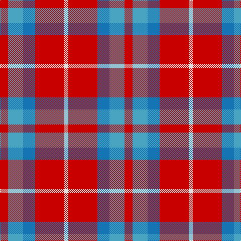

In pattern [RYBRW](/stripes/rybrw/).

This was sourced from tartans-authority.  It is a [5 stripe tartan](/stripes/stripes5/).

Original link http://www.tartansauthority.com/tartan-ferret/display/6428/

## Thread count
R/16 Ba30 B24 R58 LN/8

## Palette
Each colour and the base-6 reference it is a variant of.

| Colour | Shade | Base |
|---|---|---|
| B | <code style="background-color:#1474B4;">#1474B4</code> `oklch(54.0% 0.129 245.1)` <small>#1474B4</small> | B <code style="background-color:#2A418A;">#2A418A</code> |
| Ba | <code style="background-color:#48A4C0;">#48A4C0</code> `oklch(67.5% 0.096 221.0)` <small>#48A4C0</small> | Y <code style="background-color:#F2BF00;">#F2BF00</code> |
| LN | <code style="background-color:#E0E0E0;">#E0E0E0</code> `oklch(90.7% 0.000 89.9)` <small>#E0E0E0</small> | W <code style="background-color:#F7F7F7;">#F7F7F7</code> |
| R | <code style="background-color:#C80000;">#C80000</code> `oklch(52.3% 0.215 29.2)` <small>#C80000</small> | R <code style="background-color:#CC0000;">#CC0000</code> |

# Sample pattern

## Nearest tartans

The nearest existing variants by ΔTartan distance.

1. [Snowbird](/setts/s8/r29b12lg15r8lg15b12r29w4~x2/) — ΔT 1.04
1. [Buckeye](/setts/s4/y25k4w8r16~x4/) — ΔT 1.19
1. [Buckeye](/setts/s4/o25k4w8r16~x4/) — ΔT 1.20
1. [Masai Shuka 24 (Artefact)](/setts/s4/t15w2r20w3~x4/) — ΔT 1.37
1. [Unidentified Lindley](/setts/s6/b6o6w1o6b6ly1~x8/) — ΔT 1.39
1. [Nebar (Corporate)](/setts/s4/o24r11k6db4~x4/) — ΔT 1.41
1. [Bronte House Check](/setts/s6/m10dy60dt13lo24dt24dy8/) — ΔT 1.45
1. [Drumfintley (Fashion)](/setts/s5/m30k7o20ly4k4~x2/) — ΔT 1.45
1. [Sidney (Nova Scotia) Canadian Tartan Tartan Number: 1291. Earliest known date: 1986 The Falkirk Tartan. An ornamental twill weave check of natural light and dark wool was discovered at Falkirk in the neck of a jar containing Roman coins. The find is thought to have been buried about 260 A.D. The black and white check is woven today as the Shepherd tartan. See products available Copyright © Blair Urquhart, Comrie, 2015](/setts/s8/r16o2r11o6k4w2k4o16~x2/) — ΔT 1.48
1. [Ryan/Fehder (Personal)](/setts/s6/w4r7lo5b13r18g3~x2/) — ΔT 1.48

## Neighbour map

Every grey dot is one of 14299 variants placed by the first two principal components of the ΔTartan feature space (44% of its variance). Red is this tartan; blue dots are its nearest — click one to open its page.

<svg viewBox="0 0 640 380" role="img" style="max-width:100%;height:auto;border:1px solid #e0e0e0;border-radius:4px;display:block" xmlns="http://www.w3.org/2000/svg"><image href="/nn/cloud.v1.png" width="640" height="380"/><a href="/setts/s8/r29b12lg15r8lg15b12r29w4~x2/"><circle cx="250.2" cy="227.7" r="4" fill="#3465a4"><title>Snowbird</title></circle></a><a href="/setts/s4/y25k4w8r16~x4/"><circle cx="209.3" cy="243.2" r="4" fill="#3465a4"><title>Buckeye</title></circle></a><a href="/setts/s4/o25k4w8r16~x4/"><circle cx="205.3" cy="240.9" r="4" fill="#3465a4"><title>Buckeye</title></circle></a><a href="/setts/s4/t15w2r20w3~x4/"><circle cx="300.9" cy="230.3" r="4" fill="#3465a4"><title>Masai Shuka 24 (Artefact)</title></circle></a><a href="/setts/s6/b6o6w1o6b6ly1~x8/"><circle cx="232.6" cy="247.2" r="4" fill="#3465a4"><title>Unidentified Lindley</title></circle></a><a href="/setts/s4/o24r11k6db4~x4/"><circle cx="268.6" cy="258.4" r="4" fill="#3465a4"><title>Nebar (Corporate)</title></circle></a><a href="/setts/s6/m10dy60dt13lo24dt24dy8/"><circle cx="248.8" cy="222.4" r="4" fill="#3465a4"><title>Bronte House Check</title></circle></a><a href="/setts/s5/m30k7o20ly4k4~x2/"><circle cx="234.1" cy="219.4" r="4" fill="#3465a4"><title>Drumfintley (Fashion)</title></circle></a><a href="/setts/s8/r16o2r11o6k4w2k4o16~x2/"><circle cx="236.5" cy="202.4" r="4" fill="#3465a4"><title>Sidney (Nova Scotia) Canadian Tartan Tartan Number: 1291. Earliest known date: 1986 The Falkirk Tartan. An ornamental twill weave check of natural light and dark wool was discovered at Falkirk in the neck of a jar containing Roman coins. The find is thought to have been buried about 260 A.D. The black and white check is woven today as the Shepherd tartan. See products available Copyright © Blair Urquhart, Comrie, 2015</title></circle></a><a href="/setts/s6/w4r7lo5b13r18g3~x2/"><circle cx="197.1" cy="214.9" r="4" fill="#3465a4"><title>Ryan/Fehder (Personal)</title></circle></a><circle cx="268.6" cy="235.0" r="5" fill="#c00000"/></svg>

ID: /setts/s5/r8lg15b12r29w4~x2/
