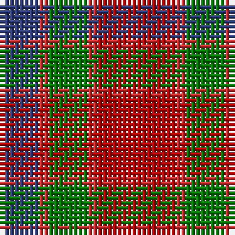

In pattern [BRGRR](/patterns/brgrr/).

This was sourced from weddslist.  It is a [5 stripes tartan](/stripes/stripes5/).

Original link http://www.weddslist.com/cgi-bin/tartans/pg.pl?source=sts

## Thread count
B/8 R2 G8 R2 Ra/16

## Palette
Each colour and its ΔE from the base-6 reference it is a variant of.

| Colour | Shade | Base | ΔE (OKLab) |
|---|---|---|---|
| B | <code style="background-color:#304080;">#304080</code> `#304080` | B <code style="background-color:#2A418A;">#2A418A</code> | 0.02 |
| G | <code style="background-color:#008000;">#008000</code> `#008000` | G <code style="background-color:#006100;">#006100</code> | 0.10 |
| R | <code style="background-color:#D03030;">#D03030</code> `#D03030` | R <code style="background-color:#CC0000;">#CC0000</code> | 0.04 |
| Ra | <code style="background-color:#C00000;">#C00000</code> `#C00000` | R <code style="background-color:#CC0000;">#CC0000</code> | 0.03 |

# Sample pattern

## Nearest tartans

The nearest existing variants by ΔTartan distance.

1. [Moray of Abercairney #2](/setts/s5/r8ra1g4ra1b4~b2c4084-g005020-rdc0000-rac82828~x2/) — ΔT 0.48
1. [Plaid Wine](/setts/s6/r24b5ra9b2ra9w9~b5c5c5c-r880000-raa07c58-we8ccb8~x4/) — ΔT 0.91
1. [Moray of Abercairney](/setts/s6/r8ra1g4ra1g1b2~b3c82af-g005020-rdc0000-rac82828~x2/) — ΔT 0.92
1. [Moray of Abercairney](/setts/s6/r8ra1g4ra1g1b2~b5480b0-g008000-rc00000-rad03030~x2/) — ΔT 1.06
1. [Highland Pub Company](/setts/s5/b16k13b13r30y4~b4c3428-k101010-rc80000-yd09800~x2/) — ΔT 1.17
1. [Bronte House Check](/setts/s6/r10g60b13y24b24g8~b2c294f-g6b380d-rfc0fc0-yd4ad7d/) — ΔT 1.19
1. [MacKintosh-Geddes (Personal?)](/setts/s7/b2r4g12r3b6r10w2~b780078-g006818-rc80000-wfcfcfc~x2/) — ΔT 1.26
1. [MacNab #2](/setts/s6/g1r1g7r4ra7r1~g006818-ra00048-rac80000~x4/) — ΔT 1.27
1. [Ikelman #2 (Personal)](/setts/s5/b11k4r4y4b1~b5c5c5c-k101010-r880000-yd09800~x4/) — ΔT 1.28
1. [MacBean/MacElvain](/setts/s7/k2r12b6r3g12r4b1~b2c4084-g005020-k101010-rdc0000~x2/) — ΔT 1.30

## Neighbour map

Every grey dot is one of 15726 variants placed by the first two principal components of the ΔTartan feature space (44% of its variance). Red is this tartan; blue dots are its nearest — click one to open its page.

<svg viewBox="0 0 640 380" role="img" style="max-width:100%;height:auto;border:1px solid #e0e0e0;border-radius:4px;display:block" xmlns="http://www.w3.org/2000/svg"><image href="/nn/cloud.v1.png" width="640" height="380"/><a href="/setts/s5/r8ra1g4ra1b4~b2c4084-g005020-rdc0000-rac82828~x2/"><circle cx="239.5" cy="231.2" r="4" fill="#3465a4"><title>Moray of Abercairney #2</title></circle></a><a href="/setts/s6/r24b5ra9b2ra9w9~b5c5c5c-r880000-raa07c58-we8ccb8~x4/"><circle cx="233.9" cy="206.0" r="4" fill="#3465a4"><title>Plaid Wine</title></circle></a><a href="/setts/s6/r8ra1g4ra1g1b2~b3c82af-g005020-rdc0000-rac82828~x2/"><circle cx="271.4" cy="208.3" r="4" fill="#3465a4"><title>Moray of Abercairney</title></circle></a><a href="/setts/s6/r8ra1g4ra1g1b2~b5480b0-g008000-rc00000-rad03030~x2/"><circle cx="278.1" cy="213.1" r="4" fill="#3465a4"><title>Moray of Abercairney</title></circle></a><a href="/setts/s5/b16k13b13r30y4~b4c3428-k101010-rc80000-yd09800~x2/"><circle cx="217.7" cy="255.6" r="4" fill="#3465a4"><title>Highland Pub Company</title></circle></a><a href="/setts/s6/r10g60b13y24b24g8~b2c294f-g6b380d-rfc0fc0-yd4ad7d/"><circle cx="247.7" cy="223.2" r="4" fill="#3465a4"><title>Bronte House Check</title></circle></a><a href="/setts/s7/b2r4g12r3b6r10w2~b780078-g006818-rc80000-wfcfcfc~x2/"><circle cx="200.7" cy="224.3" r="4" fill="#3465a4"><title>MacKintosh-Geddes (Personal?)</title></circle></a><a href="/setts/s6/g1r1g7r4ra7r1~g006818-ra00048-rac80000~x4/"><circle cx="261.3" cy="249.2" r="4" fill="#3465a4"><title>MacNab #2</title></circle></a><a href="/setts/s5/b11k4r4y4b1~b5c5c5c-k101010-r880000-yd09800~x4/"><circle cx="265.3" cy="230.9" r="4" fill="#3465a4"><title>Ikelman #2 (Personal)</title></circle></a><a href="/setts/s7/k2r12b6r3g12r4b1~b2c4084-g005020-k101010-rdc0000~x2/"><circle cx="259.3" cy="199.4" r="4" fill="#3465a4"><title>MacBean/MacElvain</title></circle></a><circle cx="241.8" cy="234.2" r="5" fill="#c00000"/></svg>

ID: /setts/s5/r8ra1g4ra1b4~b304080-g008000-rc00000-rad03030~x2/
