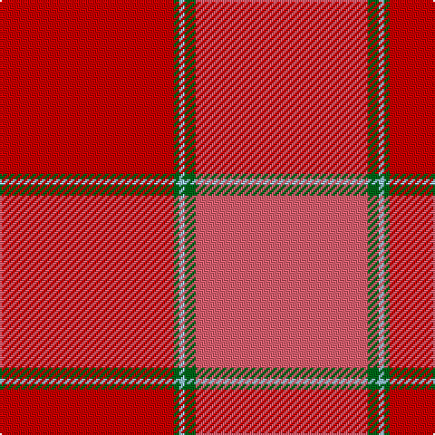

In pattern [RGWGR](/stripes/rgwgr/).

This was sourced from tartans-authority.  It is a [5 stripe tartan](/stripes/stripes5/).

Original link http://www.tartansauthority.com/tartan-ferret/display/1451/

## Thread count
R/96 G3 LB3 G6 LR/95

## Palette
Each colour and its ΔE from the base-6 reference it is a variant of.

| Colour | Shade | Base | ΔE (OKLab) |
|---|---|---|---|
| G | <code style="background-color:#006818;">#006818</code> `#006818` | G <code style="background-color:#006100;">#006100</code> | 0.02 |
| LB | <code style="background-color:#98C8E8;">#98C8E8</code> `#98C8E8` | W <code style="background-color:#F7F7F7;">#F7F7F7</code> | 0.18 |
| LR | <code style="background-color:#E86070;">#E86070</code> `#E86070` | R <code style="background-color:#CC0000;">#CC0000</code> | 0.15 |
| R | <code style="background-color:#C80000;">#C80000</code> `#C80000` | R <code style="background-color:#CC0000;">#CC0000</code> | 0.01 |

# Sample pattern

## Nearest tartans

The nearest existing variants by ΔTartan distance.

1. [MacNab (Smith)](/setts/s5/r24g2t1g1m24~x4/) — ΔT 1.60
1. [MacNab 4](/setts/s5/r24g2t1g1r24~x2/) — ΔT 1.64
1. [MacNab WI 1](/setts/s5/dr24dg1b1dg2r24~x2/) — ΔT 2.05
1. [MacNab WI1](/setts/s8/r24dg2lb1dg1r24/) — ΔT 2.21
1. [Grelloch (Fashion)](/setts/s6/r2k1r12r12t1m2~x4/) — ΔT 2.59
1. [Aberdeen F.C. Corporate Tartan Tartan Number: 2057. Earliest known date: 1990 The tartan of the Aberdeen Football Club launched on 12th April, 1990. See products available Copyright © Blair Urquhart, Comrie, 2015](/setts/s7/w2k1r28k3r28k1w2~x2/) — ΔT 2.59
1. [Maguire, Black (Name)](/setts/s6/r29g2r2g2r6lo21~x4/) — ΔT 2.64
1. [Tune Hotels](/setts/s9/r3r18r6r15r4r3r4r7w2~x2/) — ΔT 2.65
1. [Cairn O'Mount (Personal)](/setts/s6/r58n12r5y28r7lo5~x2/) — ΔT 2.69
1. [Barbour - Cardinal Red](/setts/s7/r3ly2r18db8w1r18r2~x2/) — ΔT 2.75

## Neighbour map

Every grey dot is one of 14299 variants placed by the first two principal components of the ΔTartan feature space (44% of its variance). Red is this tartan; blue dots are its nearest — click one to open its page.

<svg viewBox="0 0 640 380" role="img" style="max-width:100%;height:auto;border:1px solid #e0e0e0;border-radius:4px;display:block" xmlns="http://www.w3.org/2000/svg"><image href="/nn/cloud.v1.png" width="640" height="380"/><a href="/setts/s5/r24g2t1g1m24~x4/"><circle cx="474.6" cy="218.4" r="4" fill="#3465a4"><title>MacNab (Smith)</title></circle></a><a href="/setts/s5/r24g2t1g1r24~x2/"><circle cx="472.6" cy="220.0" r="4" fill="#3465a4"><title>MacNab 4</title></circle></a><a href="/setts/s5/dr24dg1b1dg2r24~x2/"><circle cx="448.1" cy="214.6" r="4" fill="#3465a4"><title>MacNab WI 1</title></circle></a><a href="/setts/s8/r24dg2lb1dg1r24/"><circle cx="382.7" cy="132.0" r="4" fill="#3465a4"><title>MacNab WI1</title></circle></a><a href="/setts/s6/r2k1r12r12t1m2~x4/"><circle cx="409.7" cy="226.8" r="4" fill="#3465a4"><title>Grelloch (Fashion)</title></circle></a><a href="/setts/s7/w2k1r28k3r28k1w2~x2/"><circle cx="368.0" cy="139.4" r="4" fill="#3465a4"><title>Aberdeen F.C. Corporate Tartan Tartan Number: 2057. Earliest known date: 1990 The tartan of the Aberdeen Football Club launched on 12th April, 1990. See products available Copyright © Blair Urquhart, Comrie, 2015</title></circle></a><a href="/setts/s6/r29g2r2g2r6lo21~x4/"><circle cx="454.0" cy="206.2" r="4" fill="#3465a4"><title>Maguire, Black (Name)</title></circle></a><a href="/setts/s9/r3r18r6r15r4r3r4r7w2~x2/"><circle cx="348.7" cy="222.2" r="4" fill="#3465a4"><title>Tune Hotels</title></circle></a><a href="/setts/s6/r58n12r5y28r7lo5~x2/"><circle cx="427.7" cy="215.5" r="4" fill="#3465a4"><title>Cairn O'Mount (Personal)</title></circle></a><a href="/setts/s7/r3ly2r18db8w1r18r2~x2/"><circle cx="304.9" cy="162.2" r="4" fill="#3465a4"><title>Barbour - Cardinal Red</title></circle></a><circle cx="466.3" cy="183.6" r="5" fill="#c00000"/></svg>

ID: /setts/s5/r96g3lb3g6r95/
