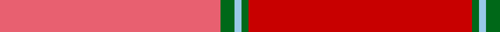

In pattern [RGWGR](/patterns/rgwgr/).

This was sourced from tartans-authority.  It is a [5 stripes tartan](/stripes/stripes5/).

Original link http://www.tartansauthority.com/tartan-ferret/display/1451/

## Thread count
LR/95 G6 LB3 G3 R/96

## Palette
Each colour and its ΔE from the base-6 reference it is a variant of.

| Colour | Shade | Base | ΔE (OKLab) |
|---|---|---|---|
| G | <code style="background-color:#006818;">#006818</code> `#006818` | G <code style="background-color:#006100;">#006100</code> | 0.02 |
| LB | <code style="background-color:#98C8E8;">#98C8E8</code> `#98C8E8` | W <code style="background-color:#F7F7F7;">#F7F7F7</code> | 0.18 |
| LR | <code style="background-color:#E86070;">#E86070</code> `#E86070` | R <code style="background-color:#CC0000;">#CC0000</code> | 0.15 |
| R | <code style="background-color:#C80000;">#C80000</code> `#C80000` | R <code style="background-color:#CC0000;">#CC0000</code> | 0.01 |

# Sample pattern

## Nearest tartans

The nearest existing variants by ΔTartan distance.

1. [MacNab (Smith)](/setts/s5/r24g1b1g2ra24~b2888c4-g006818-ra00048-rac80000~x4/) — ΔT 1.60
1. [MacNab 4](/setts/s5/r24g1b1g2ra24~b5480b0-g008000-r900030-rac00000~x2/) — ΔT 1.64
1. [MacNab WI 1](/setts/s5/b24g1ba1g2r24~b59110d-ba4367ae-g11450d-raa0000~x2/) — ΔT 2.04
1. [MacNab WI1](/setts/s8/r24g1w1g2ra24g2w1g1~g004c00-rff0000-rac80000-wd0d0d0~x2/) — ΔT 2.22
1. [Grelloch (Fashion)](/setts/s6/r2b1ra12rb12k1rb2~b5c8ca8-k101010-ra00048-ra901c38-rbc80000~x4/) — ΔT 2.59
1. [Aberdeen F.C. Corporate Tartan Tartan Number: 2057. Earliest known date: 1990 The tartan of the Aberdeen Football Club launched on 12th April, 1990. See products available Copyright © Blair Urquhart, Comrie, 2015](/setts/s7/w2k1r28k3ra28k1w2~k101010-r901c38-rac80000-we0e0e0~x2/) — ΔT 2.60
1. [Maguire, Black (Name)](/setts/s6/r29g2r2g2r6y21~g00643c-rd0002c-ybc8c00~x4/) — ΔT 2.64
1. [Tune Hotels](/setts/s9/r3ra18rb6r15ra4r3ra4r7w2~ree2e24-raa50313-rb962121-wfffff0~x2/) — ΔT 2.65
1. [Cairn O'Mount (Personal)](/setts/s6/r58b12r5g28r7y5~b647480-g648468-rb40000-ybc8c00~x2/) — ΔT 2.68
1. [Cetoloni](/setts/s6/b2r22g11ga2g11b2~b304080-g604000-ga908000-rc00020~x2/) — ΔT 2.75

## Neighbour map

Every grey dot is one of 15726 variants placed by the first two principal components of the ΔTartan feature space (44% of its variance). Red is this tartan; blue dots are its nearest — click one to open its page.

<svg viewBox="0 0 640 380" role="img" style="max-width:100%;height:auto;border:1px solid #e0e0e0;border-radius:4px;display:block" xmlns="http://www.w3.org/2000/svg"><image href="/nn/cloud.v1.png" width="640" height="380"/><a href="/setts/s5/r24g1b1g2ra24~b2888c4-g006818-ra00048-rac80000~x4/"><circle cx="477.3" cy="208.0" r="4" fill="#3465a4"><title>MacNab (Smith)</title></circle></a><a href="/setts/s5/r24g1b1g2ra24~b5480b0-g008000-r900030-rac00000~x2/"><circle cx="475.1" cy="209.5" r="4" fill="#3465a4"><title>MacNab 4</title></circle></a><a href="/setts/s5/b24g1ba1g2r24~b59110d-ba4367ae-g11450d-raa0000~x2/"><circle cx="449.4" cy="206.5" r="4" fill="#3465a4"><title>MacNab WI 1</title></circle></a><a href="/setts/s8/r24g1w1g2ra24g2w1g1~g004c00-rff0000-rac80000-wd0d0d0~x2/"><circle cx="384.8" cy="130.0" r="4" fill="#3465a4"><title>MacNab WI1</title></circle></a><a href="/setts/s6/r2b1ra12rb12k1rb2~b5c8ca8-k101010-ra00048-ra901c38-rbc80000~x4/"><circle cx="412.2" cy="214.4" r="4" fill="#3465a4"><title>Grelloch (Fashion)</title></circle></a><a href="/setts/s7/w2k1r28k3ra28k1w2~k101010-r901c38-rac80000-we0e0e0~x2/"><circle cx="369.0" cy="138.2" r="4" fill="#3465a4"><title>Aberdeen F.C. Corporate Tartan Tartan Number: 2057. Earliest known date: 1990 The tartan of the Aberdeen Football Club launched on 12th April, 1990. See products available Copyright © Blair Urquhart, Comrie, 2015</title></circle></a><a href="/setts/s6/r29g2r2g2r6y21~g00643c-rd0002c-ybc8c00~x4/"><circle cx="456.0" cy="206.4" r="4" fill="#3465a4"><title>Maguire, Black (Name)</title></circle></a><a href="/setts/s9/r3ra18rb6r15ra4r3ra4r7w2~ree2e24-raa50313-rb962121-wfffff0~x2/"><circle cx="351.4" cy="216.1" r="4" fill="#3465a4"><title>Tune Hotels</title></circle></a><a href="/setts/s6/r58b12r5g28r7y5~b647480-g648468-rb40000-ybc8c00~x2/"><circle cx="429.0" cy="212.0" r="4" fill="#3465a4"><title>Cairn O'Mount (Personal)</title></circle></a><a href="/setts/s6/b2r22g11ga2g11b2~b304080-g604000-ga908000-rc00020~x2/"><circle cx="354.9" cy="226.9" r="4" fill="#3465a4"><title>Cetoloni</title></circle></a><circle cx="469.0" cy="177.8" r="5" fill="#c00000"/></svg>

ID: /setts/s5/r96g3w3g6ra95~g006818-rc80000-rae86070-w98c8e8/
