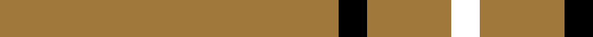
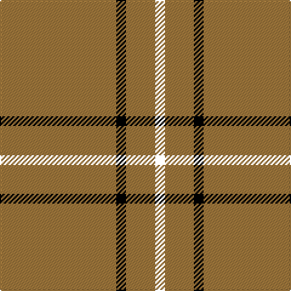

In pattern [KRRKR](/patterns/krrkr/).

This was sourced from tartans-authority.  It is a [5 stripes tartan](/stripes/stripes5/).

Original link http://www.tartansauthority.com/tartan-ferret/display/5461/

## Thread count
LT/96 K8 LTa16 LT8 R/8

## Palette
Each colour and its ΔE from the base-6 reference it is a variant of.

| Colour | Shade | Base | ΔE (OKLab) |
|---|---|---|---|
| K | <code style="background-color:#000000;">#000000</code> `#000000` | K <code style="background-color:#000000;">#000000</code> | 0.00 |
| LT | <code style="background-color:#A0783C;">#A0783C</code> `#A0783C` | R <code style="background-color:#CC0000;">#CC0000</code> | 0.18 |
| LTa | <code style="background-color:#A0783C;">#A0783C</code> `#A0783C` | R <code style="background-color:#CC0000;">#CC0000</code> | 0.18 |

# Sample pattern

## Nearest tartans

The nearest existing variants by ΔTartan distance.

1. [Lochcarron Camel](/setts/s5/r96w8k16r8ra8-k000000-ra0783c-ra8c0000-wc8c8c8/) — ΔT 0.71
1. [Bro-Dreger](/setts/s7/w6k10y6r6y64k4y6-k101010-r880000-we0e0e0-yb0840c/) — ΔT 1.19
1. [Coca Cola](/setts/s5/w14g14w14g80r6-g604000-rc80000-wd4e8f4/) — ΔT 1.37
1. [Coca Cola (Corporate)](/setts/s5/w15g15w15g80r6-g604000-rc80000-wd4e8f4/) — ΔT 1.45
1. [Glenlivet Dress Reproduction (Corp)](/setts/s8/g12r4g84b4g10w32g10b4-b2c2c80-g604000-rb03000-we0e0e0/) — ΔT 1.61
1. [Loch Tummel](/setts/s5/r76w18r6b18w6-b401000-r906030-we0e0e0/) — ΔT 1.78
1. [Wilbers](/setts/s8/y10k18y4k14ya70r8ya70k8-k101010-rc80000-ye8c000-yab49440/) — ΔT 1.79
1. [Highlands at Wyomissing, The](/setts/s5/r70w6r16y4g22-g146400-r880000-wffffff-yfccc00/) — ΔT 1.80
1. [Welsh National (District)](/setts/s5/r16g6r8g88w8-g00643c-rc8002c-we0e0e0/) — ΔT 1.83
1. [Volkswagen Orange Trim](/setts/s6/g6y6k20y52k6y6-g289c18-k101010-yd87c00/) — ΔT 1.93

## Neighbour map

Every grey dot is one of 15726 variants placed by the first two principal components of the ΔTartan feature space (44% of its variance). Red is this tartan; blue dots are its nearest — click one to open its page.

<svg viewBox="0 0 640 380" role="img" style="max-width:100%;height:auto;border:1px solid #e0e0e0;border-radius:4px;display:block" xmlns="http://www.w3.org/2000/svg"><image href="/nn/cloud.v1.png" width="640" height="380"/><a href="/setts/s5/r96w8k16r8ra8-k000000-ra0783c-ra8c0000-wc8c8c8/"><circle cx="468.9" cy="176.0" r="4" fill="#3465a4"><title>Lochcarron Camel</title></circle></a><a href="/setts/s7/w6k10y6r6y64k4y6-k101010-r880000-we0e0e0-yb0840c/"><circle cx="470.1" cy="145.9" r="4" fill="#3465a4"><title>Bro-Dreger</title></circle></a><a href="/setts/s5/w14g14w14g80r6-g604000-rc80000-wd4e8f4/"><circle cx="457.0" cy="198.8" r="4" fill="#3465a4"><title>Coca Cola</title></circle></a><a href="/setts/s5/w15g15w15g80r6-g604000-rc80000-wd4e8f4/"><circle cx="446.9" cy="200.1" r="4" fill="#3465a4"><title>Coca Cola (Corporate)</title></circle></a><a href="/setts/s8/g12r4g84b4g10w32g10b4-b2c2c80-g604000-rb03000-we0e0e0/"><circle cx="452.2" cy="137.3" r="4" fill="#3465a4"><title>Glenlivet Dress Reproduction (Corp)</title></circle></a><a href="/setts/s5/r76w18r6b18w6-b401000-r906030-we0e0e0/"><circle cx="409.2" cy="199.6" r="4" fill="#3465a4"><title>Loch Tummel</title></circle></a><a href="/setts/s8/y10k18y4k14ya70r8ya70k8-k101010-rc80000-ye8c000-yab49440/"><circle cx="400.2" cy="152.2" r="4" fill="#3465a4"><title>Wilbers</title></circle></a><a href="/setts/s5/r70w6r16y4g22-g146400-r880000-wffffff-yfccc00/"><circle cx="470.5" cy="182.1" r="4" fill="#3465a4"><title>Highlands at Wyomissing, The</title></circle></a><a href="/setts/s5/r16g6r8g88w8-g00643c-rc8002c-we0e0e0/"><circle cx="504.4" cy="206.5" r="4" fill="#3465a4"><title>Welsh National (District)</title></circle></a><a href="/setts/s6/g6y6k20y52k6y6-g289c18-k101010-yd87c00/"><circle cx="388.4" cy="198.8" r="4" fill="#3465a4"><title>Volkswagen Orange Trim</title></circle></a><circle cx="484.0" cy="184.7" r="5" fill="#c00000"/></svg>

ID: /setts/s5/r96k8r16r8k8-k000000-ra0783c/
