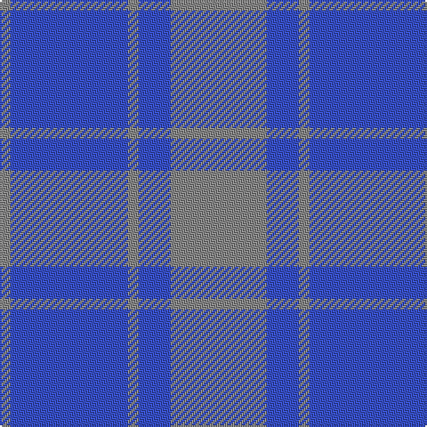

In pattern [RBRBR](/patterns/rbrbr/).

This was sourced from register-of-tartans.  It is a [5 stripes tartan](/stripes/stripes5/).

Original link https://www.tartanregister.gov.uk/tartanDetails.aspx?ref=2308

## Attestations

This cloth appears in 2 source records; the oldest owns this page.

- 01/01/1984 — MacCallum High School (register-of-tartans, [record](https://www.tartanregister.gov.uk/tartanDetails.aspx?ref=2308))
- pre 2002 — MacCallum HS of Philadelphia (Corp) (tartans-authority, [record](http://www.tartansauthority.com/tartan-ferret/display/1279/))

## Register references

External register numbers recorded for this tartan.

- Scottish Register of Tartans: [2308](https://www.tartanregister.gov.uk/tartanDetails.aspx?ref=2308)
- Scottish Tartans Authority (ITI): 1279
- Scottish Tartans World Register: 1279

## Thread count
N/6 B66 N6 B18 N/54

## Palette
Each colour and its ΔE from the base-6 reference it is a variant of.

| Colour | Shade | Base | ΔE (OKLab) |
|---|---|---|---|
| B | <code style="background-color:#3850C8;">#3850C8</code> `#3850C8` | B <code style="background-color:#2A418A;">#2A418A</code> | 0.11 |
| N | <code style="background-color:#888888;">#888888</code> `#888888` | R <code style="background-color:#CC0000;">#CC0000</code> | 0.24 |

# Sample pattern

## Nearest tartans

The nearest existing variants by ΔTartan distance.

1. [MacCallum, High School](/setts/s5/g9b3g1b11g1~b304080-g808080~x6/) — ΔT 1.06
1. [Hepburn](/setts/s6/b13ba1b3ba6y1ba1~b304080-ba8080d0-yf0c000~x4/) — ΔT 1.84
1. [MacCallum High School Corporate Tartan Tartan Number: 1279. Earliest known date: 0 From the J. Rutledge Collection, Belfast. MacCallum High School, Philadelphia See products available Copyright © Blair Urquhart, Comrie, 2015](/setts/s5/r9b3r1b11r1~b2c2c80-r888888~x6/) — ΔT 1.91
1. [Dram! (Corporate)](/setts/s6/b5ba1b15ba25b1ba5~b2c2c80-ba5c8ca8~x4/) — ΔT 1.94
1. [North Sea Commission](/setts/s5/b9ba3b1ba12y1~b5c8ca8-ba344054-ye8c000~x4/) — ΔT 2.17
1. [Pringle, James (Fashion)](/setts/s7/b20ba2b3ba2b14g18b4~b2c2c80-ba64008c-g146400~x2/) — ΔT 2.17
1. [Unidentified 17](/setts/s5/b16r2b16r19ra4~b304080-r806050-rac00000~x3/) — ΔT 2.26
1. [Hepburn #2](/setts/s6/b13ba1b3ba6y1ba1~b2c4084-ba0596fa-ye8c000~x4/) — ΔT 2.27
1. [Sugiyama](/setts/s6/b7ba2b25ba10g21ba2~b2c4084-ba1c1c50-g408060~x2/) — ΔT 2.34
1. [Hamilton Hunting](/setts/s5/b11g2b15g18w2~b2c4084-g005020-we0e0e0~x2/) — ΔT 2.41

## Neighbour map

Every grey dot is one of 15726 variants placed by the first two principal components of the ΔTartan feature space (44% of its variance). Red is this tartan; blue dots are its nearest — click one to open its page.

<svg viewBox="0 0 640 380" role="img" style="max-width:100%;height:auto;border:1px solid #e0e0e0;border-radius:4px;display:block" xmlns="http://www.w3.org/2000/svg"><image href="/nn/cloud.v1.png" width="640" height="380"/><a href="/setts/s5/g9b3g1b11g1~b304080-g808080~x6/"><circle cx="448.4" cy="284.0" r="4" fill="#3465a4"><title>MacCallum, High School</title></circle></a><a href="/setts/s6/b13ba1b3ba6y1ba1~b304080-ba8080d0-yf0c000~x4/"><circle cx="442.4" cy="226.3" r="4" fill="#3465a4"><title>Hepburn</title></circle></a><a href="/setts/s5/r9b3r1b11r1~b2c2c80-r888888~x6/"><circle cx="402.2" cy="264.7" r="4" fill="#3465a4"><title>MacCallum High School Corporate Tartan Tartan Number: 1279. Earliest known date: 0 From the J. Rutledge Collection, Belfast. MacCallum High School, Philadelphia See products available Copyright © Blair Urquhart, Comrie, 2015</title></circle></a><a href="/setts/s6/b5ba1b15ba25b1ba5~b2c2c80-ba5c8ca8~x4/"><circle cx="465.4" cy="222.9" r="4" fill="#3465a4"><title>Dram! (Corporate)</title></circle></a><a href="/setts/s5/b9ba3b1ba12y1~b5c8ca8-ba344054-ye8c000~x4/"><circle cx="396.1" cy="249.5" r="4" fill="#3465a4"><title>North Sea Commission</title></circle></a><a href="/setts/s7/b20ba2b3ba2b14g18b4~b2c2c80-ba64008c-g146400~x2/"><circle cx="432.8" cy="259.2" r="4" fill="#3465a4"><title>Pringle, James (Fashion)</title></circle></a><a href="/setts/s5/b16r2b16r19ra4~b304080-r806050-rac00000~x3/"><circle cx="407.5" cy="299.0" r="4" fill="#3465a4"><title>Unidentified 17</title></circle></a><a href="/setts/s6/b13ba1b3ba6y1ba1~b2c4084-ba0596fa-ye8c000~x4/"><circle cx="421.6" cy="223.3" r="4" fill="#3465a4"><title>Hepburn #2</title></circle></a><a href="/setts/s6/b7ba2b25ba10g21ba2~b2c4084-ba1c1c50-g408060~x2/"><circle cx="343.2" cy="258.2" r="4" fill="#3465a4"><title>Sugiyama</title></circle></a><a href="/setts/s5/b11g2b15g18w2~b2c4084-g005020-we0e0e0~x2/"><circle cx="363.5" cy="286.3" r="4" fill="#3465a4"><title>Hamilton Hunting</title></circle></a><circle cx="443.7" cy="281.3" r="5" fill="#c00000"/></svg>

ID: /setts/s5/r9b3r1b11r1~b3850c8-r888888~x6/
