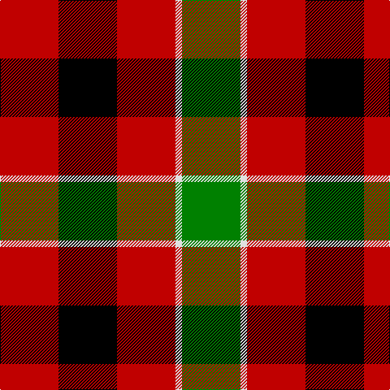

In pattern [GWRKR](/stripes/gwrkr/).

This was sourced from weddslist.  It is a [5 stripe tartan](/stripes/stripes5/).

Original link http://www.weddslist.com/cgi-bin/tartans/pg.pl?source=sts

## Also known as

This cloth is also recorded under:

- Unidentified, item

## Thread count
R/72 K72 R72 LN8 G/72

## Palette
Each colour and the base-6 reference it is a variant of.

| Colour | Shade | Base |
|---|---|---|
| G | <code style="background-color:#008000;">#008000</code> `oklch(52.0% 0.177 142.5)` <small>#008000</small> | G <code style="background-color:#006100;">#006100</code> |
| K | <code style="background-color:#000000;">#000000</code> `oklch(0.0% 0.000 0.0)` <small>#000000</small> | K <code style="background-color:#000000;">#000000</code> |
| LN | <code style="background-color:#E0E0E0;">#E0E0E0</code> `oklch(90.7% 0.000 89.9)` <small>#E0E0E0</small> | W <code style="background-color:#F7F7F7;">#F7F7F7</code> |
| R | <code style="background-color:#C00000;">#C00000</code> `oklch(50.7% 0.208 29.2)` <small>#C00000</small> | R <code style="background-color:#CC0000;">#CC0000</code> |

# Sample pattern

## Nearest tartans

The nearest existing variants by ΔTartan distance.

1. [Unidentified item](/setts/s5/dg9w1r9k9r9~x8/) — ΔT 0.84
1. [MacDuff](/setts/s7/r8t3k4g6r4k1r4~x2/) — ΔT 0.99
1. [Torana](/setts/s6/r13dt13o5lo2dt13lo13~x2/) — ΔT 1.07
1. [Norwich No.028](/setts/s6/r6g5k5g5r6t1~x4/) — ΔT 1.07
1. [MacDuff](/setts/s7/r8db3k4dg6r4k1r4~x2/) — ΔT 1.14
1. [MacDuff](/setts/s7/r22t8k9g14r10t2r10~x2/) — ΔT 1.40
1. [MacDuff #5](/setts/s7/r8t3k4dg6r4k1r4~x2/) — ΔT 1.50
1. [Connel](/setts/s6/r8k8ly1k8r8w1~x4/) — ΔT 1.51
1. [MacDuff Clan Tartan Tartan Number: 2141. Earliest known date: 1831 According to D.C.Stewart, "It will be observed that the MacDuff tartan is substantially the Royal Stuart with the white and yellow lines removed. Whether this indicates it as a source of the Stuart, or the association of the Earls of Fife with the Crown, remains to be determined." James Logan published this sett in his book, 'The Scottish Gael' in 1831. See products available Copyright © Blair Urquhart, Comrie, 2015](/setts/s7/r8db3k4g6r4k1r4~x4/) — ΔT 1.57
1. [Wcwm 1651](/setts/s7/r10k1r3y7k7y5ly3~x4/) — ΔT 1.59

## Neighbour map

Every grey dot is one of 14299 variants placed by the first two principal components of the ΔTartan feature space (44% of its variance). Red is this tartan; blue dots are its nearest — click one to open its page.

<svg viewBox="0 0 640 380" role="img" style="max-width:100%;height:auto;border:1px solid #e0e0e0;border-radius:4px;display:block" xmlns="http://www.w3.org/2000/svg"><image href="/nn/cloud.v1.png" width="640" height="380"/><a href="/setts/s5/dg9w1r9k9r9~x8/"><circle cx="212.4" cy="247.6" r="4" fill="#3465a4"><title>Unidentified item</title></circle></a><a href="/setts/s7/r8t3k4g6r4k1r4~x2/"><circle cx="214.6" cy="228.7" r="4" fill="#3465a4"><title>MacDuff</title></circle></a><a href="/setts/s6/r13dt13o5lo2dt13lo13~x2/"><circle cx="163.6" cy="245.4" r="4" fill="#3465a4"><title>Torana</title></circle></a><a href="/setts/s6/r6g5k5g5r6t1~x4/"><circle cx="150.2" cy="266.2" r="4" fill="#3465a4"><title>Norwich No.028</title></circle></a><a href="/setts/s7/r8db3k4dg6r4k1r4~x2/"><circle cx="219.4" cy="231.8" r="4" fill="#3465a4"><title>MacDuff</title></circle></a><a href="/setts/s7/r22t8k9g14r10t2r10~x2/"><circle cx="254.4" cy="212.9" r="4" fill="#3465a4"><title>MacDuff</title></circle></a><a href="/setts/s7/r8t3k4dg6r4k1r4~x2/"><circle cx="231.8" cy="232.8" r="4" fill="#3465a4"><title>MacDuff #5</title></circle></a><a href="/setts/s6/r8k8ly1k8r8w1~x4/"><circle cx="246.1" cy="226.6" r="4" fill="#3465a4"><title>Connel</title></circle></a><a href="/setts/s7/r8db3k4g6r4k1r4~x4/"><circle cx="239.9" cy="239.5" r="4" fill="#3465a4"><title>MacDuff Clan Tartan Tartan Number: 2141. Earliest known date: 1831 According to D.C.Stewart, &quot;It will be observed that the MacDuff tartan is substantially the Royal Stuart with the white and yellow lines removed. Whether this indicates it as a source of the Stuart, or the association of the Earls of Fife with the Crown, remains to be determined.&quot; James Logan published this sett in his book, 'The Scottish Gael' in 1831. See products available Copyright © Blair Urquhart, Comrie, 2015</title></circle></a><a href="/setts/s7/r10k1r3y7k7y5ly3~x4/"><circle cx="157.3" cy="219.0" r="4" fill="#3465a4"><title>Wcwm 1651</title></circle></a><circle cx="193.4" cy="243.3" r="5" fill="#c00000"/></svg>

ID: /setts/s5/r9k9r9w1g9~x8/
