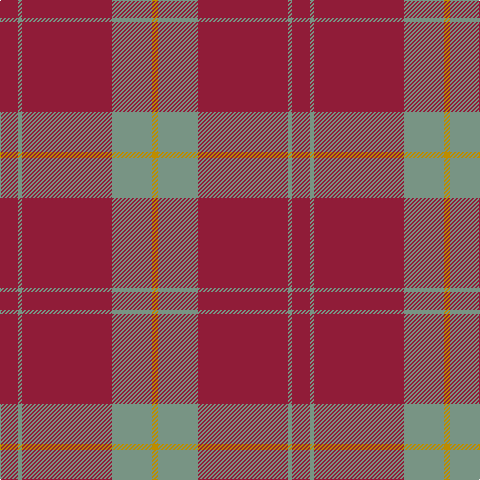

**Bands:** [RGRGY](/stripes/rgrgy/) · **Stripes:** [R Y R Y LO](/stripes/stripes5/) R Y R Y LO

This was sourced from tartans-authority.  It is a [5 band tartan](/bands/bands5/).

Original link http://www.tartansauthority.com/tartan-ferret/display/6254/

## Thread count
DR/18 LG4 DR90 LG40 DY/6

## Palette
Each colour and its ΔE from the base-6 reference it is a variant of.

| Colour | Shade | Base | ΔE (OKLab) |
|---|---|---|---|
| DR | <code style="background-color:#901C38;">#901C38</code> `#901C38` | R <code style="background-color:#CC0000;">#CC0000</code> | 0.13 |
| DY | <code style="background-color:#BC8C00;">#BC8C00</code> `#BC8C00` | Y <code style="background-color:#F2BF00;">#F2BF00</code> | 0.16 |
| LG | <code style="background-color:#789484;">#789484</code> `#789484` | G <code style="background-color:#006100;">#006100</code> | 0.24 |

# Sample pattern

## Nearest tartans

The nearest existing variants by ΔTartan distance.

1. [Monica](/setts/s6/r3o10r3o4r20lb1~x4/) — ΔT 0.96
1. [Hunt (Personal)](/setts/s8/r9y2r45y20lo3~x2/) — ΔT 0.99
1. [MacLaine of Lochbuie](/setts/s4/r32dg8b4ly1~x2/) — ΔT 1.46
1. [MacLaine of Lochbuie](/setts/s4/r32dg8b4ly1/) — ΔT 1.46
1. [Glen Shee](/setts/s5/r37o9r3g9o3~x2/) — ΔT 1.49
1. [MacKintosh, Red](/setts/s6/r24g5r3g9r3db1~x4/) — ΔT 1.51
1. [Crawford](/setts/s7/m6lb2m30g12m3g12m3~x2/) — ΔT 1.55
1. [Glen Shee Trade Tartan Tartan Number: 1662. Earliest known date: pre 2003 May have been obtained from a hand made design procured in the Highlands for The Highland Society of London. See products available Copyright © Blair Urquhart, Comrie, 2015](/setts/s5/m37dy9m3g9dy3~x2/) — ΔT 1.60
1. [MacGregor Hunting Glengyle Clan Tartan Tartan Number: 1285. Earliest known date: 1960 This is the usual MacGregor sett but with a darker crimson background colour. The story goes that Alasdair MacGregor of Cardney wanted to make tartan from the wool of his own sheep. His initial dyeing attempt produced a shocking pink colour, so he dyed the wool a second time to get this dark crimson colour. He liked the result so much that he had a bolt of cloth woven and the Cardney MacGregors have worn it ever since. The addition of the term 'Hunting' to the name is, apparently a commercial attribution. Notes from the STA, quoting Sir Malcolm MacGregor of MacGregor (2006) See products available Copyright © Blair Urquhart, Comrie, 2015](/setts/s6/m96g42m16g17k4lb6/) — ΔT 1.65
1. [MacDonald Lord of the Isles](/setts/s4/r38dg2r5dg16~x2/) — ΔT 1.65

## Neighbour map

Every grey dot is one of 14299 variants placed by the first two principal components of the ΔTartan feature space (44% of its variance). Red is this tartan; blue dots are its nearest — click one to open its page.

<svg viewBox="0 0 640 380" role="img" style="max-width:100%;height:auto;border:1px solid #e0e0e0;border-radius:4px;display:block" xmlns="http://www.w3.org/2000/svg"><image href="/nn/cloud.v1.png" width="640" height="380"/><a href="/setts/s6/r3o10r3o4r20lb1~x4/"><circle cx="462.0" cy="199.1" r="4" fill="#3465a4"><title>Monica</title></circle></a><a href="/setts/s8/r9y2r45y20lo3~x2/"><circle cx="500.4" cy="195.7" r="4" fill="#3465a4"><title>Hunt (Personal)</title></circle></a><a href="/setts/s4/r32dg8b4ly1~x2/"><circle cx="529.3" cy="182.5" r="4" fill="#3465a4"><title>MacLaine of Lochbuie</title></circle></a><a href="/setts/s4/r32dg8b4ly1/"><circle cx="529.3" cy="182.5" r="4" fill="#3465a4"><title>MacLaine of Lochbuie</title></circle></a><a href="/setts/s5/r37o9r3g9o3~x2/"><circle cx="488.1" cy="239.7" r="4" fill="#3465a4"><title>Glen Shee</title></circle></a><a href="/setts/s6/r24g5r3g9r3db1~x4/"><circle cx="489.9" cy="183.7" r="4" fill="#3465a4"><title>MacKintosh, Red</title></circle></a><a href="/setts/s7/m6lb2m30g12m3g12m3~x2/"><circle cx="426.8" cy="203.4" r="4" fill="#3465a4"><title>Crawford</title></circle></a><a href="/setts/s5/m37dy9m3g9dy3~x2/"><circle cx="494.9" cy="241.4" r="4" fill="#3465a4"><title>Glen Shee Trade Tartan Tartan Number: 1662. Earliest known date: pre 2003 May have been obtained from a hand made design procured in the Highlands for The Highland Society of London. See products available Copyright © Blair Urquhart, Comrie, 2015</title></circle></a><a href="/setts/s6/m96g42m16g17k4lb6/"><circle cx="429.7" cy="167.8" r="4" fill="#3465a4"><title>MacGregor Hunting Glengyle Clan Tartan Tartan Number: 1285. Earliest known date: 1960 This is the usual MacGregor sett but with a darker crimson background colour. The story goes that Alasdair MacGregor of Cardney wanted to make tartan from the wool of his own sheep. His initial dyeing attempt produced a shocking pink colour, so he dyed the wool a second time to get this dark crimson colour. He liked the result so much that he had a bolt of cloth woven and the Cardney MacGregors have worn it ever since. The addition of the term 'Hunting' to the name is, apparently a commercial attribution. Notes from the STA, quoting Sir Malcolm MacGregor of MacGregor (2006) See products available Copyright © Blair Urquhart, Comrie, 2015</title></circle></a><a href="/setts/s4/r38dg2r5dg16~x2/"><circle cx="556.3" cy="250.8" r="4" fill="#3465a4"><title>MacDonald Lord of the Isles</title></circle></a><circle cx="516.5" cy="209.0" r="5" fill="#c00000"/></svg>

ID: /setts/s5/r9y2r45y20lo3~x2/
