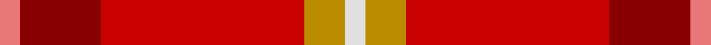
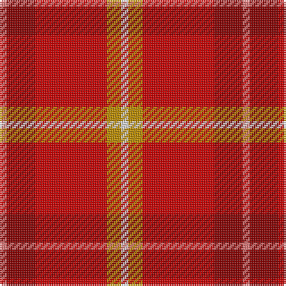

This page is one **sett** — a single exact thread-count. It belongs to the [tartan](/tartans/rii1ri4r10lo2w1/)
(the same proportion at any scale), whose colour order is pattern [RRRYW](/stripes/rrryw/).

Sourced from tartans-authority.  It is a [5 stripe tartan](/stripes/stripes5/).

Original link http://www.tartansauthority.com/tartan-ferret/display/10521/

## Register references

External register numbers recorded for this tartan.

- Scottish Register of Tartans: [10521](https://www.tartanregister.gov.uk/tartanDetails?ref=10521)
- Scottish Tartans Authority (ITI): 10521

## Thread count
LR/4 DR16 R40 DY8 LN/4

## Palette

Palette: <strong>Tartan Register</strong>
<table><thead><tr><th>Colour</th><th>Threads</th><th>Shade</th><th>Base</th><th>OKLCh</th></tr></thead><tbody><tr><td>LR/</td><td style="text-align:right;font-variant-numeric:tabular-nums">4</td><td><code style="background-color:#E87878;">#E87878</code> <small style="color:#888">#E87878</small></td><td>R <code style="background-color:#CC0000;">#CC0000</code></td><td><small style="color:#888">oklch(70.0% 0.139 21.2)</small></td></tr><tr><td>DR</td><td style="text-align:right;font-variant-numeric:tabular-nums">16</td><td><code style="background-color:#880000;">#880000</code> <small style="color:#888">#880000</small></td><td>R <code style="background-color:#CC0000;">#CC0000</code></td><td><small style="color:#888">oklch(39.4% 0.162 29.2)</small></td></tr><tr><td>R</td><td style="text-align:right;font-variant-numeric:tabular-nums">40</td><td><code style="background-color:#C80000;">#C80000</code> <small style="color:#888">#C80000</small></td><td>R <code style="background-color:#CC0000;">#CC0000</code></td><td><small style="color:#888">oklch(52.3% 0.215 29.2)</small></td></tr><tr><td>DY</td><td style="text-align:right;font-variant-numeric:tabular-nums">8</td><td><code style="background-color:#BC8C00;">#BC8C00</code> <small style="color:#888">#BC8C00</small></td><td>Y <code style="background-color:#F2BF00;">#F2BF00</code></td><td><small style="color:#888">oklch(66.8% 0.137 84.1)</small></td></tr><tr><td>LN/</td><td style="text-align:right;font-variant-numeric:tabular-nums">4</td><td><code style="background-color:#E0E0E0;">#E0E0E0</code> <small style="color:#888">#E0E0E0</small></td><td>W <code style="background-color:#F7F7F7;">#F7F7F7</code></td><td><small style="color:#888">oklch(90.7% 0.000 89.9)</small></td></tr></tbody></table>

# Sample pattern

## Nearest tartans

The nearest existing variants by ΔTartan distance, with this tartan at the top so the swatches line up against it.

ΔTartan

Tartan

Sett

—

<a href="/ttd/edit/#slug=rii1ri4r10lo2w1~x4">Love (Fashion)</a> <a class="nn-out" href="/setts/s5/rii1ri4r10lo2w1~x4/" title="open its dictionary page">↗</a>

1.48

<a href="/ttd/edit/#slug=m1dp4r10o2w1~x4">Love</a> <a class="nn-out" href="/setts/s5/m1dp4r10o2w1~x4/" title="open its dictionary page">↗</a>

1.67

<a href="/ttd/edit/#slug=r3ly2r18db8w1ri18r2~x2">Barbour - Cardinal Red</a> <a class="nn-out" href="/setts/s7/r3ly2r18db8w1ri18r2~x2/" title="open its dictionary page">↗</a>

1.86

<a href="/ttd/edit/#slug=do5r21lo21w2db1~x2">Haughey (2015)</a> <a class="nn-out" href="/setts/s5/do5r21lo21w2db1~x2/" title="open its dictionary page">↗</a>

1.87

<a href="/ttd/edit/#slug=r58n12r5y28r7lo5~x2">Cairn O'Mount (Personal)</a> <a class="nn-out" href="/setts/s6/r58n12r5y28r7lo5~x2/" title="open its dictionary page">↗</a>

1.99

<a href="/ttd/edit/#slug=k7w2dg2o31r35lo2~x2">Mason (Personal)</a> <a class="nn-out" href="/setts/s6/k7w2dg2o31r35lo2~x2/" title="open its dictionary page">↗</a>

2.07

<a href="/ttd/edit/#slug=r2do2r20y13lg3db5r2r4o2~x2">Flowers of the Forest, The</a> <a class="nn-out" href="/setts/s9/r2do2r20y13lg3db5r2r4o2~x2/" title="open its dictionary page">↗</a>

2.08

<a href="/ttd/edit/#slug=r10dg4ri1w1t1~x6">Staves (Personal)</a> <a class="nn-out" href="/setts/s5/r10dg4ri1w1t1~x6/" title="open its dictionary page">↗</a>

2.11

<a href="/ttd/edit/#slug=r10dg4ri1w1t1~x2">Staves (Personal)</a> <a class="nn-out" href="/setts/s5/r10dg4ri1w1t1~x2/" title="open its dictionary page">↗</a>

2.13

<a href="/ttd/edit/#slug=rii26ri5m12ly1g1r3~x2">Roseate Sunrise</a> <a class="nn-out" href="/setts/s6/rii26ri5m12ly1g1r3~x2/" title="open its dictionary page">↗</a>

2.14

<a href="/ttd/edit/#slug=r33k8dy12g12r8dy2r8~x2">Tipperary, County</a> <a class="nn-out" href="/setts/s7/r33k8dy12g12r8dy2r8~x2/" title="open its dictionary page">↗</a>

## Neighbour map

Every grey dot is one of 14359 variants placed by the first two principal components of the ΔTartan feature space (44% of its variance). Red is this tartan; blue dots are its nearest — click one to open its page.

<svg viewBox="0 0 640 380" role="img" style="max-width:100%;height:auto;border:1px solid #e0e0e0;border-radius:4px;display:block" xmlns="http://www.w3.org/2000/svg"><image href="/nn/cloud.v1.png" width="640" height="380"/><a href="/setts/s5/m1dp4r10o2w1~x4/"><circle cx="324.8" cy="196.2" r="4" fill="#3465a4"><title>Love</title></circle></a><a href="/setts/s7/r3ly2r18db8w1ri18r2~x2/"><circle cx="304.0" cy="162.7" r="4" fill="#3465a4"><title>Barbour - Cardinal Red</title></circle></a><a href="/setts/s5/do5r21lo21w2db1~x2/"><circle cx="301.0" cy="162.3" r="4" fill="#3465a4"><title>Haughey (2015)</title></circle></a><a href="/setts/s6/r58n12r5y28r7lo5~x2/"><circle cx="426.8" cy="215.9" r="4" fill="#3465a4"><title>Cairn O'Mount (Personal)</title></circle></a><a href="/setts/s6/k7w2dg2o31r35lo2~x2/"><circle cx="304.0" cy="150.5" r="4" fill="#3465a4"><title>Mason (Personal)</title></circle></a><a href="/setts/s9/r2do2r20y13lg3db5r2r4o2~x2/"><circle cx="290.2" cy="154.2" r="4" fill="#3465a4"><title>Flowers of the Forest, The</title></circle></a><a href="/setts/s5/r10dg4ri1w1t1~x6/"><circle cx="327.1" cy="175.3" r="4" fill="#3465a4"><title>Staves (Personal)</title></circle></a><a href="/setts/s5/r10dg4ri1w1t1~x2/"><circle cx="326.2" cy="174.8" r="4" fill="#3465a4"><title>Staves (Personal)</title></circle></a><a href="/setts/s6/rii26ri5m12ly1g1r3~x2/"><circle cx="349.7" cy="122.6" r="4" fill="#3465a4"><title>Roseate Sunrise</title></circle></a><a href="/setts/s7/r33k8dy12g12r8dy2r8~x2/"><circle cx="361.4" cy="194.0" r="4" fill="#3465a4"><title>Tipperary, County</title></circle></a><circle cx="347.7" cy="197.1" r="5" fill="#c00000"/></svg>

ID: /setts/s5/rii1ri4r10lo2w1~x4/
