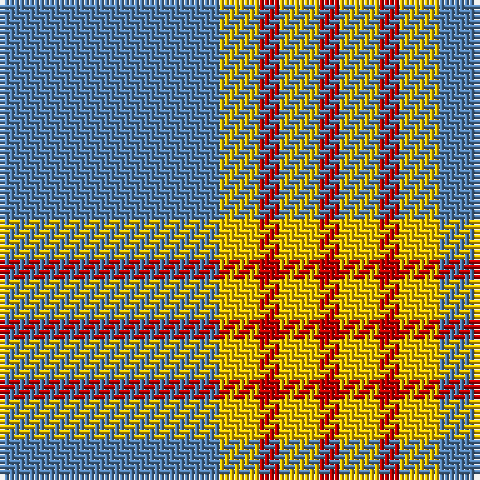

In pattern [BYRYR](/stripes/byryr/).

This was sourced from weddslist.  It is a [5 stripe tartan](/stripes/stripes5/).

Original link http://www.weddslist.com/cgi-bin/tartans/pg.pl?source=sts

## Thread count
B/44 Y8 R4 Y8 R/4

## Palette
Each colour and the base-6 reference it is a variant of.

| Colour | Shade | Base |
|---|---|---|
| B | <code style="background-color:#5480B0;">#5480B0</code> `oklch(58.8% 0.089 251.5)` <small>#5480B0</small> | B <code style="background-color:#2A418A;">#2A418A</code> |
| R | <code style="background-color:#C00000;">#C00000</code> `oklch(50.7% 0.208 29.2)` <small>#C00000</small> | R <code style="background-color:#CC0000;">#CC0000</code> |
| Y | <code style="background-color:#F0C000;">#F0C000</code> `oklch(82.7% 0.169 90.5)` <small>#F0C000</small> | Y <code style="background-color:#F2BF00;">#F2BF00</code> |

# Sample pattern

## Nearest tartans

The nearest existing variants by ΔTartan distance, with this tartan at the top so the swatches line up against it.

ΔTartan

Tartan

Sett

—

<a href="/ttd/edit/#slug=t11ly2r1ly2r1~x4">Carlisle, Ancient</a> <a class="nn-out" href="/setts/s5/t11ly2r1ly2r1~x4/" title="open its dictionary page">↗</a>

0.81

<a href="/ttd/edit/#slug=ly5n1ly1n12r1~x8">Ceredigion (Personal)</a> <a class="nn-out" href="/setts/s5/ly5n1ly1n12r1~x8/" title="open its dictionary page">↗</a>

1.26

<a href="/ttd/edit/#slug=lo72dt16w9dt4w5dt16~x2">Machair</a> <a class="nn-out" href="/setts/s6/lo72dt16w9dt4w5dt16~x2/" title="open its dictionary page">↗</a>

1.29

<a href="/ttd/edit/#slug=lo38w9lo3do9w3~x2">Loch Tummel Trade Tartan Tartan Number: 1751. Earliest known date: pre 2003 Nothing See products available Copyright © Blair Urquhart, Comrie, 2015</a> <a class="nn-out" href="/setts/s5/lo38w9lo3do9w3~x2/" title="open its dictionary page">↗</a>

1.45

<a href="/ttd/edit/#slug=n62w11k4lg17~x2">Thunderlord (Corporate)</a> <a class="nn-out" href="/setts/s4/n62w11k4lg17~x2/" title="open its dictionary page">↗</a>

1.51

<a href="/ttd/edit/#slug=t11ly5k1ly2r1ly2t11~x12">Carlisle</a> <a class="nn-out" href="/setts/s7/t11ly5k1ly2r1ly2t11~x12/" title="open its dictionary page">↗</a>

1.54

<a href="/ttd/edit/#slug=t50dr4t12dr23ly4dr4~x2">Sligo</a> <a class="nn-out" href="/setts/s6/t50dr4t12dr23ly4dr4~x2/" title="open its dictionary page">↗</a>

1.61

<a href="/ttd/edit/#slug=lg50r4lg12ly23r4g4~x2">Ingenico</a> <a class="nn-out" href="/setts/s6/lg50r4lg12ly23r4g4~x2/" title="open its dictionary page">↗</a>

1.65

<a href="/ttd/edit/#slug=b11lo2r1lo2r1~x4">Carlisle Ancient</a> <a class="nn-out" href="/setts/s5/b11lo2r1lo2r1~x4/" title="open its dictionary page">↗</a>

1.67

<a href="/ttd/edit/#slug=k10t30g3t3g3t3r6~x2">Kinding (Personal)</a> <a class="nn-out" href="/setts/s7/k10t30g3t3g3t3r6~x2/" title="open its dictionary page">↗</a>

1.68

<a href="/ttd/edit/#slug=n6lb2n25lb25n2lb6~x2">Erskine, Grey</a> <a class="nn-out" href="/setts/s6/n6lb2n25lb25n2lb6~x2/" title="open its dictionary page">↗</a>

## Neighbour map

Every grey dot is one of 14299 variants placed by the first two principal components of the ΔTartan feature space (44% of its variance). Red is this tartan; blue dots are its nearest — click one to open its page.

<svg viewBox="0 0 640 380" role="img" style="max-width:100%;height:auto;border:1px solid #e0e0e0;border-radius:4px;display:block" xmlns="http://www.w3.org/2000/svg"><image href="/nn/cloud.v1.png" width="640" height="380"/><a href="/setts/s5/ly5n1ly1n12r1~x8/"><circle cx="433.6" cy="218.8" r="4" fill="#3465a4"><title>Ceredigion (Personal)</title></circle></a><a href="/setts/s6/lo72dt16w9dt4w5dt16~x2/"><circle cx="382.0" cy="178.5" r="4" fill="#3465a4"><title>Machair</title></circle></a><a href="/setts/s5/lo38w9lo3do9w3~x2/"><circle cx="409.2" cy="200.0" r="4" fill="#3465a4"><title>Loch Tummel Trade Tartan Tartan Number: 1751. Earliest known date: pre 2003 Nothing See products available Copyright © Blair Urquhart, Comrie, 2015</title></circle></a><a href="/setts/s4/n62w11k4lg17~x2/"><circle cx="403.9" cy="210.8" r="4" fill="#3465a4"><title>Thunderlord (Corporate)</title></circle></a><a href="/setts/s7/t11ly5k1ly2r1ly2t11~x12/"><circle cx="367.0" cy="191.1" r="4" fill="#3465a4"><title>Carlisle</title></circle></a><a href="/setts/s6/t50dr4t12dr23ly4dr4~x2/"><circle cx="400.5" cy="206.8" r="4" fill="#3465a4"><title>Sligo</title></circle></a><a href="/setts/s6/lg50r4lg12ly23r4g4~x2/"><circle cx="388.1" cy="197.5" r="4" fill="#3465a4"><title>Ingenico</title></circle></a><a href="/setts/s5/b11lo2r1lo2r1~x4/"><circle cx="396.5" cy="209.3" r="4" fill="#3465a4"><title>Carlisle Ancient</title></circle></a><a href="/setts/s7/k10t30g3t3g3t3r6~x2/"><circle cx="340.0" cy="185.4" r="4" fill="#3465a4"><title>Kinding (Personal)</title></circle></a><a href="/setts/s6/n6lb2n25lb25n2lb6~x2/"><circle cx="356.8" cy="221.4" r="4" fill="#3465a4"><title>Erskine, Grey</title></circle></a><circle cx="408.1" cy="208.3" r="5" fill="#c00000"/></svg>

ID: /setts/s5/t11ly2r1ly2r1~x4/
