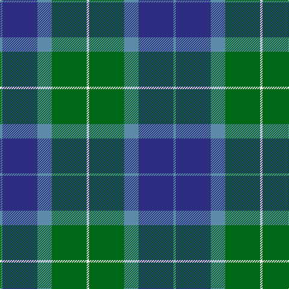

This page is one **sett** — a single exact thread-count. It belongs to the [tartan](/tartans/t2db29t12g29w2/)
(the same proportion at any scale), whose colour order is pattern [BBBGW](/stripes/bbbgw/).

Sourced from tartans-authority.  It is a [5 stripe tartan](/stripes/stripes5/).

Original link http://www.tartansauthority.com/tartan-ferret/display/46/

## Also known as

This cloth is also recorded under:

- Wallace, Blue Wallace

3 attestations — the source records this cloth was collapsed from (oldest owns this page)

<ul>
<li>pre 1985 — Wallace Blue (Fashion) (tartans-authority, <a href="http://www.tartansauthority.com/tartan-ferret/display/46/">record</a>)</li>
<li>undated — Wallace, Blue Wallace (weddslist, <a href="http://www.weddslist.com/cgi-bin/tartans/pg.pl?source=sts">record</a>)</li>
<li>undated — Wallace Blue Clan Tartan Tartan Number: 46. Earliest known date: pre 2003 The design is based on the sett from the Vestiarium Scoticum (1842). See products available Copyright © Blair Urquhart, Comrie, 2015 (house-of-tartan, <a href="http://www.house-of-tartan.scotland.net/house/TartanViewjs.asp?colr=Def&tnam=46">record</a>)</li>
</ul>

## Register references

External register numbers recorded for this tartan.

- Scottish Tartans Authority (ITI): 46

## Thread count
B/4 DB58 B24 G58 W/4

## Palette

Palette: <strong>Tartan Register</strong>
<table><thead><tr><th>Colour</th><th>Threads</th><th>Shade</th><th>Base</th><th>OKLCh</th></tr></thead><tbody><tr><td>B/</td><td style="text-align:right;font-variant-numeric:tabular-nums">4</td><td><code style="background-color:#5C8CA8;">#5C8CA8</code> <small style="color:#888">#5C8CA8</small></td><td>B <code style="background-color:#2A418A;">#2A418A</code></td><td><small style="color:#888">oklch(61.7% 0.067 235.0)</small></td></tr><tr><td>DB</td><td style="text-align:right;font-variant-numeric:tabular-nums">58</td><td><code style="background-color:#2C2C80;">#2C2C80</code> <small style="color:#888">#2C2C80</small></td><td>B <code style="background-color:#2A418A;">#2A418A</code></td><td><small style="color:#888">oklch(35.0% 0.138 276.6)</small></td></tr><tr><td>B</td><td style="text-align:right;font-variant-numeric:tabular-nums">24</td><td><code style="background-color:#5C8CA8;">#5C8CA8</code> <small style="color:#888">#5C8CA8</small></td><td>B <code style="background-color:#2A418A;">#2A418A</code></td><td><small style="color:#888">oklch(61.7% 0.067 235.0)</small></td></tr><tr><td>G</td><td style="text-align:right;font-variant-numeric:tabular-nums">58</td><td><code style="background-color:#006818;">#006818</code> <small style="color:#888">#006818</small></td><td>G <code style="background-color:#006100;">#006100</code></td><td><small style="color:#888">oklch(45.0% 0.142 145.0)</small></td></tr><tr><td>W/</td><td style="text-align:right;font-variant-numeric:tabular-nums">4</td><td><code style="background-color:#F8F8F8;">#F8F8F8</code> <small style="color:#888">#F8F8F8</small></td><td>W <code style="background-color:#F7F7F7;">#F7F7F7</code></td><td><small style="color:#888">oklch(97.9% 0.000 89.9)</small></td></tr></tbody></table>

# Sample pattern

## Nearest tartans

The nearest existing variants by ΔTartan distance, with this tartan at the top so the swatches line up against it.

ΔTartan

Tartan

Sett

—

<a href="/ttd/edit/#slug=t2db29t12g29w2~x2">Wallace Blue (Fashion)</a> <a class="nn-out" href="/setts/s5/t2db29t12g29w2~x2/" title="open its dictionary page">↗</a>

0.76

<a href="/ttd/edit/#slug=r2g23dbi11db22r2~x2">Skibo</a> <a class="nn-out" href="/setts/s5/r2g23dbi11db22r2~x2/" title="open its dictionary page">↗</a>

1.03

<a href="/ttd/edit/#slug=db30k10g10lb2g15lb2~x2">MacRobart (Personal)</a> <a class="nn-out" href="/setts/s6/db30k10g10lb2g15lb2~x2/" title="open its dictionary page">↗</a>

1.05

<a href="/ttd/edit/#slug=r3b25k16b3g25b3~x2">Flower of Scotland</a> <a class="nn-out" href="/setts/s6/r3b25k16b3g25b3~x2/" title="open its dictionary page">↗</a>

1.14

<a href="/ttd/edit/#slug=b32k10g15k2ly4~x2">Rothesay &amp; Caithness Fencibles (Mil)</a> <a class="nn-out" href="/setts/s5/b32k10g15k2ly4~x2/" title="open its dictionary page">↗</a>

1.15

<a href="/ttd/edit/#slug=k3db3g23db21w2~x2">Douglas Clan Tartan Tartan Number: 1032. Earliest known date: 1831 Wilson's sent a list of tartans to Logan about 1830 stating that 'No 148' had been sold as Douglas for a 'considerable' time. Logan included the Douglas tartan even though he said that no family tartans appeared in his book. The distinction between clans and families is obscure. There are many historic references to the 'Border Clans' which would certainly describe the Douglas'. There is also a black and grey sett for the clan which first appeared in the Vestiarium Scoticum in 1842. The present chiefship is vacant on account of the compound surnames of the eligible claimants. Lord Lyon will not recognise 'double barrel' names. See products available Copyright © Blair Urquhart, Comrie, 2015</a> <a class="nn-out" href="/setts/s5/k3db3g23db21w2~x2/" title="open its dictionary page">↗</a>

1.17

<a href="/ttd/edit/#slug=k20db50g50r3k3~x2">Louisville Spaulding (Personal)</a> <a class="nn-out" href="/setts/s5/k20db50g50r3k3~x2/" title="open its dictionary page">↗</a>

1.19

<a href="/ttd/edit/#slug=k2g12k11b12w1~x2">MacKirdy</a> <a class="nn-out" href="/setts/s5/k2g12k11b12w1~x2/" title="open its dictionary page">↗</a>

1.24

<a href="/ttd/edit/#slug=db20k6lo4db3g20w2~x2">DeLoughery (Personal)</a> <a class="nn-out" href="/setts/s6/db20k6lo4db3g20w2~x2/" title="open its dictionary page">↗</a>

1.24

<a href="/setts/s6/b12k4g6ly1~x8/">Sinclair of Ulbster</a>

1.26

<a href="/ttd/edit/#slug=g5mi3g32k16b32m3b5~x2">MacThomas</a> <a class="nn-out" href="/setts/s7/g5mi3g32k16b32m3b5~x2/" title="open its dictionary page">↗</a>

## Neighbour map

Every grey dot is one of 14359 variants placed by the first two principal components of the ΔTartan feature space (44% of its variance). Red is this tartan; blue dots are its nearest — click one to open its page.

<svg viewBox="0 0 640 380" role="img" style="max-width:100%;height:auto;border:1px solid #e0e0e0;border-radius:4px;display:block" xmlns="http://www.w3.org/2000/svg"><image href="/nn/cloud.v1.png" width="640" height="380"/><a href="/setts/s5/r2g23dbi11db22r2~x2/"><circle cx="216.3" cy="232.9" r="4" fill="#3465a4"><title>Skibo</title></circle></a><a href="/setts/s6/db30k10g10lb2g15lb2~x2/"><circle cx="264.1" cy="218.3" r="4" fill="#3465a4"><title>MacRobart (Personal)</title></circle></a><a href="/setts/s6/r3b25k16b3g25b3~x2/"><circle cx="210.3" cy="231.3" r="4" fill="#3465a4"><title>Flower of Scotland</title></circle></a><a href="/setts/s5/b32k10g15k2ly4~x2/"><circle cx="276.6" cy="209.4" r="4" fill="#3465a4"><title>Rothesay &amp; Caithness Fencibles (Mil)</title></circle></a><a href="/setts/s5/k3db3g23db21w2~x2/"><circle cx="258.5" cy="213.5" r="4" fill="#3465a4"><title>Douglas Clan Tartan Tartan Number: 1032. Earliest known date: 1831 Wilson's sent a list of tartans to Logan about 1830 stating that 'No 148' had been sold as Douglas for a 'considerable' time. Logan included the Douglas tartan even though he said that no family tartans appeared in his book. The distinction between clans and families is obscure. There are many historic references to the 'Border Clans' which would certainly describe the Douglas'. There is also a black and grey sett for the clan which first appeared in the Vestiarium Scoticum in 1842. The present chiefship is vacant on account of the compound surnames of the eligible claimants. Lord Lyon will not recognise 'double barrel' names. See products available Copyright © Blair Urquhart, Comrie, 2015</title></circle></a><a href="/setts/s5/k20db50g50r3k3~x2/"><circle cx="255.5" cy="221.7" r="4" fill="#3465a4"><title>Louisville Spaulding (Personal)</title></circle></a><a href="/setts/s5/k2g12k11b12w1~x2/"><circle cx="179.2" cy="234.0" r="4" fill="#3465a4"><title>MacKirdy</title></circle></a><a href="/setts/s6/db20k6lo4db3g20w2~x2/"><circle cx="206.6" cy="204.1" r="4" fill="#3465a4"><title>DeLoughery (Personal)</title></circle></a><a href="/setts/s6/b12k4g6ly1~x8/"><circle cx="192.0" cy="240.6" r="4" fill="#3465a4"><title>Sinclair of Ulbster</title></circle></a><a href="/setts/s7/g5mi3g32k16b32m3b5~x2/"><circle cx="212.1" cy="199.6" r="4" fill="#3465a4"><title>MacThomas</title></circle></a><circle cx="248.9" cy="224.0" r="5" fill="#c00000"/></svg>

ID: /setts/s5/t2db29t12g29w2~x2/
