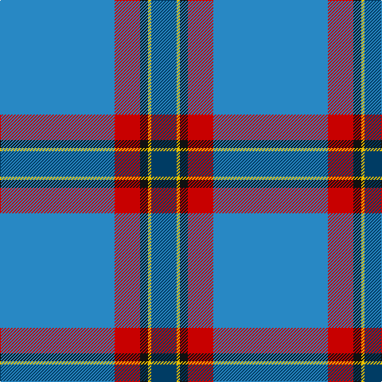

This page is one **sett** — a single exact thread-count. It belongs to the [tartan](/tartans/t72r16k5ly2dt16/)
(the same proportion at any scale), whose colour order is pattern [BRKYB](/stripes/brkyb/).

Sourced from register-of-tartans.  It is a [5 stripe tartan](/stripes/stripes5/).

Original link https://www.tartanregister.gov.uk/tartanDetails.aspx?ref=4107

## Also known as

This cloth is also recorded under:

- Thomas, Jean Marc

2 attestations — the source records this cloth was collapsed from (oldest owns this page)

<ul>
<li>01/01/2005 — Thomas, Jean Marc (Personal) (register-of-tartans, <a href="https://www.tartanregister.gov.uk/tartanDetails.aspx?ref=4107">record</a>)</li>
<li>2005 — Thomas, Jean Marc (Personal) (tartans-authority, <a href="http://www.tartansauthority.com/tartan-ferret/display/6990/">record</a>)</li>
</ul>

## Register references

External register numbers recorded for this tartan.

- Scottish Register of Tartans: [4107](https://www.tartanregister.gov.uk/tartanDetails.aspx?ref=4107)
- Scottish Tartans Authority (ITI): 6990

## Thread count
B/144 R32 K10 Y4 DB/32

## Palette

Palette: <strong>Tartan Register</strong>
<table><thead><tr><th>Colour</th><th>Threads</th><th>Shade</th><th>Base</th><th>OKLCh</th></tr></thead><tbody><tr><td>B/</td><td style="text-align:right;font-variant-numeric:tabular-nums">144</td><td><code style="background-color:#2888C4;">#2888C4</code> <small style="color:#888">#2888C4</small></td><td>B <code style="background-color:#2A418A;">#2A418A</code></td><td><small style="color:#888">oklch(60.1% 0.125 241.5)</small></td></tr><tr><td>R</td><td style="text-align:right;font-variant-numeric:tabular-nums">32</td><td><code style="background-color:#C80000;">#C80000</code> <small style="color:#888">#C80000</small></td><td>R <code style="background-color:#CC0000;">#CC0000</code></td><td><small style="color:#888">oklch(52.3% 0.215 29.2)</small></td></tr><tr><td>K</td><td style="text-align:right;font-variant-numeric:tabular-nums">10</td><td><code style="background-color:#101010;">#101010</code> <small style="color:#888">#101010</small></td><td>K <code style="background-color:#000000;">#000000</code></td><td><small style="color:#888">oklch(17.3% 0.000 89.9)</small></td></tr><tr><td>Y</td><td style="text-align:right;font-variant-numeric:tabular-nums">4</td><td><code style="background-color:#E8C000;">#E8C000</code> <small style="color:#888">#E8C000</small></td><td>Y <code style="background-color:#F2BF00;">#F2BF00</code></td><td><small style="color:#888">oklch(81.9% 0.168 93.7)</small></td></tr><tr><td>DB/</td><td style="text-align:right;font-variant-numeric:tabular-nums">32</td><td><code style="background-color:#003C64;">#003C64</code> <small style="color:#888">#003C64</small></td><td>B <code style="background-color:#2A418A;">#2A418A</code></td><td><small style="color:#888">oklch(34.5% 0.089 246.0)</small></td></tr></tbody></table>

# Sample pattern

## Nearest tartans

The nearest existing variants by ΔTartan distance, with this tartan at the top so the swatches line up against it.

ΔTartan

Tartan

Sett

—

<a href="/ttd/edit/#slug=t72r16k5ly2dt16~x2">Thomas, Jean Marc (Personal)</a> <a class="nn-out" href="/setts/s5/t72r16k5ly2dt16~x2/" title="open its dictionary page">↗</a>

1.23

<a href="/ttd/edit/#slug=r2db19n6b44lb2~x2">World Fed. of Bldg Contractors (Corp</a> <a class="nn-out" href="/setts/s5/r2db19n6b44lb2~x2/" title="open its dictionary page">↗</a>

1.33

<a href="/ttd/edit/#slug=r2t21r2db6ly1r1~x4">Lauder Primary School (Corporate)</a> <a class="nn-out" href="/setts/s6/r2t21r2db6ly1r1~x4/" title="open its dictionary page">↗</a>

1.43

<a href="/ttd/edit/#slug=lb5dy6w2g7w2b44w2~x2">Leblant-Macqueron (Personal)</a> <a class="nn-out" href="/setts/s7/lb5dy6w2g7w2b44w2~x2/" title="open its dictionary page">↗</a>

1.48

<a href="/ttd/edit/#slug=k2db36g12w3r2~x2">Cleland</a> <a class="nn-out" href="/setts/s5/k2db36g12w3r2~x2/" title="open its dictionary page">↗</a>

1.50

<a href="/ttd/edit/#slug=k2w1o8r1t28r2~x2">Norris Hunting</a> <a class="nn-out" href="/setts/s6/k2w1o8r1t28r2~x2/" title="open its dictionary page">↗</a>

1.55

<a href="/ttd/edit/#slug=k2n36g12w3r2~x2">Cleland</a> <a class="nn-out" href="/setts/s5/k2n36g12w3r2~x2/" title="open its dictionary page">↗</a>

1.56

<a href="/ttd/edit/#slug=lg25r1ly1n9w4~x2">Tailor Ishida, Kobe</a> <a class="nn-out" href="/setts/s5/lg25r1ly1n9w4~x2/" title="open its dictionary page">↗</a>

1.57

<a href="/ttd/edit/#slug=t20dp3db7ly1~x4">Peacock (Samantha)</a> <a class="nn-out" href="/setts/s4/t20dp3db7ly1~x4/" title="open its dictionary page">↗</a>

1.57

<a href="/ttd/edit/#slug=lg25r1g1n9w4~x2">Tailor Ishida, Kobe</a> <a class="nn-out" href="/setts/s5/lg25r1g1n9w4~x2/" title="open its dictionary page">↗</a>

1.60

<a href="/ttd/edit/#slug=t28dt15r2dt2w1dt6~x2">Corries</a> <a class="nn-out" href="/setts/s6/t28dt15r2dt2w1dt6~x2/" title="open its dictionary page">↗</a>

## Neighbour map

Every grey dot is one of 14359 variants placed by the first two principal components of the ΔTartan feature space (44% of its variance). Red is this tartan; blue dots are its nearest — click one to open its page.

<svg viewBox="0 0 640 380" role="img" style="max-width:100%;height:auto;border:1px solid #e0e0e0;border-radius:4px;display:block" xmlns="http://www.w3.org/2000/svg"><image href="/nn/cloud.v1.png" width="640" height="380"/><a href="/setts/s5/r2db19n6b44lb2~x2/"><circle cx="370.3" cy="170.8" r="4" fill="#3465a4"><title>World Fed. of Bldg Contractors (Corp</title></circle></a><a href="/setts/s6/r2t21r2db6ly1r1~x4/"><circle cx="413.6" cy="165.4" r="4" fill="#3465a4"><title>Lauder Primary School (Corporate)</title></circle></a><a href="/setts/s7/lb5dy6w2g7w2b44w2~x2/"><circle cx="398.8" cy="138.3" r="4" fill="#3465a4"><title>Leblant-Macqueron (Personal)</title></circle></a><a href="/setts/s5/k2db36g12w3r2~x2/"><circle cx="387.3" cy="169.2" r="4" fill="#3465a4"><title>Cleland</title></circle></a><a href="/setts/s6/k2w1o8r1t28r2~x2/"><circle cx="453.3" cy="152.0" r="4" fill="#3465a4"><title>Norris Hunting</title></circle></a><a href="/setts/s5/k2n36g12w3r2~x2/"><circle cx="406.0" cy="177.9" r="4" fill="#3465a4"><title>Cleland</title></circle></a><a href="/setts/s5/lg25r1ly1n9w4~x2/"><circle cx="390.2" cy="161.8" r="4" fill="#3465a4"><title>Tailor Ishida, Kobe</title></circle></a><a href="/setts/s4/t20dp3db7ly1~x4/"><circle cx="420.9" cy="213.2" r="4" fill="#3465a4"><title>Peacock (Samantha)</title></circle></a><a href="/setts/s5/lg25r1g1n9w4~x2/"><circle cx="391.7" cy="163.5" r="4" fill="#3465a4"><title>Tailor Ishida, Kobe</title></circle></a><a href="/setts/s6/t28dt15r2dt2w1dt6~x2/"><circle cx="381.4" cy="178.9" r="4" fill="#3465a4"><title>Corries</title></circle></a><circle cx="410.6" cy="146.2" r="5" fill="#c00000"/></svg>

ID: /setts/s5/t72r16k5ly2dt16~x2/
