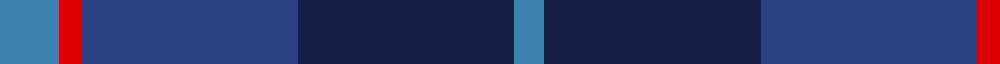
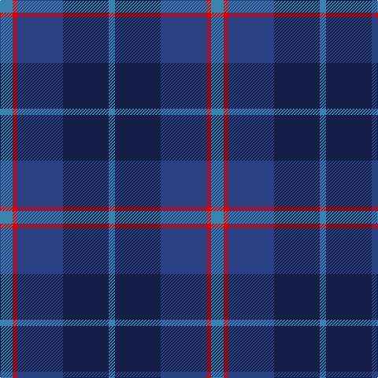

This page is one **sett** — a single exact thread-count. It belongs to the [tartan](/tartans/b8r3ba29db29b4/)
(the same proportion at any scale), whose colour order is pattern [BBBRB](/stripes/bbbrb/).

Sourced from register-of-tartans.  It is a [5 stripe tartan](/stripes/stripes5/).

Original link https://www.tartanregister.gov.uk/tartanDetails.aspx?ref=409

## Register references

External register numbers recorded for this tartan.

- Scottish Register of Tartans: [409](https://www.tartanregister.gov.uk/tartanDetails.aspx?ref=409)
- Scottish Tartans World Register: 2216

## Thread count
B/16 R6 Ba58 DB58 B/8

## Palette
Each colour and the base-6 reference it is a variant of.

| Colour | Shade | Base |
|---|---|---|
| B | <code style="background-color:#3C82AF;">#3C82AF</code> `oklch(58.1% 0.099 239.8)` <small>#3C82AF</small> | B <code style="background-color:#2A418A;">#2A418A</code> |
| Ba | <code style="background-color:#2C4084;">#2C4084</code> `oklch(39.4% 0.117 268.3)` <small>#2C4084</small> | B <code style="background-color:#2A418A;">#2A418A</code> |
| DB | <code style="background-color:#141E46;">#141E46</code> `oklch(25.2% 0.076 269.7)` <small>#141E46</small> | B <code style="background-color:#2A418A;">#2A418A</code> |
| R | <code style="background-color:#DC0000;">#DC0000</code> `oklch(56.2% 0.230 29.2)` <small>#DC0000</small> | R <code style="background-color:#CC0000;">#CC0000</code> |

# Sample pattern

## Nearest tartans

The nearest existing variants by ΔTartan distance, with this tartan at the top so the swatches line up against it.

ΔTartan

Tartan

Sett

—

<a href="/ttd/edit/#slug=t8r3db29db29t4~x2">Bryson</a> <a class="nn-out" href="/setts/s5/t8r3db29db29t4~x2/" title="open its dictionary page">↗</a>

1.07

<a href="/ttd/edit/#slug=t8o4db30dt30r3dt4~x2">Hutchesons' Grammar (Corporate)</a> <a class="nn-out" href="/setts/s6/t8o4db30dt30r3dt4~x2/" title="open its dictionary page">↗</a>

1.40

<a href="/ttd/edit/#slug=db21k10dt8r3~x2">Rangers 1989 (Sports)</a> <a class="nn-out" href="/setts/s4/db21k10dt8r3~x2/" title="open its dictionary page">↗</a>

1.44

<a href="/ttd/edit/#slug=db7db2db25db10g21db2~x2">Sugiyama</a> <a class="nn-out" href="/setts/s6/db7db2db25db10g21db2~x2/" title="open its dictionary page">↗</a>

1.46

<a href="/ttd/edit/#slug=n9db1n1db1n1db7dg7r2~x4">Caledonian Hotel (Corporate)</a> <a class="nn-out" href="/setts/s8/n9db1n1db1n1db7dg7r2~x4/" title="open its dictionary page">↗</a>

1.49

<a href="/ttd/edit/#slug=r2y23db11b22r2~x2">Skibo (Corporate)</a> <a class="nn-out" href="/setts/s5/r2y23db11b22r2~x2/" title="open its dictionary page">↗</a>

1.53

<a href="/ttd/edit/#slug=dt17o2dt2o2dt2k17db13k4~x2">Balmoral Hotel</a> <a class="nn-out" href="/setts/s8/dt17o2dt2o2dt2k17db13k4~x2/" title="open its dictionary page">↗</a>

1.57

<a href="/ttd/edit/#slug=n6k6n21k16db36ly4">Bareback (Corporate)</a> <a class="nn-out" href="/setts/s6/n6k6n21k16db36ly4/" title="open its dictionary page">↗</a>

1.57

<a href="/ttd/edit/#slug=db12t6db52dt41m12dp6m12">Great Scot (Fashion)</a> <a class="nn-out" href="/setts/s7/db12t6db52dt41m12dp6m12/" title="open its dictionary page">↗</a>

1.60

<a href="/ttd/edit/#slug=g15dt2w2dt11n28dt4~x2">Rhode Island, The State of</a> <a class="nn-out" href="/setts/s6/g15dt2w2dt11n28dt4~x2/" title="open its dictionary page">↗</a>

1.60

<a href="/ttd/edit/#slug=dp9db6w1dg4dp2~x4">Cathro</a> <a class="nn-out" href="/setts/s5/dp9db6w1dg4dp2~x4/" title="open its dictionary page">↗</a>

## Neighbour map

Every grey dot is one of 14299 variants placed by the first two principal components of the ΔTartan feature space (44% of its variance). Red is this tartan; blue dots are its nearest — click one to open its page.

<svg viewBox="0 0 640 380" role="img" style="max-width:100%;height:auto;border:1px solid #e0e0e0;border-radius:4px;display:block" xmlns="http://www.w3.org/2000/svg"><image href="/nn/cloud.v1.png" width="640" height="380"/><a href="/setts/s6/t8o4db30dt30r3dt4~x2/"><circle cx="279.8" cy="227.9" r="4" fill="#3465a4"><title>Hutchesons' Grammar (Corporate)</title></circle></a><a href="/setts/s4/db21k10dt8r3~x2/"><circle cx="301.5" cy="303.3" r="4" fill="#3465a4"><title>Rangers 1989 (Sports)</title></circle></a><a href="/setts/s6/db7db2db25db10g21db2~x2/"><circle cx="345.6" cy="267.2" r="4" fill="#3465a4"><title>Sugiyama</title></circle></a><a href="/setts/s8/n9db1n1db1n1db7dg7r2~x4/"><circle cx="256.2" cy="235.2" r="4" fill="#3465a4"><title>Caledonian Hotel (Corporate)</title></circle></a><a href="/setts/s5/r2y23db11b22r2~x2/"><circle cx="291.0" cy="268.0" r="4" fill="#3465a4"><title>Skibo (Corporate)</title></circle></a><a href="/setts/s8/dt17o2dt2o2dt2k17db13k4~x2/"><circle cx="260.1" cy="248.1" r="4" fill="#3465a4"><title>Balmoral Hotel</title></circle></a><a href="/setts/s6/n6k6n21k16db36ly4/"><circle cx="233.0" cy="240.3" r="4" fill="#3465a4"><title>Bareback (Corporate)</title></circle></a><a href="/setts/s7/db12t6db52dt41m12dp6m12/"><circle cx="285.4" cy="238.5" r="4" fill="#3465a4"><title>Great Scot (Fashion)</title></circle></a><a href="/setts/s6/g15dt2w2dt11n28dt4~x2/"><circle cx="299.5" cy="222.8" r="4" fill="#3465a4"><title>Rhode Island, The State of</title></circle></a><a href="/setts/s5/dp9db6w1dg4dp2~x4/"><circle cx="288.1" cy="263.5" r="4" fill="#3465a4"><title>Cathro</title></circle></a><circle cx="283.7" cy="262.1" r="5" fill="#c00000"/></svg>

ID: /setts/s5/t8r3db29db29t4~x2/
