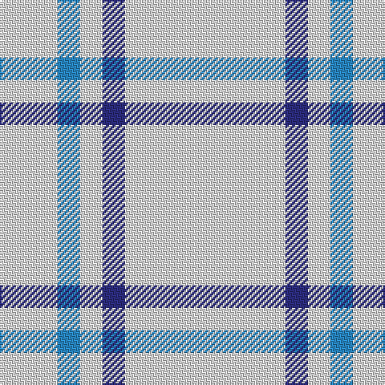

In pattern [WBWBW](/patterns/wbwbw/).

This was sourced from tartans-authority.  It is a [5 stripes tartan](/stripes/stripes5/).

Original link http://www.tartansauthority.com/tartan-ferret/display/8135/

## Thread count
LN/36 B14 LN14 DB14 LN/100

## Palette
Each colour and its ΔE from the base-6 reference it is a variant of.

| Colour | Shade | Base | ΔE (OKLab) |
|---|---|---|---|
| B | <code style="background-color:#2888C4;">#2888C4</code> `#2888C4` | B <code style="background-color:#2A418A;">#2A418A</code> | 0.21 |
| DB | <code style="background-color:#2C2C80;">#2C2C80</code> `#2C2C80` | B <code style="background-color:#2A418A;">#2A418A</code> | 0.06 |
| LN | <code style="background-color:#E0E0E0;">#E0E0E0</code> `#E0E0E0` | W <code style="background-color:#F7F7F7;">#F7F7F7</code> | 0.07 |

# Sample pattern

## Nearest tartans

The nearest existing variants by ΔTartan distance.

1. [Young in Australia](/setts/s4/w162g12y16g16-g23321b-we8ddcb-ye0a126/) — ΔT 2.09
1. [Asahi (Estimated threadcount)](/setts/s5/w90b4w8b30w14-b1474b4-we0e0e0/) — ΔT 2.21
1. [Loevenstein Castle #2](/setts/s4/y80b4y16b12-b00008c-yb0b0b0/) — ΔT 2.28
1. [The Poulain League](/setts/s5/y12b76k6b76y12-b8080d0-k000000-yf0c000/) — ΔT 2.28
1. [Lochnagar](/setts/s6/w4b4g28g16g4w4-b800080-g808080-we0e0e0/) — ΔT 2.44
1. [Butties](/setts/s6/w93y6w13b35w12y6-b3850c8-wffffff-yb0b0b0/) — ΔT 2.46
1. [Guzzo Dress (Personal)](/setts/s8/w20k2w20y5k3w3y4k2-k101010-we0e0e0-ydc943c/) — ΔT 2.47
1. [London Fog Safari (Fashion)](/setts/s6/y20k4w10k8y100b4-b1474b4-k101010-we0e0e0-yb8b8b8/) — ΔT 2.60
1. [London Fog Camel 2 (Fashion)](/setts/s10/y3w2y18b9y18w2y18k9y18w2-b2888c4-k101010-wd4d4c4-yccc0a4/) — ΔT 2.65
1. [Guzzo Dress (Montreal, Canada) (Personal)](/setts/s8/w20k2w20y5k3w3y4k2-k101010-wffffff-yffe600/) — ΔT 2.68

## Neighbour map

Every grey dot is one of 15726 variants placed by the first two principal components of the ΔTartan feature space (44% of its variance). Red is this tartan; blue dots are its nearest — click one to open its page.

<svg viewBox="0 0 640 380" role="img" style="max-width:100%;height:auto;border:1px solid #e0e0e0;border-radius:4px;display:block" xmlns="http://www.w3.org/2000/svg"><image href="/nn/cloud.v1.png" width="640" height="380"/><a href="/setts/s4/w162g12y16g16-g23321b-we8ddcb-ye0a126/"><circle cx="499.8" cy="187.4" r="4" fill="#3465a4"><title>Young in Australia</title></circle></a><a href="/setts/s5/w90b4w8b30w14-b1474b4-we0e0e0/"><circle cx="535.9" cy="197.2" r="4" fill="#3465a4"><title>Asahi (Estimated threadcount)</title></circle></a><a href="/setts/s4/y80b4y16b12-b00008c-yb0b0b0/"><circle cx="603.3" cy="216.7" r="4" fill="#3465a4"><title>Loevenstein Castle #2</title></circle></a><a href="/setts/s5/y12b76k6b76y12-b8080d0-k000000-yf0c000/"><circle cx="542.6" cy="226.1" r="4" fill="#3465a4"><title>The Poulain League</title></circle></a><a href="/setts/s6/w4b4g28g16g4w4-b800080-g808080-we0e0e0/"><circle cx="527.1" cy="251.5" r="4" fill="#3465a4"><title>Lochnagar</title></circle></a><a href="/setts/s6/w93y6w13b35w12y6-b3850c8-wffffff-yb0b0b0/"><circle cx="424.0" cy="165.3" r="4" fill="#3465a4"><title>Butties</title></circle></a><a href="/setts/s8/w20k2w20y5k3w3y4k2-k101010-we0e0e0-ydc943c/"><circle cx="402.2" cy="177.8" r="4" fill="#3465a4"><title>Guzzo Dress (Personal)</title></circle></a><a href="/setts/s6/y20k4w10k8y100b4-b1474b4-k101010-we0e0e0-yb8b8b8/"><circle cx="552.5" cy="139.6" r="4" fill="#3465a4"><title>London Fog Safari (Fashion)</title></circle></a><a href="/setts/s10/y3w2y18b9y18w2y18k9y18w2-b2888c4-k101010-wd4d4c4-yccc0a4/"><circle cx="395.4" cy="195.0" r="4" fill="#3465a4"><title>London Fog Camel 2 (Fashion)</title></circle></a><a href="/setts/s8/w20k2w20y5k3w3y4k2-k101010-wffffff-yffe600/"><circle cx="387.7" cy="169.7" r="4" fill="#3465a4"><title>Guzzo Dress (Montreal, Canada) (Personal)</title></circle></a><circle cx="516.5" cy="230.8" r="5" fill="#c00000"/></svg>

ID: /setts/s5/w100b14w14ba14w36-b2c2c80-ba2888c4-we0e0e0/
