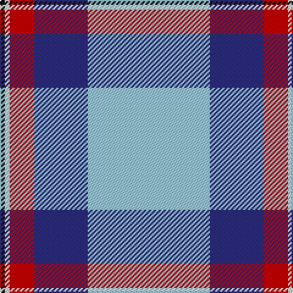

In pattern [KWRBW](/patterns/kwrbw/).

This was sourced from tartans-authority.  It is a [5 stripes tartan](/stripes/stripes5/).

Original link http://www.tartansauthority.com/tartan-ferret/display/10420/

## Thread count
K/4 LN4 R20 DB44 LB/100

## Palette
Each colour and its ΔE from the base-6 reference it is a variant of.

| Colour | Shade | Base | ΔE (OKLab) |
|---|---|---|---|
| DB | <code style="background-color:#2C2C80;">#2C2C80</code> `#2C2C80` | B <code style="background-color:#2C4084;">#2C4084</code> | 0.05 |
| K | <code style="background-color:#101010;">#101010</code> `#101010` | K <code style="background-color:#000000;">#000000</code> | 0.17 |
| LB | <code style="background-color:#98C8E8;">#98C8E8</code> `#98C8E8` | W <code style="background-color:#F4F4F0;">#F4F4F0</code> | 0.17 |
| LN | <code style="background-color:#E0E0E0;">#E0E0E0</code> `#E0E0E0` | W <code style="background-color:#F4F4F0;">#F4F4F0</code> | 0.06 |
| R | <code style="background-color:#C80000;">#C80000</code> `#C80000` | R <code style="background-color:#C80000;">#C80000</code> | 0.00 |

# Sample pattern

## Nearest tartans

The nearest existing variants by ΔTartan distance.

1. [Mount Vernon Primary School](/setts/s5/w100b44r20wa4k4-b000080-k101010-rff0000-w87ceeb-waffffff/) — ΔT 0.59
1. [Jack Sinclair (Personal)](/setts/s7/b8r4b80k22g4w32r4-b6495ed-g006818-k101010-rcc1100-wf8f8f8/) — ΔT 0.97
1. [Gothenburg/Goteborg](/setts/s7/b52w56b28y6k2y4k2-b2c4084-k101010-we0e0e0-ye8c000/) — ΔT 1.27
1. [Kinloch of Loch Awe (Personal)](/setts/s5/w36r58b4ba6k2-b2888c4-ba780078-k101010-r888888-wf8f8f8/) — ΔT 1.32
1. [Gothenburg](/setts/s7/b52w56b28y6k2y4k2-b3850c8-k101010-we0e0e0-ye8c000/) — ΔT 1.36
1. [Prehospital EMS (Corporate)](/setts/s5/k4w28y28b64ya4-b4444bc-k101010-we0e0e0-yd48428-yae8c000/) — ΔT 1.36
1. [Herriot (New Zealand) (Name)](/setts/s6/w15y2b5ya3ba40b10-b003c64-ba64809c-we0e0e0-ye8c000-yaa0a0a0/) — ΔT 1.42
1. [Tartan Lassie (Fashion)](/setts/s6/w6b46y88b52g8ya4-b444890-g248814-we0e0e0-yeca0a0-yae8c000/) — ΔT 1.46
1. [Herriot New Zealand](/setts/s6/w15y2k5wa3b40k10-b006699-k000033-wffffff-wac0c0c0-yffff33/) — ΔT 1.52
1. [Cornish, National Day](/setts/s5/k10w4y72b94r6-b8080d0-k000000-rc00000-we0e0e0-yf0c000/) — ΔT 1.55

## Neighbour map

Every grey dot is one of 15726 variants placed by the first two principal components of the ΔTartan feature space (44% of its variance). Red is this tartan; blue dots are its nearest — click one to open its page.

<svg viewBox="0 0 640 380" role="img" style="max-width:100%;height:auto;border:1px solid #e0e0e0;border-radius:4px;display:block" xmlns="http://www.w3.org/2000/svg"><image href="/nn/cloud.v1.png" width="640" height="380"/><a href="/setts/s5/w100b44r20wa4k4-b000080-k101010-rff0000-w87ceeb-waffffff/"><circle cx="298.0" cy="134.0" r="4" fill="#3465a4"><title>Mount Vernon Primary School</title></circle></a><a href="/setts/s7/b8r4b80k22g4w32r4-b6495ed-g006818-k101010-rcc1100-wf8f8f8/"><circle cx="283.7" cy="120.0" r="4" fill="#3465a4"><title>Jack Sinclair (Personal)</title></circle></a><a href="/setts/s7/b52w56b28y6k2y4k2-b2c4084-k101010-we0e0e0-ye8c000/"><circle cx="306.1" cy="133.4" r="4" fill="#3465a4"><title>Gothenburg/Goteborg</title></circle></a><a href="/setts/s5/w36r58b4ba6k2-b2888c4-ba780078-k101010-r888888-wf8f8f8/"><circle cx="322.4" cy="132.0" r="4" fill="#3465a4"><title>Kinloch of Loch Awe (Personal)</title></circle></a><a href="/setts/s7/b52w56b28y6k2y4k2-b3850c8-k101010-we0e0e0-ye8c000/"><circle cx="310.3" cy="134.5" r="4" fill="#3465a4"><title>Gothenburg</title></circle></a><a href="/setts/s5/k4w28y28b64ya4-b4444bc-k101010-we0e0e0-yd48428-yae8c000/"><circle cx="235.1" cy="164.0" r="4" fill="#3465a4"><title>Prehospital EMS (Corporate)</title></circle></a><a href="/setts/s6/w15y2b5ya3ba40b10-b003c64-ba64809c-we0e0e0-ye8c000-yaa0a0a0/"><circle cx="291.5" cy="150.8" r="4" fill="#3465a4"><title>Herriot (New Zealand) (Name)</title></circle></a><a href="/setts/s6/w6b46y88b52g8ya4-b444890-g248814-we0e0e0-yeca0a0-yae8c000/"><circle cx="288.4" cy="148.8" r="4" fill="#3465a4"><title>Tartan Lassie (Fashion)</title></circle></a><a href="/setts/s6/w15y2k5wa3b40k10-b006699-k000033-wffffff-wac0c0c0-yffff33/"><circle cx="248.2" cy="138.6" r="4" fill="#3465a4"><title>Herriot New Zealand</title></circle></a><a href="/setts/s5/k10w4y72b94r6-b8080d0-k000000-rc00000-we0e0e0-yf0c000/"><circle cx="286.6" cy="135.9" r="4" fill="#3465a4"><title>Cornish, National Day</title></circle></a><circle cx="312.7" cy="136.6" r="5" fill="#c00000"/></svg>

ID: /setts/s5/w100b44r20wa4k4-b2c2c80-k101010-rc80000-w98c8e8-wae0e0e0/
