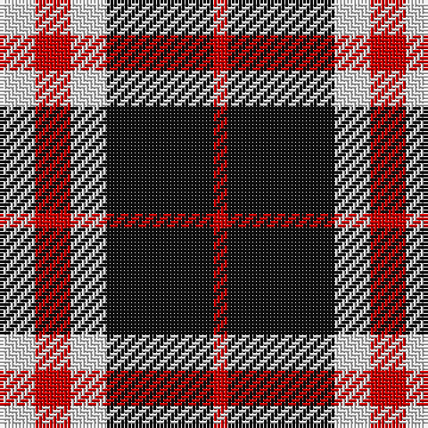

In pattern [RKWRW](/patterns/rkwrw/).

This was sourced from tartans-authority.  It is a [5 stripes tartan](/stripes/stripes5/).

Original link http://www.tartansauthority.com/tartan-ferret/display/7670/

## Thread count
LN/10 R10 LN10 K30 R/4

## Palette
Each colour and its ΔE from the base-6 reference it is a variant of.

| Colour | Shade | Base | ΔE (OKLab) |
|---|---|---|---|
| K | <code style="background-color:#101010;">#101010</code> `#101010` | K <code style="background-color:#000000;">#000000</code> | 0.17 |
| LN | <code style="background-color:#E0E0E0;">#E0E0E0</code> `#E0E0E0` | W <code style="background-color:#F7F7F7;">#F7F7F7</code> | 0.07 |
| R | <code style="background-color:#C80000;">#C80000</code> `#C80000` | R <code style="background-color:#CC0000;">#CC0000</code> | 0.01 |

# Sample pattern

## Nearest tartans

The nearest existing variants by ΔTartan distance.

1. [Braes High School Falkirk](/setts/s5/w10r10w10k30r4-k101010-rc80000-wffffff/) — ΔT 0.29
1. [Rocket Dog (Fashion)](/setts/s7/k9r9k25w30k5w5r7-k101010-rc80000-wf0e4cc/) — ΔT 0.95
1. [Wcwm 759-3](/setts/s6/w10r68k48r8ra48r8-k000000-r8c8c8c-ra8c0000-wc8c8c8/) — ΔT 1.18
1. [Meg Merrilees Fancy Tartan Tartan Number: 1602. Earliest known date: 1831 Miss McDougall, Inverness library, says in her notes:The first mention I had of this tartan was in an advertisment by D MacDougall, Draper, 27 High St., Inverness in 1831 . . . Meg Merrilees and other winter shawls. From Dalgety Archives. STS notes that it was sold by Forsyth's in Glasgow in 1840. Meg Merrilees was a character in one of Scotts novels, Guy Mannering. BU See products available Copyright © Blair Urquhart, Comrie, 2015](/setts/s6/w46b12w12r10k70r20-b2c2c80-k101010-rc80000-we0e0e0/) — ΔT 1.21
1. [Ikelman No 2](/setts/s5/g52k20r20y20g6-g808080-k000000-rc00000-yf0c000/) — ΔT 1.24
1. [Thom(p)son camel](/setts/s6/r8ra60k12w26k26w6-k000000-rc00000-ra806050-we0e0e0/) — ΔT 1.24
1. [Meg, Merrilees](/setts/s6/w46b12w12r10k70r20-b304080-k000000-rc00000-we0e0e0/) — ΔT 1.30
1. [Dunoon Irish](/setts/s4/w12g78r78w12-g003820-rb84c00-wfcfcfc/) — ΔT 1.30
1. [Merrilees](/setts/s6/w46b12w12r10k70r20-b5c8ca8-k101010-rc80000-wf8f8f8/) — ΔT 1.30
1. [Burberry, Check](/setts/s5/k24w24k24r84ra8-k000000-r906030-rac00000-we0e0e0/) — ΔT 1.31

## Neighbour map

Every grey dot is one of 15726 variants placed by the first two principal components of the ΔTartan feature space (44% of its variance). Red is this tartan; blue dots are its nearest — click one to open its page.

<svg viewBox="0 0 640 380" role="img" style="max-width:100%;height:auto;border:1px solid #e0e0e0;border-radius:4px;display:block" xmlns="http://www.w3.org/2000/svg"><image href="/nn/cloud.v1.png" width="640" height="380"/><a href="/setts/s5/w10r10w10k30r4-k101010-rc80000-wffffff/"><circle cx="208.9" cy="227.9" r="4" fill="#3465a4"><title>Braes High School Falkirk</title></circle></a><a href="/setts/s7/k9r9k25w30k5w5r7-k101010-rc80000-wf0e4cc/"><circle cx="188.8" cy="218.0" r="4" fill="#3465a4"><title>Rocket Dog (Fashion)</title></circle></a><a href="/setts/s6/w10r68k48r8ra48r8-k000000-r8c8c8c-ra8c0000-wc8c8c8/"><circle cx="189.6" cy="203.8" r="4" fill="#3465a4"><title>Wcwm 759-3</title></circle></a><a href="/setts/s6/w46b12w12r10k70r20-b2c2c80-k101010-rc80000-we0e0e0/"><circle cx="161.4" cy="200.3" r="4" fill="#3465a4"><title>Meg Merrilees Fancy Tartan Tartan Number: 1602. Earliest known date: 1831 Miss McDougall, Inverness library, says in her notes:The first mention I had of this tartan was in an advertisment by D MacDougall, Draper, 27 High St., Inverness in 1831 . . . Meg Merrilees and other winter shawls. From Dalgety Archives. STS notes that it was sold by Forsyth's in Glasgow in 1840. Meg Merrilees was a character in one of Scotts novels, Guy Mannering. BU See products available Copyright © Blair Urquhart, Comrie, 2015</title></circle></a><a href="/setts/s5/g52k20r20y20g6-g808080-k000000-rc00000-yf0c000/"><circle cx="200.0" cy="217.9" r="4" fill="#3465a4"><title>Ikelman No 2</title></circle></a><a href="/setts/s6/r8ra60k12w26k26w6-k000000-rc00000-ra806050-we0e0e0/"><circle cx="183.4" cy="189.7" r="4" fill="#3465a4"><title>Thom(p)son camel</title></circle></a><a href="/setts/s6/w46b12w12r10k70r20-b304080-k000000-rc00000-we0e0e0/"><circle cx="157.2" cy="202.0" r="4" fill="#3465a4"><title>Meg, Merrilees</title></circle></a><a href="/setts/s4/w12g78r78w12-g003820-rb84c00-wfcfcfc/"><circle cx="233.9" cy="251.6" r="4" fill="#3465a4"><title>Dunoon Irish</title></circle></a><a href="/setts/s6/w46b12w12r10k70r20-b5c8ca8-k101010-rc80000-wf8f8f8/"><circle cx="156.1" cy="196.8" r="4" fill="#3465a4"><title>Merrilees</title></circle></a><a href="/setts/s5/k24w24k24r84ra8-k000000-r906030-rac00000-we0e0e0/"><circle cx="239.3" cy="199.3" r="4" fill="#3465a4"><title>Burberry, Check</title></circle></a><circle cx="214.3" cy="231.3" r="5" fill="#c00000"/></svg>

ID: /setts/s5/w10r10w10k30r4-k101010-rc80000-we0e0e0/
