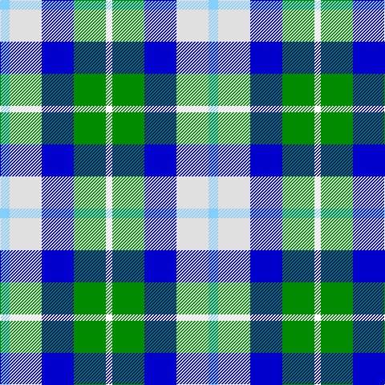

In pattern [KGBWW](/patterns/kgbww/).

This was sourced from register-of-tartans.  It is a [5 stripes tartan](/stripes/stripes5/).

Original link https://www.tartanregister.gov.uk/tartanDetails.aspx?ref=2771

## Thread count
LB/12 LN40 B40 G40 R/8

## Palette
Each colour and its ΔE from the base-6 reference it is a variant of.

| Colour | Shade | Base | ΔE (OKLab) |
|---|---|---|---|
| B | <code style="background-color:#0000CD;">#0000CD</code> `#0000CD` | B <code style="background-color:#2A418A;">#2A418A</code> | 0.14 |
| G | <code style="background-color:#008B00;">#008B00</code> `#008B00` | G <code style="background-color:#006100;">#006100</code> | 0.13 |
| LB | <code style="background-color:#82CFFD;">#82CFFD</code> `#82CFFD` | W <code style="background-color:#F7F7F7;">#F7F7F7</code> | 0.18 |
| LN | <code style="background-color:#E0E0E0;">#E0E0E0</code> `#E0E0E0` | W <code style="background-color:#F7F7F7;">#F7F7F7</code> | 0.07 |

# Sample pattern

## Nearest tartans

The nearest existing variants by ΔTartan distance.

1. [MacTeddy](/setts/s5/b12w40ba40g40r8-b5c8ca8-ba2c2c80-g207810-rc80000-we0e0e0/) — ΔT 1.18
1. [Crinnion (Middlesbrough) (Personal)](/setts/s5/b12k4w12ba16y12-b275edc-ba761ca0-k101010-wd1d5cd-y0bb43f/) — ΔT 1.62
1. [Loch Leven Check Trade Tartan Tartan Number: 108. Earliest known date: 1976 Sample presented by Clan Crest Textiles Ltd in 1976. See products available Copyright © Blair Urquhart, Comrie, 2015](/setts/s6/b4g26b22ba8w18b4-b2c2c80-ba5c8ca8-g006818-we0e0e0/) — ΔT 1.68
1. [Unidentified (Winterbottom)](/setts/s6/b26w26b8y4g16r6-b2c2c80-g006818-rc80000-we0e0e0-yd4c028/) — ΔT 1.72
1. [Loch Leven](/setts/s6/b4g26b22ga8w18b4-b1474b4-g006818-ga789484-wfcfcfc/) — ΔT 1.74
1. [Sirrell (2014)](/setts/s6/b38w40ba36r4k14wa30-b5c8ca8-ba14283c-k101010-rc80000-wfcfcfc-wa98c8e8/) — ΔT 1.80
1. [Business Air](/setts/s8/b8y4b32ba30g32w6g6w8-b8080d0-ba000050-g008000-we0e0e0-yf0c000/) — ΔT 1.81
1. [Blue Boy, The](/setts/s7/b4g28b28ba8w24b4w4-b000064-ba00008c-g007800-wffffff/) — ΔT 1.83
1. [Blue Boy, The (Fashion)](/setts/s7/b4g28b28ba8w24b4w4-b000064-ba00008c-g007800-wfcfcfc/) — ΔT 1.84
1. [MacNeil of Barra (Clan)](/setts/s6/w12b56k48g48k8y12-b1474b4-g006818-k101010-wfcfcfc-ye8c000/) — ΔT 1.85

## Neighbour map

Every grey dot is one of 15726 variants placed by the first two principal components of the ΔTartan feature space (44% of its variance). Red is this tartan; blue dots are its nearest — click one to open its page.

<svg viewBox="0 0 640 380" role="img" style="max-width:100%;height:auto;border:1px solid #e0e0e0;border-radius:4px;display:block" xmlns="http://www.w3.org/2000/svg"><image href="/nn/cloud.v1.png" width="640" height="380"/><a href="/setts/s5/b12w40ba40g40r8-b5c8ca8-ba2c2c80-g207810-rc80000-we0e0e0/"><circle cx="50.3" cy="238.5" r="4" fill="#3465a4"><title>MacTeddy</title></circle></a><a href="/setts/s5/b12k4w12ba16y12-b275edc-ba761ca0-k101010-wd1d5cd-y0bb43f/"><circle cx="14.0" cy="269.4" r="4" fill="#3465a4"><title>Crinnion (Middlesbrough) (Personal)</title></circle></a><a href="/setts/s6/b4g26b22ba8w18b4-b2c2c80-ba5c8ca8-g006818-we0e0e0/"><circle cx="128.5" cy="232.1" r="4" fill="#3465a4"><title>Loch Leven Check Trade Tartan Tartan Number: 108. Earliest known date: 1976 Sample presented by Clan Crest Textiles Ltd in 1976. See products available Copyright © Blair Urquhart, Comrie, 2015</title></circle></a><a href="/setts/s6/b26w26b8y4g16r6-b2c2c80-g006818-rc80000-we0e0e0-yd4c028/"><circle cx="111.2" cy="207.1" r="4" fill="#3465a4"><title>Unidentified (Winterbottom)</title></circle></a><a href="/setts/s6/b4g26b22ga8w18b4-b1474b4-g006818-ga789484-wfcfcfc/"><circle cx="128.8" cy="232.5" r="4" fill="#3465a4"><title>Loch Leven</title></circle></a><a href="/setts/s6/b38w40ba36r4k14wa30-b5c8ca8-ba14283c-k101010-rc80000-wfcfcfc-wa98c8e8/"><circle cx="14.0" cy="185.5" r="4" fill="#3465a4"><title>Sirrell (2014)</title></circle></a><a href="/setts/s8/b8y4b32ba30g32w6g6w8-b8080d0-ba000050-g008000-we0e0e0-yf0c000/"><circle cx="90.9" cy="181.0" r="4" fill="#3465a4"><title>Business Air</title></circle></a><a href="/setts/s7/b4g28b28ba8w24b4w4-b000064-ba00008c-g007800-wffffff/"><circle cx="112.0" cy="202.9" r="4" fill="#3465a4"><title>Blue Boy, The</title></circle></a><a href="/setts/s7/b4g28b28ba8w24b4w4-b000064-ba00008c-g007800-wfcfcfc/"><circle cx="112.5" cy="203.2" r="4" fill="#3465a4"><title>Blue Boy, The (Fashion)</title></circle></a><a href="/setts/s6/w12b56k48g48k8y12-b1474b4-g006818-k101010-wfcfcfc-ye8c000/"><circle cx="82.6" cy="214.6" r="4" fill="#3465a4"><title>MacNeil of Barra (Clan)</title></circle></a><circle cx="29.6" cy="236.4" r="5" fill="#c00000"/></svg>

ID: /setts/s5/w12wa40b40g40k8-b0000cd-g008b00-k000000-w82cffd-wae0e0e0/
