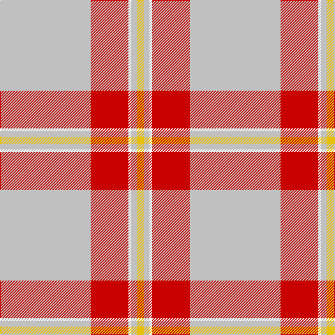

In pattern [WRWWY](/patterns/wrwwy/).

This was sourced from register-of-tartans.  It is a [5 stripes tartan](/stripes/stripes5/).

Original link https://www.tartanregister.gov.uk/tartanDetails.aspx?ref=3320

## Attestations

This cloth appears in 2 source records; the oldest owns this page.

- 01/01/1982 — Perry Arisaid (Personal) (register-of-tartans, [record](https://www.tartanregister.gov.uk/tartanDetails.aspx?ref=3320))
- 1982 — Perry Arisaid (Personal) (tartans-authority, [record](http://www.tartansauthority.com/tartan-ferret/display/1304/))

## Thread count
N/130 R54 W4 N8 Y/10

## Palette
Each colour and its ΔE from the base-6 reference it is a variant of.

| Colour | Shade | Base | ΔE (OKLab) |
|---|---|---|---|
| N | <code style="background-color:#C0C0C0;">#C0C0C0</code> `#C0C0C0` | W <code style="background-color:#F7F7F7;">#F7F7F7</code> | 0.17 |
| R | <code style="background-color:#C80000;">#C80000</code> `#C80000` | R <code style="background-color:#CC0000;">#CC0000</code> | 0.01 |
| W | <code style="background-color:#FCFCFC;">#FCFCFC</code> `#FCFCFC` | W <code style="background-color:#F7F7F7;">#F7F7F7</code> | 0.01 |
| Y | <code style="background-color:#E8C000;">#E8C000</code> `#E8C000` | Y <code style="background-color:#F2BF00;">#F2BF00</code> | 0.02 |

# Sample pattern

## Nearest tartans

The nearest existing variants by ΔTartan distance.

1. [Unidentified Fisherwife's Plaid](/setts/s7/w160b2r28b18r48w4r8-b3c82af-rdc0000-we0e0e0/) — ΔT 1.75
1. [Unidentified, Fisherwife's Plaid](/setts/s7/w160b2r28b18r48w4r8-b5480b0-rc00000-we0e0e0/) — ΔT 1.84
1. [Perry, Arisaid](/setts/s5/g130r54w4g8y10-g808080-rc00000-we0e0e0-yf0c000/) — ΔT 1.88
1. [Loch Skene (Fashion)](/setts/s10/w96g30y4g6w4g6ya24w16g4w12-g604000-we8ccb8-yfcb464-yaa08858/) — ΔT 1.89
1. [MacGregor Dress Red (Dance)](/setts/s6/w104r44w12r16k2b6-b2c2c80-k101010-rc80000-wf8f8f8/) — ΔT 1.93
1. [Hoa Sen](/setts/s8/y16k4r46k2r34k2g8w6-g007800-k101010-re87878-wffffff-yffe600/) — ΔT 1.93
1. [Young, Christina](/setts/s6/w108k14r14y12ya8r2-k101010-rc80000-we0e0e0-yd87c00-yae8c000/) — ΔT 1.99
1. [Gairloch (Fashion)](/setts/s8/w48w2g18w2w18w4g4k4-g808080-k101010-we0e0e0/) — ΔT 2.00
1. [McBrayer Dress](/setts/s8/w114k2r24w2g24r28w2r4-g508844-k101010-rc80000-wf4e0c8/) — ΔT 2.01
1. [Unidentified, Ross-shire](/setts/s8/w150r2ra36g18r2ra54w4ra10-g008000-r806050-rac00000-we0e0e0/) — ΔT 2.09

## Neighbour map

Every grey dot is one of 15726 variants placed by the first two principal components of the ΔTartan feature space (44% of its variance). Red is this tartan; blue dots are its nearest — click one to open its page.

<svg viewBox="0 0 640 380" role="img" style="max-width:100%;height:auto;border:1px solid #e0e0e0;border-radius:4px;display:block" xmlns="http://www.w3.org/2000/svg"><image href="/nn/cloud.v1.png" width="640" height="380"/><a href="/setts/s7/w160b2r28b18r48w4r8-b3c82af-rdc0000-we0e0e0/"><circle cx="436.7" cy="103.3" r="4" fill="#3465a4"><title>Unidentified Fisherwife's Plaid</title></circle></a><a href="/setts/s7/w160b2r28b18r48w4r8-b5480b0-rc00000-we0e0e0/"><circle cx="430.4" cy="102.3" r="4" fill="#3465a4"><title>Unidentified, Fisherwife's Plaid</title></circle></a><a href="/setts/s5/g130r54w4g8y10-g808080-rc00000-we0e0e0-yf0c000/"><circle cx="508.0" cy="170.7" r="4" fill="#3465a4"><title>Perry, Arisaid</title></circle></a><a href="/setts/s10/w96g30y4g6w4g6ya24w16g4w12-g604000-we8ccb8-yfcb464-yaa08858/"><circle cx="388.6" cy="108.9" r="4" fill="#3465a4"><title>Loch Skene (Fashion)</title></circle></a><a href="/setts/s6/w104r44w12r16k2b6-b2c2c80-k101010-rc80000-wf8f8f8/"><circle cx="405.2" cy="95.6" r="4" fill="#3465a4"><title>MacGregor Dress Red (Dance)</title></circle></a><a href="/setts/s8/y16k4r46k2r34k2g8w6-g007800-k101010-re87878-wffffff-yffe600/"><circle cx="384.7" cy="114.5" r="4" fill="#3465a4"><title>Hoa Sen</title></circle></a><a href="/setts/s6/w108k14r14y12ya8r2-k101010-rc80000-we0e0e0-yd87c00-yae8c000/"><circle cx="415.0" cy="74.9" r="4" fill="#3465a4"><title>Young, Christina</title></circle></a><a href="/setts/s8/w48w2g18w2w18w4g4k4-g808080-k101010-we0e0e0/"><circle cx="463.3" cy="131.9" r="4" fill="#3465a4"><title>Gairloch (Fashion)</title></circle></a><a href="/setts/s8/w114k2r24w2g24r28w2r4-g508844-k101010-rc80000-wf4e0c8/"><circle cx="391.0" cy="76.5" r="4" fill="#3465a4"><title>McBrayer Dress</title></circle></a><a href="/setts/s8/w150r2ra36g18r2ra54w4ra10-g008000-r806050-rac00000-we0e0e0/"><circle cx="378.2" cy="78.5" r="4" fill="#3465a4"><title>Unidentified, Ross-shire</title></circle></a><circle cx="461.4" cy="143.7" r="5" fill="#c00000"/></svg>

ID: /setts/s5/w130r54wa4w8y10-rc80000-wc0c0c0-wafcfcfc-ye8c000/
