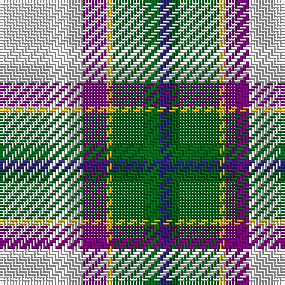

In pattern [BGYBW](/stripes/bgybw/).

This was sourced from register-of-tartans.  It is a [5 stripe tartan](/stripes/stripes5/).

Original link https://www.tartanregister.gov.uk/tartanDetails.aspx?ref=2820

## Register references

External register numbers recorded for this tartan.

- Scottish Register of Tartans: [2820](https://www.tartanregister.gov.uk/tartanDetails.aspx?ref=2820)
- Scottish Tartans Authority (ITI): 200
- Scottish Tartans World Register: 200

## Thread count
LN/28 P8 Y2 G16 DB/4

## Palette
Each colour and the base-6 reference it is a variant of.

| Colour | Shade | Base |
|---|---|---|
| DB | <code style="background-color:#2C2C80;">#2C2C80</code> `oklch(35.0% 0.138 276.6)` <small>#2C2C80</small> | B <code style="background-color:#2A418A;">#2A418A</code> |
| G | <code style="background-color:#006818;">#006818</code> `oklch(45.0% 0.142 145.0)` <small>#006818</small> | G <code style="background-color:#006100;">#006100</code> |
| LN | <code style="background-color:#E0E0E0;">#E0E0E0</code> `oklch(90.7% 0.000 89.9)` <small>#E0E0E0</small> | W <code style="background-color:#F7F7F7;">#F7F7F7</code> |
| P | <code style="background-color:#780078;">#780078</code> `oklch(40.2% 0.185 328.4)` <small>#780078</small> | B <code style="background-color:#2A418A;">#2A418A</code> |
| Y | <code style="background-color:#E8C000;">#E8C000</code> `oklch(81.9% 0.168 93.7)` <small>#E8C000</small> | Y <code style="background-color:#F2BF00;">#F2BF00</code> |

# Sample pattern

## Nearest tartans

The nearest existing variants by ΔTartan distance, with this tartan at the top so the swatches line up against it.

ΔTartan

Tartan

Sett

—

<a href="/ttd/edit/#slug=w14dp4ly1g8db2~x2">Manx Laxey Dress Green</a> <a class="nn-out" href="/setts/s5/w14dp4ly1g8db2~x2/" title="open its dictionary page">↗</a>

0.59

<a href="/ttd/edit/#slug=db2w14p4ly1g8db2~x2">Manx Laxey, dress green</a> <a class="nn-out" href="/setts/s6/db2w14p4ly1g8db2~x2/" title="open its dictionary page">↗</a>

0.88

<a href="/ttd/edit/#slug=w8g5dp10t24w30g2lp2~x2">Shiel, Purple V2 (Dance)</a> <a class="nn-out" href="/setts/s7/w8g5dp10t24w30g2lp2~x2/" title="open its dictionary page">↗</a>

0.89

<a href="/ttd/edit/#slug=g4w28p8ly2db17g4~x2">Manx, dress</a> <a class="nn-out" href="/setts/s6/g4w28p8ly2db17g4~x2/" title="open its dictionary page">↗</a>

1.07

<a href="/ttd/edit/#slug=w8g5t10dp24w30g2lp2~x2">Shiel, Purple (Dance)</a> <a class="nn-out" href="/setts/s7/w8g5t10dp24w30g2lp2~x2/" title="open its dictionary page">↗</a>

1.09

<a href="/ttd/edit/#slug=w8b5t10dp24w30b2dg2~x2">Shiel, Magenta (Dance)</a> <a class="nn-out" href="/setts/s7/w8b5t10dp24w30b2dg2~x2/" title="open its dictionary page">↗</a>

1.10

<a href="/ttd/edit/#slug=r3w33dp8dg18r9g3~x2">MacKintosh Dress (Dance)</a> <a class="nn-out" href="/setts/s6/r3w33dp8dg18r9g3~x2/" title="open its dictionary page">↗</a>

1.11

<a href="/ttd/edit/#slug=t8w28lo3g3t8k9t4~x2">MacTavish of Dunardry (Clan)</a> <a class="nn-out" href="/setts/s7/t8w28lo3g3t8k9t4~x2/" title="open its dictionary page">↗</a>

1.13

<a href="/ttd/edit/#slug=n8w28o3g3n8k9n4~x2">MacTavish of Dunardry Dress</a> <a class="nn-out" href="/setts/s7/n8w28o3g3n8k9n4~x2/" title="open its dictionary page">↗</a>

1.13

<a href="/ttd/edit/#slug=g4w28dp8ly2db17g4~x2">Manx Dress</a> <a class="nn-out" href="/setts/s6/g4w28dp8ly2db17g4~x2/" title="open its dictionary page">↗</a>

1.17

<a href="/ttd/edit/#slug=g4w28db14ly2t17g4~x2">Allanton Dress (Fashion)</a> <a class="nn-out" href="/setts/s6/g4w28db14ly2t17g4~x2/" title="open its dictionary page">↗</a>

## Neighbour map

Every grey dot is one of 14299 variants placed by the first two principal components of the ΔTartan feature space (44% of its variance). Red is this tartan; blue dots are its nearest — click one to open its page.

<svg viewBox="0 0 640 380" role="img" style="max-width:100%;height:auto;border:1px solid #e0e0e0;border-radius:4px;display:block" xmlns="http://www.w3.org/2000/svg"><image href="/nn/cloud.v1.png" width="640" height="380"/><a href="/setts/s6/db2w14p4ly1g8db2~x2/"><circle cx="187.5" cy="152.3" r="4" fill="#3465a4"><title>Manx Laxey, dress green</title></circle></a><a href="/setts/s7/w8g5dp10t24w30g2lp2~x2/"><circle cx="208.7" cy="144.4" r="4" fill="#3465a4"><title>Shiel, Purple V2 (Dance)</title></circle></a><a href="/setts/s6/g4w28p8ly2db17g4~x2/"><circle cx="184.6" cy="151.6" r="4" fill="#3465a4"><title>Manx, dress</title></circle></a><a href="/setts/s7/w8g5t10dp24w30g2lp2~x2/"><circle cx="198.8" cy="137.3" r="4" fill="#3465a4"><title>Shiel, Purple (Dance)</title></circle></a><a href="/setts/s7/w8b5t10dp24w30b2dg2~x2/"><circle cx="208.5" cy="140.3" r="4" fill="#3465a4"><title>Shiel, Magenta (Dance)</title></circle></a><a href="/setts/s6/r3w33dp8dg18r9g3~x2/"><circle cx="176.2" cy="158.0" r="4" fill="#3465a4"><title>MacKintosh Dress (Dance)</title></circle></a><a href="/setts/s7/t8w28lo3g3t8k9t4~x2/"><circle cx="177.0" cy="161.3" r="4" fill="#3465a4"><title>MacTavish of Dunardry (Clan)</title></circle></a><a href="/setts/s7/n8w28o3g3n8k9n4~x2/"><circle cx="163.8" cy="152.1" r="4" fill="#3465a4"><title>MacTavish of Dunardry Dress</title></circle></a><a href="/setts/s6/g4w28dp8ly2db17g4~x2/"><circle cx="181.6" cy="150.5" r="4" fill="#3465a4"><title>Manx Dress</title></circle></a><a href="/setts/s6/g4w28db14ly2t17g4~x2/"><circle cx="162.5" cy="163.9" r="4" fill="#3465a4"><title>Allanton Dress (Fashion)</title></circle></a><circle cx="204.4" cy="164.1" r="5" fill="#c00000"/></svg>

ID: /setts/s5/w14dp4ly1g8db2~x2/
