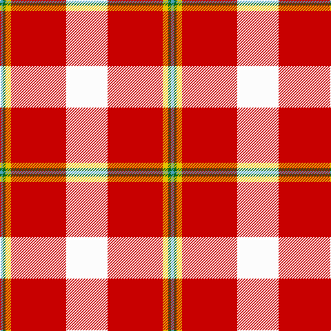

**Bands:** [WRYGY](/stripes/wrygy/) · **Stripes:** [W R LY G LG](/stripes/stripes5/) W R LY G LG

This was sourced from tartans-authority.  It is a [5 band tartan](/bands/bands5/).

Original link http://www.tartansauthority.com/tartan-ferret/display/11001/

## Thread count
B/4 G4 Y8 R80 W/60

## Palette
Each colour and its ΔE from the base-6 reference it is a variant of.

| Colour | Shade | Base | ΔE (OKLab) |
|---|---|---|---|
| B | <code style="background-color:#48A4C0;">#48A4C0</code> `#48A4C0` | Y <code style="background-color:#F2BF00;">#F2BF00</code> | 0.29 |
| G | <code style="background-color:#006818;">#006818</code> `#006818` | G <code style="background-color:#006100;">#006100</code> | 0.02 |
| R | <code style="background-color:#C80000;">#C80000</code> `#C80000` | R <code style="background-color:#CC0000;">#CC0000</code> | 0.01 |
| W | <code style="background-color:#FCFCFC;">#FCFCFC</code> `#FCFCFC` | W <code style="background-color:#F7F7F7;">#F7F7F7</code> | 0.01 |
| Y | <code style="background-color:#E8C000;">#E8C000</code> `#E8C000` | Y <code style="background-color:#F2BF00;">#F2BF00</code> | 0.02 |

# Sample pattern

## Nearest tartans

The nearest existing variants by ΔTartan distance.

1. [Papalia, Special Dress](/setts/s6/o4w2r2r34w37k2~x2/) — ΔT 0.98
1. [Arduaine, Red (Dance)](/setts/s7/w5k2w30r24w3r8dt3~x2/) — ΔT 1.25
1. [Lennox Dress](/setts/s7/r8dp2r24db5w26dy2w8~x2/) — ΔT 1.32
1. [Cunningham Dress](/setts/s7/w5r2w34r34k2r2db4~x2/) — ΔT 1.35
1. [Lennox, dress](/setts/s7/r8p2r24db5w26o2w8~x2/) — ΔT 1.38
1. [Torridon, Cherry (Dance)](/setts/s7/r3r2db2r30w30db2w3~x2/) — ΔT 1.40
1. [MacPherson Dress Red](/setts/s7/w4r2w25r21w3r8ly3~x2/) — ΔT 1.48
1. [Shiel, Claret (Dance)](/setts/s7/w8r5dp10r24w30r2db2~x2/) — ΔT 1.56
1. [Lennox Dress District Tartan Tartan Number: 1649. Earliest known date: 1986 Families with the surname 'Lennox' are usually considered related to Clans Stewart or MacFarlane. Some of this surname also choose to wear the distinctive and ancient 'Lennox' tartan. D W Stewart reproduced the sett from a 'lost' portrait of the Countess of Lennox dating from the 16th century. See products available Copyright © Blair Urquhart, Comrie, 2015](/setts/s7/r8m2r24m5w25dy2w8~x2/) — ΔT 1.61
1. [MacGiboney (Personal)](/setts/s7/r8dp2r24dp5w25dy2w8~x2/) — ΔT 1.64

## Neighbour map

Every grey dot is one of 14313 variants placed by the first two principal components of the ΔTartan feature space (44% of its variance). Red is this tartan; blue dots are its nearest — click one to open its page.

<svg viewBox="0 0 640 380" role="img" style="max-width:100%;height:auto;border:1px solid #e0e0e0;border-radius:4px;display:block" xmlns="http://www.w3.org/2000/svg"><image href="/nn/cloud.v1.png" width="640" height="380"/><a href="/setts/s6/o4w2r2r34w37k2~x2/"><circle cx="265.3" cy="108.6" r="4" fill="#3465a4"><title>Papalia, Special Dress</title></circle></a><a href="/setts/s7/w5k2w30r24w3r8dt3~x2/"><circle cx="297.3" cy="141.1" r="4" fill="#3465a4"><title>Arduaine, Red (Dance)</title></circle></a><a href="/setts/s7/r8dp2r24db5w26dy2w8~x2/"><circle cx="234.7" cy="140.0" r="4" fill="#3465a4"><title>Lennox Dress</title></circle></a><a href="/setts/s7/w5r2w34r34k2r2db4~x2/"><circle cx="288.2" cy="118.0" r="4" fill="#3465a4"><title>Cunningham Dress</title></circle></a><a href="/setts/s7/r8p2r24db5w26o2w8~x2/"><circle cx="233.4" cy="141.4" r="4" fill="#3465a4"><title>Lennox, dress</title></circle></a><a href="/setts/s7/r3r2db2r30w30db2w3~x2/"><circle cx="285.2" cy="126.5" r="4" fill="#3465a4"><title>Torridon, Cherry (Dance)</title></circle></a><a href="/setts/s7/w4r2w25r21w3r8ly3~x2/"><circle cx="289.9" cy="154.5" r="4" fill="#3465a4"><title>MacPherson Dress Red</title></circle></a><a href="/setts/s7/w8r5dp10r24w30r2db2~x2/"><circle cx="212.0" cy="131.0" r="4" fill="#3465a4"><title>Shiel, Claret (Dance)</title></circle></a><a href="/setts/s7/r8m2r24m5w25dy2w8~x2/"><circle cx="254.2" cy="159.0" r="4" fill="#3465a4"><title>Lennox Dress District Tartan Tartan Number: 1649. Earliest known date: 1986 Families with the surname 'Lennox' are usually considered related to Clans Stewart or MacFarlane. Some of this surname also choose to wear the distinctive and ancient 'Lennox' tartan. D W Stewart reproduced the sett from a 'lost' portrait of the Countess of Lennox dating from the 16th century. See products available Copyright © Blair Urquhart, Comrie, 2015</title></circle></a><a href="/setts/s7/r8dp2r24dp5w25dy2w8~x2/"><circle cx="248.8" cy="156.6" r="4" fill="#3465a4"><title>MacGiboney (Personal)</title></circle></a><circle cx="290.2" cy="121.9" r="5" fill="#c00000"/></svg>

ID: /setts/s5/w15r20ly2g1lg1~x4/
