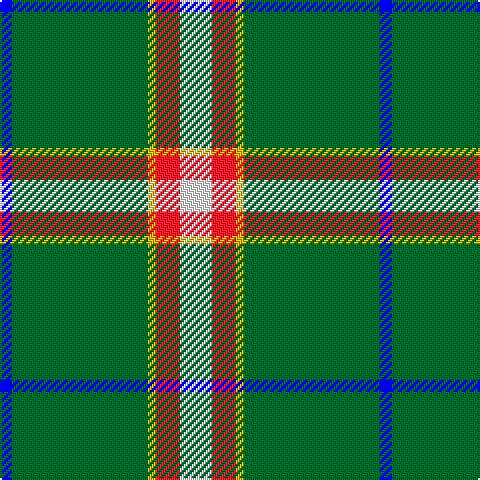

In pattern [BGYRW](/patterns/bgyrw/).

This was sourced from register-of-tartans.  It is a [5 stripes tartan](/stripes/stripes5/).

Original link https://www.tartanregister.gov.uk/tartanDetails.aspx?ref=10314

## Thread count
B/6 G68 Y4 R12 W/16

## Palette
Each colour and its ΔE from the base-6 reference it is a variant of.

| Colour | Shade | Base | ΔE (OKLab) |
|---|---|---|---|
| B | <code style="background-color:#0000FF;">#0000FF</code> `#0000FF` | B <code style="background-color:#2C4084;">#2C4084</code> | 0.21 |
| G | <code style="background-color:#006633;">#006633</code> `#006633` | G <code style="background-color:#006400;">#006400</code> | 0.04 |
| R | <code style="background-color:#E32636;">#E32636</code> `#E32636` | R <code style="background-color:#C80000;">#C80000</code> | 0.07 |
| W | <code style="background-color:#FFFFFF;">#FFFFFF</code> `#FFFFFF` | W <code style="background-color:#F4F4F0;">#F4F4F0</code> | 0.03 |
| Y | <code style="background-color:#EEB422;">#EEB422</code> `#EEB422` | Y <code style="background-color:#E8C000;">#E8C000</code> | 0.03 |

# Sample pattern

## Nearest tartans

The nearest existing variants by ΔTartan distance.

1. [Spencer (2013)](/setts/s6/g110y8b30w6r6w10-b2c2c80-g408060-r880000-wfcfcfc-ye8c000/) — ΔT 1.13
1. [Milling-Kristensen (Personal)](/setts/s5/w16r12y4g68b6-b3068a4-g007460-rc80000-we0e0e0-ybc8c00/) — ΔT 1.19
1. [Scotstown](/setts/s5/y8g68w24b20r4-b1474b4-g005020-rfa4b00-wffffff-ya0a0a0/) — ΔT 1.28
1. [Spencer (2013)](/setts/s6/g110y8b30w6r6w10-b2c2c80-g003c14-rc8002c-wffffff-yffd700/) — ΔT 1.39
1. [Limerick County Crest (Fashion)](/setts/s6/w24k6g100w6k26y12-g006818-k101010-we0e0e0-ybc8c00/) — ΔT 1.46
1. [Green Mountain](/setts/s8/g52r4g6y4g16w40b6w8-b1c0070-g003820-rc80000-we0e0e0-ye8c000/) — ΔT 1.53
1. [Wilson's, No 189](/setts/s4/b8g20w2r2-b800080-g008000-rc00000-we0e0e0/) — ΔT 1.59
1. [Alberta (Province)](/setts/s7/g104k8r8k8b16k8y32-b2474e8-g006818-k101010-re87878-yd8b000/) — ΔT 1.65
1. [Cleland (Name)](/setts/s5/k4g72ga24w6r4-g688898-ga005814-k101010-rc80000-wf8f8f8/) — ΔT 1.67
1. [Hall (P.I.E.) (Personal)](/setts/s8/y10g6y6g106r14b10r26w8-b2c2c80-g006818-r901c38-wf8f8f8-ye8c000/) — ΔT 1.68

## Neighbour map

Every grey dot is one of 15726 variants placed by the first two principal components of the ΔTartan feature space (44% of its variance). Red is this tartan; blue dots are its nearest — click one to open its page.

<svg viewBox="0 0 640 380" role="img" style="max-width:100%;height:auto;border:1px solid #e0e0e0;border-radius:4px;display:block" xmlns="http://www.w3.org/2000/svg"><image href="/nn/cloud.v1.png" width="640" height="380"/><a href="/setts/s6/g110y8b30w6r6w10-b2c2c80-g408060-r880000-wfcfcfc-ye8c000/"><circle cx="370.3" cy="142.2" r="4" fill="#3465a4"><title>Spencer (2013)</title></circle></a><a href="/setts/s5/w16r12y4g68b6-b3068a4-g007460-rc80000-we0e0e0-ybc8c00/"><circle cx="366.6" cy="167.5" r="4" fill="#3465a4"><title>Milling-Kristensen (Personal)</title></circle></a><a href="/setts/s5/y8g68w24b20r4-b1474b4-g005020-rfa4b00-wffffff-ya0a0a0/"><circle cx="253.9" cy="165.0" r="4" fill="#3465a4"><title>Scotstown</title></circle></a><a href="/setts/s6/g110y8b30w6r6w10-b2c2c80-g003c14-rc8002c-wffffff-yffd700/"><circle cx="354.2" cy="140.5" r="4" fill="#3465a4"><title>Spencer (2013)</title></circle></a><a href="/setts/s6/w24k6g100w6k26y12-g006818-k101010-we0e0e0-ybc8c00/"><circle cx="307.0" cy="166.0" r="4" fill="#3465a4"><title>Limerick County Crest (Fashion)</title></circle></a><a href="/setts/s8/g52r4g6y4g16w40b6w8-b1c0070-g003820-rc80000-we0e0e0-ye8c000/"><circle cx="253.7" cy="143.2" r="4" fill="#3465a4"><title>Green Mountain</title></circle></a><a href="/setts/s4/b8g20w2r2-b800080-g008000-rc00000-we0e0e0/"><circle cx="342.9" cy="220.0" r="4" fill="#3465a4"><title>Wilson's, No 189</title></circle></a><a href="/setts/s7/g104k8r8k8b16k8y32-b2474e8-g006818-k101010-re87878-yd8b000/"><circle cx="287.4" cy="151.1" r="4" fill="#3465a4"><title>Alberta (Province)</title></circle></a><a href="/setts/s5/k4g72ga24w6r4-g688898-ga005814-k101010-rc80000-wf8f8f8/"><circle cx="397.9" cy="166.9" r="4" fill="#3465a4"><title>Cleland (Name)</title></circle></a><a href="/setts/s8/y10g6y6g106r14b10r26w8-b2c2c80-g006818-r901c38-wf8f8f8-ye8c000/"><circle cx="342.2" cy="129.9" r="4" fill="#3465a4"><title>Hall (P.I.E.) (Personal)</title></circle></a><circle cx="333.6" cy="153.6" r="5" fill="#c00000"/></svg>

ID: /setts/s5/w16r12y4g68b6-b0000ff-g006633-re32636-wffffff-yeeb422/
