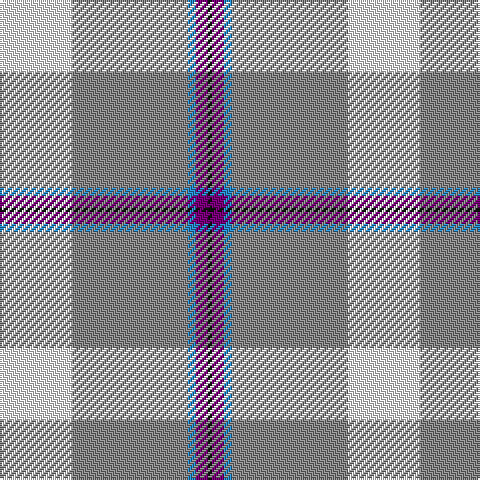

In pattern [KBBRW](/stripes/kbbrw/).

This was sourced from register-of-tartans.  It is a [5 stripe tartan](/stripes/stripes5/).

Original link https://www.tartanregister.gov.uk/tartanDetails.aspx?ref=5340

## Also known as

This cloth is also recorded under:

- Kinloch of Loch Awe

## Attestations

This cloth appears in 2 source records; the oldest owns this page.

- 01/09/2004 — Kinloch of Loch Awe (Personal) (register-of-tartans, [record](https://www.tartanregister.gov.uk/tartanDetails.aspx?ref=5340))
- pre 2005 — Kinloch at Loch Awe (Personal) (tartans-authority, [record](http://www.tartansauthority.com/tartan-ferret/display/6731/))

## Register references

External register numbers recorded for this tartan.

- Scottish Register of Tartans: [5340](https://www.tartanregister.gov.uk/tartanDetails.aspx?ref=5340)
- Scottish Tartans Authority (ITI): 6731
- Scottish Tartans World Register: 3027

## Thread count
W/36 N58 B4 P6 K/2

## Palette
Each colour and the base-6 reference it is a variant of.

| Colour | Shade | Base |
|---|---|---|
| B | <code style="background-color:#2888C4;">#2888C4</code> `oklch(60.1% 0.125 241.5)` <small>#2888C4</small> | B <code style="background-color:#2A418A;">#2A418A</code> |
| K | <code style="background-color:#101010;">#101010</code> `oklch(17.3% 0.000 89.9)` <small>#101010</small> | K <code style="background-color:#000000;">#000000</code> |
| N | <code style="background-color:#888888;">#888888</code> `oklch(62.7% 0.000 89.9)` <small>#888888</small> | R <code style="background-color:#CC0000;">#CC0000</code> |
| Na | <code style="background-color:#A0A0A0;">#A0A0A0</code> `oklch(70.6% 0.000 89.9)` <small>#A0A0A0</small> | Y <code style="background-color:#F2BF00;">#F2BF00</code> |
| P | <code style="background-color:#780078;">#780078</code> `oklch(40.2% 0.185 328.4)` <small>#780078</small> | B <code style="background-color:#2A418A;">#2A418A</code> |
| W | <code style="background-color:#F8F8F8;">#F8F8F8</code> `oklch(97.9% 0.000 89.9)` <small>#F8F8F8</small> | W <code style="background-color:#F7F7F7;">#F7F7F7</code> |

# Sample pattern

## Nearest tartans

The nearest existing variants by ΔTartan distance, with this tartan at the top so the swatches line up against it.

ΔTartan

Tartan

Sett

—

<a href="/ttd/edit/#slug=w18o29t2dp3k1~x2">Kinloch of Loch Awe (Personal)</a> <a class="nn-out" href="/setts/s5/w18o29t2dp3k1~x2/" title="open its dictionary page">↗</a>

0.91

<a href="/ttd/edit/#slug=k5w2ly36b47r3~x2">Cornish, National Day</a> <a class="nn-out" href="/setts/s5/k5w2ly36b47r3~x2/" title="open its dictionary page">↗</a>

1.13

<a href="/ttd/edit/#slug=k5w2ly36t47r3~x2">Oliver Dress Pink</a> <a class="nn-out" href="/setts/s5/k5w2ly36t47r3~x2/" title="open its dictionary page">↗</a>

1.20

<a href="/ttd/edit/#slug=t53k2w53k2r4ly7~x2">Galicia</a> <a class="nn-out" href="/setts/s6/t53k2w53k2r4ly7~x2/" title="open its dictionary page">↗</a>

1.33

<a href="/ttd/edit/#slug=lb25db11r5w1k1~x4">Mount Vernon Primary School (Corp)</a> <a class="nn-out" href="/setts/s5/lb25db11r5w1k1~x4/" title="open its dictionary page">↗</a>

1.50

<a href="/ttd/edit/#slug=w40t40r1k4~x2">Kimon Andreou Family (Personal)</a> <a class="nn-out" href="/setts/s4/w40t40r1k4~x2/" title="open its dictionary page">↗</a>

1.54

<a href="/setts/s8/k5w2ly36t47r3~x2/">Cornish National Day</a>

1.56

<a href="/ttd/edit/#slug=w15ly2dt5lr3t40dt10">Herriot (New Zealand) (Name)</a> <a class="nn-out" href="/setts/s6/w15ly2dt5lr3t40dt10/" title="open its dictionary page">↗</a>

1.57

<a href="/ttd/edit/#slug=w3b23lr44b26g4ly2~x2">Tartan Lassie (Fashion)</a> <a class="nn-out" href="/setts/s6/w3b23lr44b26g4ly2~x2/" title="open its dictionary page">↗</a>

1.58

<a href="/ttd/edit/#slug=w2r12lg5lb35b4r4ly2~x2">Nicolson of the Isles (Personal)</a> <a class="nn-out" href="/setts/s7/w2r12lg5lb35b4r4ly2~x2/" title="open its dictionary page">↗</a>

1.58

<a href="/ttd/edit/#slug=w40ly4o10w8db4o4db4o4g1~x2">Boucherville Formal District Tartan Tartan Number: 2118. Earliest known date: 1990 Three designers from La Navette d'Art ENR, Jeanette Blanchette, Pauline Bastien and Jacqueline Provost, based their design on symbolic colours. Le bleu azur represente la loyaute, le gris argent la serenite, le jaune (l'or) la generosite, le vert represente l'esperance, et le blanc symbole de purete et d'innocence &quot;nous rappelle notre appartenance au Quebec.&quot; &quot;Les tisserands, c'est nous tous...!&quot; See products available Copyright © Blair Urquhart, Comrie, 2015</a> <a class="nn-out" href="/setts/s9/w40ly4o10w8db4o4db4o4g1~x2/" title="open its dictionary page">↗</a>

## Neighbour map

Every grey dot is one of 14299 variants placed by the first two principal components of the ΔTartan feature space (44% of its variance). Red is this tartan; blue dots are its nearest — click one to open its page.

<svg viewBox="0 0 640 380" role="img" style="max-width:100%;height:auto;border:1px solid #e0e0e0;border-radius:4px;display:block" xmlns="http://www.w3.org/2000/svg"><image href="/nn/cloud.v1.png" width="640" height="380"/><a href="/setts/s5/k5w2ly36b47r3~x2/"><circle cx="288.3" cy="134.2" r="4" fill="#3465a4"><title>Cornish, National Day</title></circle></a><a href="/setts/s5/k5w2ly36t47r3~x2/"><circle cx="290.0" cy="144.0" r="4" fill="#3465a4"><title>Oliver Dress Pink</title></circle></a><a href="/setts/s6/t53k2w53k2r4ly7~x2/"><circle cx="261.2" cy="110.3" r="4" fill="#3465a4"><title>Galicia</title></circle></a><a href="/setts/s5/lb25db11r5w1k1~x4/"><circle cx="315.2" cy="135.8" r="4" fill="#3465a4"><title>Mount Vernon Primary School (Corp)</title></circle></a><a href="/setts/s4/w40t40r1k4~x2/"><circle cx="313.6" cy="150.4" r="4" fill="#3465a4"><title>Kimon Andreou Family (Personal)</title></circle></a><a href="/setts/s8/k5w2ly36t47r3~x2/"><circle cx="296.5" cy="139.0" r="4" fill="#3465a4"><title>Cornish National Day</title></circle></a><a href="/setts/s6/w15ly2dt5lr3t40dt10/"><circle cx="295.0" cy="152.8" r="4" fill="#3465a4"><title>Herriot (New Zealand) (Name)</title></circle></a><a href="/setts/s6/w3b23lr44b26g4ly2~x2/"><circle cx="290.6" cy="148.8" r="4" fill="#3465a4"><title>Tartan Lassie (Fashion)</title></circle></a><a href="/setts/s7/w2r12lg5lb35b4r4ly2~x2/"><circle cx="290.5" cy="114.6" r="4" fill="#3465a4"><title>Nicolson of the Isles (Personal)</title></circle></a><a href="/setts/s9/w40ly4o10w8db4o4db4o4g1~x2/"><circle cx="364.6" cy="81.6" r="4" fill="#3465a4"><title>Boucherville Formal District Tartan Tartan Number: 2118. Earliest known date: 1990 Three designers from La Navette d'Art ENR, Jeanette Blanchette, Pauline Bastien and Jacqueline Provost, based their design on symbolic colours. Le bleu azur represente la loyaute, le gris argent la serenite, le jaune (l'or) la generosite, le vert represente l'esperance, et le blanc symbole de purete et d'innocence &quot;nous rappelle notre appartenance au Quebec.&quot; &quot;Les tisserands, c'est nous tous...!&quot; See products available Copyright © Blair Urquhart, Comrie, 2015</title></circle></a><circle cx="324.3" cy="131.4" r="5" fill="#c00000"/></svg>

ID: /setts/s5/w18o29t2dp3k1~x2/
