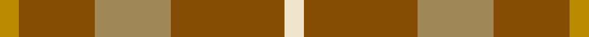

This page is one **sett** — a single exact thread-count. It belongs to the [tartan](/tartans/w1o6loi4o4lo1/)
(the same proportion at any scale), whose colour order is pattern [WRYRY](/stripes/wryry/).

Sourced from tartans-authority.  It is a [5 stripe tartan](/stripes/stripes5/).

Original link http://www.tartansauthority.com/tartan-ferret/display/8111/

## Register references

External register numbers recorded for this tartan.

- Scottish Tartans Authority (ITI): 8111

## Thread count
DY/10 T40 LT40 T60 W/10

## Palette

Palette: <strong>Tartan Register</strong> <small style="color:#888">(2 of 4 colours)</small>
<table><thead><tr><th>Colour</th><th>Threads</th><th>Shade</th><th>Base</th><th>OKLCh</th></tr></thead><tbody><tr><td>DY/</td><td style="text-align:right;font-variant-numeric:tabular-nums">10</td><td><code style="background-color:#BC8C00;">#BC8C00</code> <small style="color:#888">#BC8C00</small></td><td>Y <code style="background-color:#F2BF00;">#F2BF00</code></td><td><small style="color:#888">oklch(66.8% 0.137 84.1)</small></td></tr><tr><td>T</td><td style="text-align:right;font-variant-numeric:tabular-nums">40</td><td><code style="background-color:#844C04;">#844C04</code> <small style="color:#888">#844C04</small></td><td>R <code style="background-color:#CC0000;">#CC0000</code></td><td><small style="color:#888">oklch(47.2% 0.106 63.3)</small></td></tr><tr><td>LT</td><td style="text-align:right;font-variant-numeric:tabular-nums">40</td><td><code style="background-color:#A08858;">#A08858</code> <small style="color:#888">#A08858</small></td><td>Y <code style="background-color:#F2BF00;">#F2BF00</code></td><td><small style="color:#888">oklch(63.7% 0.071 84.0)</small></td></tr><tr><td>T</td><td style="text-align:right;font-variant-numeric:tabular-nums">60</td><td><code style="background-color:#844C04;">#844C04</code> <small style="color:#888">#844C04</small></td><td>R <code style="background-color:#CC0000;">#CC0000</code></td><td><small style="color:#888">oklch(47.2% 0.106 63.3)</small></td></tr><tr><td>W/</td><td style="text-align:right;font-variant-numeric:tabular-nums">10</td><td><code style="background-color:#F0E4CC;">#F0E4CC</code> <small style="color:#888">#F0E4CC</small></td><td>W <code style="background-color:#F7F7F7;">#F7F7F7</code></td><td><small style="color:#888">oklch(92.2% 0.034 84.6)</small></td></tr></tbody></table>

# Sample pattern

## Nearest tartans

The nearest existing variants by ΔTartan distance, with this tartan at the top so the swatches line up against it.

ΔTartan

Tartan

Sett

—

<a href="/ttd/edit/#slug=w1o6loi4o4lo1~x10">Amber Rose (Fashion)</a> <a class="nn-out" href="/setts/s5/w1o6loi4o4lo1~x10/" title="open its dictionary page">↗</a>

1.76

<a href="/ttd/edit/#slug=r3y19ly3y19r3y3r21t3~x2">Burnett of Powis (Personal)</a> <a class="nn-out" href="/setts/s8/r3y19ly3y19r3y3r21t3~x2/" title="open its dictionary page">↗</a>

1.83

<a href="/ttd/edit/#slug=o16r2o10r15t5~x2">Mowbray (Moubray) Family Tartan Tartan Number: 565. Earliest known date: 1983 Designed C.1984 by Peter MacDonald for a Mr Mowbray in the USA. Sometimes woven with green in place of gray, and blue in place of azure. See products available Copyright © Blair Urquhart, Comrie, 2015</a> <a class="nn-out" href="/setts/s5/o16r2o10r15t5~x2/" title="open its dictionary page">↗</a>

1.89

<a href="/ttd/edit/#slug=r3lo8r3lo20dy20lo3dy8lo3~x2">Miyuki #4</a> <a class="nn-out" href="/setts/s8/r3lo8r3lo20dy20lo3dy8lo3~x2/" title="open its dictionary page">↗</a>

1.89

<a href="/ttd/edit/#slug=y16r2y10r15t5~x2">Mowbray, (Moubray)</a> <a class="nn-out" href="/setts/s5/y16r2y10r15t5~x2/" title="open its dictionary page">↗</a>

2.05

<a href="/ttd/edit/#slug=g30lo3t8o25~x2">Dohmen Family (Zuid-Nederland)</a> <a class="nn-out" href="/setts/s4/g30lo3t8o25~x2/" title="open its dictionary page">↗</a>

2.12

<a href="/ttd/edit/#slug=t6lo28dy20t3~x2">Prince of Orange Tartan Tartan Number: 389. Earliest known date: pre 2003 Sales help Princess Diana Memorial Trust See products available Copyright © Blair Urquhart, Comrie, 2015</a> <a class="nn-out" href="/setts/s4/t6lo28dy20t3~x2/" title="open its dictionary page">↗</a>

2.13

<a href="/ttd/edit/#slug=dy12lo6dy2ly1~x4">Loch Garth Tartan Tartan Number: 1750. Earliest known date: pre 2003 Nothing See products available Copyright © Blair Urquhart, Comrie, 2015</a> <a class="nn-out" href="/setts/s4/dy12lo6dy2ly1~x4/" title="open its dictionary page">↗</a>

2.17

<a href="/ttd/edit/#slug=dy4lg11dy14o30r4~x2">Trinity Bicycles</a> <a class="nn-out" href="/setts/s5/dy4lg11dy14o30r4~x2/" title="open its dictionary page">↗</a>

2.18

<a href="/ttd/edit/#slug=t6lo28o20t3~x2">Prince of Orange</a> <a class="nn-out" href="/setts/s4/t6lo28o20t3~x2/" title="open its dictionary page">↗</a>

2.22

<a href="/ttd/edit/#slug=o24dr2o3oi6o3dr2dg15o20dr4~x2">Land's End (Unnamed Camel)</a> <a class="nn-out" href="/setts/s9/o24dr2o3oi6o3dr2dg15o20dr4~x2/" title="open its dictionary page">↗</a>

## Neighbour map

Every grey dot is one of 14359 variants placed by the first two principal components of the ΔTartan feature space (44% of its variance). Red is this tartan; blue dots are its nearest — click one to open its page.

<svg viewBox="0 0 640 380" role="img" style="max-width:100%;height:auto;border:1px solid #e0e0e0;border-radius:4px;display:block" xmlns="http://www.w3.org/2000/svg"><image href="/nn/cloud.v1.png" width="640" height="380"/><a href="/setts/s8/r3y19ly3y19r3y3r21t3~x2/"><circle cx="351.4" cy="226.1" r="4" fill="#3465a4"><title>Burnett of Powis (Personal)</title></circle></a><a href="/setts/s5/o16r2o10r15t5~x2/"><circle cx="368.9" cy="295.3" r="4" fill="#3465a4"><title>Mowbray (Moubray) Family Tartan Tartan Number: 565. Earliest known date: 1983 Designed C.1984 by Peter MacDonald for a Mr Mowbray in the USA. Sometimes woven with green in place of gray, and blue in place of azure. See products available Copyright © Blair Urquhart, Comrie, 2015</title></circle></a><a href="/setts/s8/r3lo8r3lo20dy20lo3dy8lo3~x2/"><circle cx="350.3" cy="256.5" r="4" fill="#3465a4"><title>Miyuki #4</title></circle></a><a href="/setts/s5/y16r2y10r15t5~x2/"><circle cx="373.9" cy="299.2" r="4" fill="#3465a4"><title>Mowbray, (Moubray)</title></circle></a><a href="/setts/s4/g30lo3t8o25~x2/"><circle cx="294.3" cy="259.1" r="4" fill="#3465a4"><title>Dohmen Family (Zuid-Nederland)</title></circle></a><a href="/setts/s4/t6lo28dy20t3~x2/"><circle cx="321.9" cy="262.6" r="4" fill="#3465a4"><title>Prince of Orange Tartan Tartan Number: 389. Earliest known date: pre 2003 Sales help Princess Diana Memorial Trust See products available Copyright © Blair Urquhart, Comrie, 2015</title></circle></a><a href="/setts/s4/dy12lo6dy2ly1~x4/"><circle cx="463.3" cy="263.6" r="4" fill="#3465a4"><title>Loch Garth Tartan Tartan Number: 1750. Earliest known date: pre 2003 Nothing See products available Copyright © Blair Urquhart, Comrie, 2015</title></circle></a><a href="/setts/s5/dy4lg11dy14o30r4~x2/"><circle cx="317.1" cy="270.9" r="4" fill="#3465a4"><title>Trinity Bicycles</title></circle></a><a href="/setts/s4/t6lo28o20t3~x2/"><circle cx="328.9" cy="260.2" r="4" fill="#3465a4"><title>Prince of Orange</title></circle></a><a href="/setts/s9/o24dr2o3oi6o3dr2dg15o20dr4~x2/"><circle cx="409.7" cy="212.8" r="4" fill="#3465a4"><title>Land's End (Unnamed Camel)</title></circle></a><circle cx="373.5" cy="286.1" r="5" fill="#c00000"/></svg>

ID: /setts/s5/w1o6loi4o4lo1~x10/
