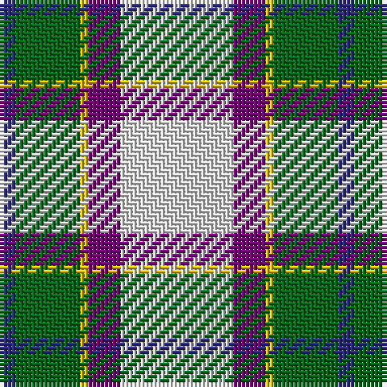

In pattern [BGYBW](/patterns/bgybw/).

This was sourced from register-of-tartans.  It is a [5 stripes tartan](/stripes/stripes5/).

Original link https://www.tartanregister.gov.uk/tartanDetails.aspx?ref=2820

## Thread count
DB/4 G16 Y2 P8 LN/28

## Palette
Each colour and its ΔE from the base-6 reference it is a variant of.

| Colour | Shade | Base | ΔE (OKLab) |
|---|---|---|---|
| DB | <code style="background-color:#2C2C80;">#2C2C80</code> `#2C2C80` | B <code style="background-color:#2C4084;">#2C4084</code> | 0.05 |
| G | <code style="background-color:#006818;">#006818</code> `#006818` | G <code style="background-color:#006400;">#006400</code> | 0.02 |
| LN | <code style="background-color:#E0E0E0;">#E0E0E0</code> `#E0E0E0` | W <code style="background-color:#F4F4F0;">#F4F4F0</code> | 0.06 |
| P | <code style="background-color:#780078;">#780078</code> `#780078` | B <code style="background-color:#2C4084;">#2C4084</code> | 0.16 |
| Y | <code style="background-color:#E8C000;">#E8C000</code> `#E8C000` | Y <code style="background-color:#E8C000;">#E8C000</code> | 0.00 |

# Sample pattern

## Nearest tartans

The nearest existing variants by ΔTartan distance.

1. [Manx Laxey, dress green](/setts/s6/b4w28ba8y2g16b4-b304080-ba800080-g008000-we0e0e0-yf0c000/) — ΔT 0.59
1. [Shiel, Purple V2 (Dance)](/setts/s7/w16g10b20ba48w60g4wa4-b440044-ba5c8ca8-g006818-wf0e0c8-wac49cd8/) — ΔT 0.87
1. [Manx, dress](/setts/s6/g8w56b16y4ba34g8-b800080-ba304080-g008000-we0e0e0-yf0c000/) — ΔT 0.89
1. [Shiel, Purple (Dance)](/setts/s7/w16g10b20ba48w60g4wa4-b5c8ca8-ba440044-g006818-wf0e0c8-wac49cd8/) — ΔT 1.06
1. [Shiel, Magenta (Dance)](/setts/s7/w16b10ba20bb48w60b4g4-b9080b8-ba7490a4-bb542850-g003820-wf0e0c8/) — ΔT 1.08
1. [MacKintosh Dress (Dance)](/setts/s6/g6r18ga36b16w66r6-b780078-g289c18-ga285800-rc80000-we0e0e0/) — ΔT 1.10
1. [MacTavish of Dunardry (Clan)](/setts/s7/b16w56y6g6b16k18b8-b5c8ca8-g408060-k101010-we0e0e0-ya08858/) — ΔT 1.11
1. [MacTavish of Dunardry Dress](/setts/s7/b16w56r6g6b16k18b8-b5a6e90-g487731-k101010-r95765b-wffffff/) — ΔT 1.13
1. [Manx Dress](/setts/s6/g8w56b16y4ba34g8-b780078-ba2c2c80-g006818-we0e0e0-ye8c000/) — ΔT 1.13
1. [Allanton Dress (Fashion)](/setts/s6/g8w56b28y4ba34g8-b2c2c80-ba5c8ca8-g006818-we0e0e0-ye8c000/) — ΔT 1.17

## Neighbour map

Every grey dot is one of 15726 variants placed by the first two principal components of the ΔTartan feature space (44% of its variance). Red is this tartan; blue dots are its nearest — click one to open its page.

<svg viewBox="0 0 640 380" role="img" style="max-width:100%;height:auto;border:1px solid #e0e0e0;border-radius:4px;display:block" xmlns="http://www.w3.org/2000/svg"><image href="/nn/cloud.v1.png" width="640" height="380"/><a href="/setts/s6/b4w28ba8y2g16b4-b304080-ba800080-g008000-we0e0e0-yf0c000/"><circle cx="184.9" cy="153.6" r="4" fill="#3465a4"><title>Manx Laxey, dress green</title></circle></a><a href="/setts/s7/w16g10b20ba48w60g4wa4-b440044-ba5c8ca8-g006818-wf0e0c8-wac49cd8/"><circle cx="206.2" cy="145.6" r="4" fill="#3465a4"><title>Shiel, Purple V2 (Dance)</title></circle></a><a href="/setts/s6/g8w56b16y4ba34g8-b800080-ba304080-g008000-we0e0e0-yf0c000/"><circle cx="181.9" cy="153.0" r="4" fill="#3465a4"><title>Manx, dress</title></circle></a><a href="/setts/s7/w16g10b20ba48w60g4wa4-b5c8ca8-ba440044-g006818-wf0e0c8-wac49cd8/"><circle cx="196.6" cy="139.7" r="4" fill="#3465a4"><title>Shiel, Purple (Dance)</title></circle></a><a href="/setts/s7/w16b10ba20bb48w60b4g4-b9080b8-ba7490a4-bb542850-g003820-wf0e0c8/"><circle cx="206.4" cy="142.2" r="4" fill="#3465a4"><title>Shiel, Magenta (Dance)</title></circle></a><a href="/setts/s6/g6r18ga36b16w66r6-b780078-g289c18-ga285800-rc80000-we0e0e0/"><circle cx="174.7" cy="160.3" r="4" fill="#3465a4"><title>MacKintosh Dress (Dance)</title></circle></a><a href="/setts/s7/b16w56y6g6b16k18b8-b5c8ca8-g408060-k101010-we0e0e0-ya08858/"><circle cx="174.2" cy="162.3" r="4" fill="#3465a4"><title>MacTavish of Dunardry (Clan)</title></circle></a><a href="/setts/s7/b16w56r6g6b16k18b8-b5a6e90-g487731-k101010-r95765b-wffffff/"><circle cx="161.3" cy="154.5" r="4" fill="#3465a4"><title>MacTavish of Dunardry Dress</title></circle></a><a href="/setts/s6/g8w56b16y4ba34g8-b780078-ba2c2c80-g006818-we0e0e0-ye8c000/"><circle cx="178.7" cy="152.0" r="4" fill="#3465a4"><title>Manx Dress</title></circle></a><a href="/setts/s6/g8w56b28y4ba34g8-b2c2c80-ba5c8ca8-g006818-we0e0e0-ye8c000/"><circle cx="159.2" cy="164.2" r="4" fill="#3465a4"><title>Allanton Dress (Fashion)</title></circle></a><circle cx="202.5" cy="166.0" r="5" fill="#c00000"/></svg>

ID: /setts/s5/w28b8y2g16ba4-b780078-ba2c2c80-g006818-we0e0e0-ye8c000/
