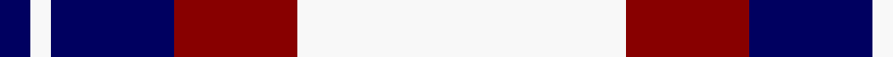

In pattern [BWBRW](/patterns/bwbrw/).

This was sourced from register-of-tartans.  It is a [5 stripes tartan](/stripes/stripes5/).

Original link https://www.tartanregister.gov.uk/tartanDetails.aspx?ref=1252

## Register references

External register numbers recorded for this tartan.

- Scottish Register of Tartans: [1252](https://www.tartanregister.gov.uk/tartanDetails.aspx?ref=1252)
- Scottish Tartans Authority (ITI): 4927

## Thread count
DB/6 W4 DB24 DR24 W/64

## Palette
Each colour and its ΔE from the base-6 reference it is a variant of.

| Colour | Shade | Base | ΔE (OKLab) |
|---|---|---|---|
| DB | <code style="background-color:#000060;">#000060</code> `#000060` | B <code style="background-color:#2A418A;">#2A418A</code> | 0.18 |
| DR | <code style="background-color:#880000;">#880000</code> `#880000` | R <code style="background-color:#CC0000;">#CC0000</code> | 0.15 |
| W | <code style="background-color:#F8F8F8;">#F8F8F8</code> `#F8F8F8` | W <code style="background-color:#F7F7F7;">#F7F7F7</code> | 0.00 |

# Sample pattern

## Nearest tartans

The nearest existing variants by ΔTartan distance.

1. [Buchanan Dress Blue Clan Tartan Tartan Number: 1672. Earliest known date: pre 2003 One of a number of dress tartans produced by Hugh Macpherson, a kiltmaker in Edinburgh, intended for dancing and other informal occassions. The 'dress' version of clan tartan is usually created by substituting white for one of the 'ground' colours. See products available Copyright © Blair Urquhart, Comrie, 2015](/setts/s6/w5b16w5b16w33r3~b2c2c80-rc80000-we0e0e0~x2/) — ΔT 1.22
1. [Buchanan, dress Blue](/setts/s6/w5b16w5b16w33r3~b304080-rc00000-we0e0e0~x2/) — ΔT 1.23
1. [Buchanan Dress Blue (Dance)](/setts/s6/w5b16w5b16w33r3~b1c0070-r880000-wf8f8f8~x2/) — ΔT 1.30
1. [MacPherson of Cluny (Black and White)](/setts/s7/w5r3w35k28w4k11w2~k101010-rc80000-wfcfcfc~x2/) — ΔT 1.31
1. [Forbes Dress (Clans Originaux)](/setts/s7/w6b3w20k2w3k25w3~b1474b4-k101010-wfcfcfc~x2/) — ΔT 1.33
1. [McPartlin (Personal)](/setts/s5/k27w29k5w14r2~k101010-rc80000-wf8e8d8~x2/) — ΔT 1.38
1. [MacPherson #10](/setts/s6/r1w14k6w1k3y1~k101010-rdc0000-we0e0e0-ye8c000~x4/) — ΔT 1.46
1. [Ailsa, Navy (Dance)](/setts/s6/b8w3b28w32k3w4~b1c0070-k101010-wf0e0c8~x2/) — ΔT 1.48
1. [MacPherson of Cluny Clan Tartan Tartan Number: 1830. Earliest known date: 1948 Also known as MacPherson Dress often woven with purple in place of red See products available Copyright © Blair Urquhart, Comrie, 2015](/setts/s7/w5r3w35k28w4k11w2~k101010-rc80000-we0e0e0~x2/) — ΔT 1.50
1. [Gangs of New York Fashion Check Tartan Tartan Number: 8248. Earliest known date: 8th July 2010 The period was the 1860s, a rather attractive time for men, all frock coats and top hats. Narrow-leg trousers and checks were fashionable. I accentuated Daniel's height and slenderness by extending his top hat, making his trousers thinner and his shoes longer. The other members of his gang were dressed along the same lines but not so finely: no one had the same presence as Bill the Butcher. See products available Copyright © Blair Urquhart, Comrie, 2015](/setts/s6/w5k20w2r5w20r2~k101010-rc80000-wf8e8d8~x2/) — ΔT 1.50

## Neighbour map

Every grey dot is one of 15726 variants placed by the first two principal components of the ΔTartan feature space (44% of its variance). Red is this tartan; blue dots are its nearest — click one to open its page.

<svg viewBox="0 0 640 380" role="img" style="max-width:100%;height:auto;border:1px solid #e0e0e0;border-radius:4px;display:block" xmlns="http://www.w3.org/2000/svg"><image href="/nn/cloud.v1.png" width="640" height="380"/><a href="/setts/s6/w5b16w5b16w33r3~b2c2c80-rc80000-we0e0e0~x2/"><circle cx="293.1" cy="206.1" r="4" fill="#3465a4"><title>Buchanan Dress Blue Clan Tartan Tartan Number: 1672. Earliest known date: pre 2003 One of a number of dress tartans produced by Hugh Macpherson, a kiltmaker in Edinburgh, intended for dancing and other informal occassions. The 'dress' version of clan tartan is usually created by substituting white for one of the 'ground' colours. See products available Copyright © Blair Urquhart, Comrie, 2015</title></circle></a><a href="/setts/s6/w5b16w5b16w33r3~b304080-rc00000-we0e0e0~x2/"><circle cx="297.3" cy="207.5" r="4" fill="#3465a4"><title>Buchanan, dress Blue</title></circle></a><a href="/setts/s6/w5b16w5b16w33r3~b1c0070-r880000-wf8f8f8~x2/"><circle cx="281.4" cy="202.5" r="4" fill="#3465a4"><title>Buchanan Dress Blue (Dance)</title></circle></a><a href="/setts/s7/w5r3w35k28w4k11w2~k101010-rc80000-wfcfcfc~x2/"><circle cx="300.0" cy="165.4" r="4" fill="#3465a4"><title>MacPherson of Cluny (Black and White)</title></circle></a><a href="/setts/s7/w6b3w20k2w3k25w3~b1474b4-k101010-wfcfcfc~x2/"><circle cx="279.7" cy="177.2" r="4" fill="#3465a4"><title>Forbes Dress (Clans Originaux)</title></circle></a><a href="/setts/s5/k27w29k5w14r2~k101010-rc80000-wf8e8d8~x2/"><circle cx="298.2" cy="209.6" r="4" fill="#3465a4"><title>McPartlin (Personal)</title></circle></a><a href="/setts/s6/r1w14k6w1k3y1~k101010-rdc0000-we0e0e0-ye8c000~x4/"><circle cx="299.5" cy="157.0" r="4" fill="#3465a4"><title>MacPherson #10</title></circle></a><a href="/setts/s6/b8w3b28w32k3w4~b1c0070-k101010-wf0e0c8~x2/"><circle cx="276.7" cy="196.8" r="4" fill="#3465a4"><title>Ailsa, Navy (Dance)</title></circle></a><a href="/setts/s7/w5r3w35k28w4k11w2~k101010-rc80000-we0e0e0~x2/"><circle cx="304.9" cy="169.1" r="4" fill="#3465a4"><title>MacPherson of Cluny Clan Tartan Tartan Number: 1830. Earliest known date: 1948 Also known as MacPherson Dress often woven with purple in place of red See products available Copyright © Blair Urquhart, Comrie, 2015</title></circle></a><a href="/setts/s6/w5k20w2r5w20r2~k101010-rc80000-wf8e8d8~x2/"><circle cx="249.2" cy="195.5" r="4" fill="#3465a4"><title>Gangs of New York Fashion Check Tartan Tartan Number: 8248. Earliest known date: 8th July 2010 The period was the 1860s, a rather attractive time for men, all frock coats and top hats. Narrow-leg trousers and checks were fashionable. I accentuated Daniel's height and slenderness by extending his top hat, making his trousers thinner and his shoes longer. The other members of his gang were dressed along the same lines but not so finely: no one had the same presence as Bill the Butcher. See products available Copyright © Blair Urquhart, Comrie, 2015</title></circle></a><circle cx="286.1" cy="184.2" r="5" fill="#c00000"/></svg>

ID: /setts/s5/w32r12b12w2b3~b000060-r880000-wf8f8f8~x2/
