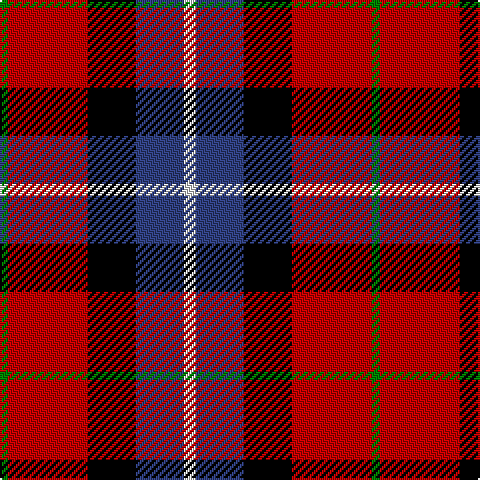

In pattern [GRKBW](/patterns/grkbw/).

This was sourced from weddslist.  It is a [5 stripes tartan](/stripes/stripes5/).

Original link http://www.weddslist.com/cgi-bin/tartans/pg.pl?source=sts

## Thread count
G/4 R40 K24 B24 LN/6

## Palette
Each colour and its ΔE from the base-6 reference it is a variant of.

| Colour | Shade | Base | ΔE (OKLab) |
|---|---|---|---|
| B | <code style="background-color:#304080;">#304080</code> `#304080` | B <code style="background-color:#2A418A;">#2A418A</code> | 0.02 |
| G | <code style="background-color:#008000;">#008000</code> `#008000` | G <code style="background-color:#006100;">#006100</code> | 0.10 |
| K | <code style="background-color:#000000;">#000000</code> `#000000` | K <code style="background-color:#000000;">#000000</code> | 0.00 |
| LN | <code style="background-color:#E0E0E0;">#E0E0E0</code> `#E0E0E0` | W <code style="background-color:#F7F7F7;">#F7F7F7</code> | 0.07 |
| R | <code style="background-color:#C00000;">#C00000</code> `#C00000` | R <code style="background-color:#CC0000;">#CC0000</code> | 0.03 |

# Sample pattern

## Nearest tartans

The nearest existing variants by ΔTartan distance.

1. [Baillie of Polkemmet Red](/setts/s5/w3b12k12r20g2~b1870a4-g006818-k101010-rc80000-we0e0e0~x2/) — ΔT 0.85
1. [Aberdeen University](/setts/s5/y2r15k7b8y2~b304080-k000000-rc00000-yf0c000~x4/) — ΔT 1.14
1. [Graham of Menteith, (Red)](/setts/s6/r26b3r4k16ba16k4~b5480b0-ba304080-k000000-rc00000~x2/) — ΔT 1.15
1. [Wcwm 759-2](/setts/s6/w5r34k22r4ra24r4~k000000-r8c0000-ra8c8c8c-wc8c8c8~x2/) — ΔT 1.18
1. [Fife](/setts/s6/b31ba4b6k19r20y4~b304080-ba5480b0-k000000-rc00000-yf0c000~x2/) — ΔT 1.21
1. [McGill University (Corporate)](/setts/s5/w3r24b12g8y3~b1c0070-g003820-rc80000-we0e0e0-ybc8c00~x2/) — ΔT 1.22
1. [MacTavish](/setts/s6/b2r12ba2b6k6b1~b4367ae-ba000052-k000000-raa0000~x2/) — ΔT 1.26
1. [MacTavish](/setts/s6/b2r12ba2b6k6b1~b4367ae-ba000052-k000000-raa0000/) — ΔT 1.26
1. [Dutch](/setts/s6/k4r19k19r2b22w4~b440044-k000000-rc47000-wfcfcfc~x2/) — ΔT 1.27
1. [O2 (Corporate)](/setts/s5/k15b2r15ba6bb1~b2c2c80-ba1474b4-bb2474e8-k00002c-rc80000~x2/) — ΔT 1.29

## Neighbour map

Every grey dot is one of 15726 variants placed by the first two principal components of the ΔTartan feature space (44% of its variance). Red is this tartan; blue dots are its nearest — click one to open its page.

<svg viewBox="0 0 640 380" role="img" style="max-width:100%;height:auto;border:1px solid #e0e0e0;border-radius:4px;display:block" xmlns="http://www.w3.org/2000/svg"><image href="/nn/cloud.v1.png" width="640" height="380"/><a href="/setts/s5/w3b12k12r20g2~b1870a4-g006818-k101010-rc80000-we0e0e0~x2/"><circle cx="168.9" cy="200.4" r="4" fill="#3465a4"><title>Baillie of Polkemmet Red</title></circle></a><a href="/setts/s5/y2r15k7b8y2~b304080-k000000-rc00000-yf0c000~x4/"><circle cx="184.6" cy="218.7" r="4" fill="#3465a4"><title>Aberdeen University</title></circle></a><a href="/setts/s6/r26b3r4k16ba16k4~b5480b0-ba304080-k000000-rc00000~x2/"><circle cx="204.1" cy="211.1" r="4" fill="#3465a4"><title>Graham of Menteith, (Red)</title></circle></a><a href="/setts/s6/w5r34k22r4ra24r4~k000000-r8c0000-ra8c8c8c-wc8c8c8~x2/"><circle cx="204.9" cy="206.8" r="4" fill="#3465a4"><title>Wcwm 759-2</title></circle></a><a href="/setts/s6/b31ba4b6k19r20y4~b304080-ba5480b0-k000000-rc00000-yf0c000~x2/"><circle cx="168.7" cy="203.7" r="4" fill="#3465a4"><title>Fife</title></circle></a><a href="/setts/s5/w3r24b12g8y3~b1c0070-g003820-rc80000-we0e0e0-ybc8c00~x2/"><circle cx="209.0" cy="198.3" r="4" fill="#3465a4"><title>McGill University (Corporate)</title></circle></a><a href="/setts/s6/b2r12ba2b6k6b1~b4367ae-ba000052-k000000-raa0000~x2/"><circle cx="208.4" cy="198.0" r="4" fill="#3465a4"><title>MacTavish</title></circle></a><a href="/setts/s6/b2r12ba2b6k6b1~b4367ae-ba000052-k000000-raa0000/"><circle cx="208.4" cy="198.0" r="4" fill="#3465a4"><title>MacTavish</title></circle></a><a href="/setts/s6/k4r19k19r2b22w4~b440044-k000000-rc47000-wfcfcfc~x2/"><circle cx="150.2" cy="200.7" r="4" fill="#3465a4"><title>Dutch</title></circle></a><a href="/setts/s5/k15b2r15ba6bb1~b2c2c80-ba1474b4-bb2474e8-k00002c-rc80000~x2/"><circle cx="196.4" cy="182.5" r="4" fill="#3465a4"><title>O2 (Corporate)</title></circle></a><circle cx="158.8" cy="198.3" r="5" fill="#c00000"/></svg>

ID: /setts/s5/w3b12k12r20g2~b304080-g008000-k000000-rc00000-we0e0e0~x2/
