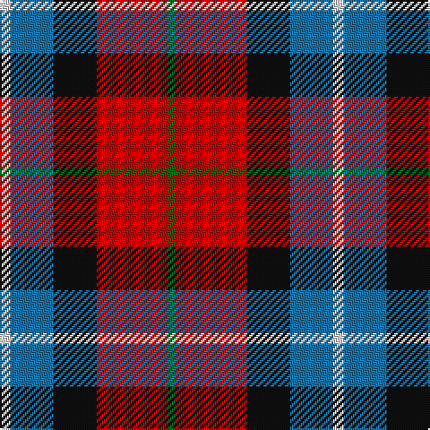

This page is one **sett** — a single exact thread-count. It belongs to the [tartan](/tartans/w3b12k12r20g2/)
(the same proportion at any scale), whose colour order is pattern [GRKBW](/stripes/grkbw/).

Sourced from register-of-tartans.  It is a [5 stripe tartan](/stripes/stripes5/).

Original link https://www.tartanregister.gov.uk/tartanDetails.aspx?ref=166

## Also known as

This cloth is also recorded under:

- Baillie of Polkemett
- Baillie of Polkemett, Red

2 attestations — the source records this cloth was collapsed from (oldest owns this page)

<ul>
<li>01/01/1937 — Baillie of Polkemmet Red (register-of-tartans, <a href="https://www.tartanregister.gov.uk/tartanDetails.aspx?ref=166">record</a>)</li>
<li>1937 — Baillie of Polkemett, Red (Clan) (tartans-authority, <a href="http://www.tartansauthority.com/tartan-ferret/display/1008/">record</a>)</li>
</ul>

## Register references

External register numbers recorded for this tartan.

- Scottish Register of Tartans: [166](https://www.tartanregister.gov.uk/tartanDetails.aspx?ref=166)
- Scottish Tartans Authority (ITI): 1008
- Scottish Tartans World Register: 1008

## Thread count
LN/6 B24 K24 R40 G/4

## Palette

Palette: <strong>Tartan Register</strong>
<table><thead><tr><th>Colour</th><th>Threads</th><th>Shade</th><th>Base</th><th>OKLCh</th></tr></thead><tbody><tr><td>LN/</td><td style="text-align:right;font-variant-numeric:tabular-nums">6</td><td><code style="background-color:#E0E0E0;">#E0E0E0</code> <small style="color:#888">#E0E0E0</small></td><td>W <code style="background-color:#F7F7F7;">#F7F7F7</code></td><td><small style="color:#888">oklch(90.7% 0.000 89.9)</small></td></tr><tr><td>B</td><td style="text-align:right;font-variant-numeric:tabular-nums">24</td><td><code style="background-color:#1870A4;">#1870A4</code> <small style="color:#888">#1870A4</small></td><td>B <code style="background-color:#2A418A;">#2A418A</code></td><td><small style="color:#888">oklch(52.2% 0.113 241.2)</small></td></tr><tr><td>K</td><td style="text-align:right;font-variant-numeric:tabular-nums">24</td><td><code style="background-color:#101010;">#101010</code> <small style="color:#888">#101010</small></td><td>K <code style="background-color:#000000;">#000000</code></td><td><small style="color:#888">oklch(17.3% 0.000 89.9)</small></td></tr><tr><td>R</td><td style="text-align:right;font-variant-numeric:tabular-nums">40</td><td><code style="background-color:#C80000;">#C80000</code> <small style="color:#888">#C80000</small></td><td>R <code style="background-color:#CC0000;">#CC0000</code></td><td><small style="color:#888">oklch(52.3% 0.215 29.2)</small></td></tr><tr><td>G/</td><td style="text-align:right;font-variant-numeric:tabular-nums">4</td><td><code style="background-color:#006818;">#006818</code> <small style="color:#888">#006818</small></td><td>G <code style="background-color:#006100;">#006100</code></td><td><small style="color:#888">oklch(45.0% 0.142 145.0)</small></td></tr></tbody></table>

# Sample pattern

## Nearest tartans

The nearest existing variants by ΔTartan distance, with this tartan at the top so the swatches line up against it.

ΔTartan

Tartan

Sett

—

<a href="/ttd/edit/#slug=w3b12k12r20g2~x2">Baillie of Polkemmet Red</a> <a class="nn-out" href="/setts/s5/w3b12k12r20g2~x2/" title="open its dictionary page">↗</a>

0.85

<a href="/ttd/edit/#slug=w3db12k12r20g2~x2">Baillie of Polkemett</a> <a class="nn-out" href="/setts/s5/w3db12k12r20g2~x2/" title="open its dictionary page">↗</a>

0.99

<a href="/ttd/edit/#slug=w3r24db12dg8lo3~x2">McGill University (Corporate)</a> <a class="nn-out" href="/setts/s5/w3r24db12dg8lo3~x2/" title="open its dictionary page">↗</a>

1.06

<a href="/ttd/edit/#slug=o12k4w2y6r3~x2">Strathblane</a> <a class="nn-out" href="/setts/s5/o12k4w2y6r3~x2/" title="open its dictionary page">↗</a>

1.13

<a href="/ttd/edit/#slug=t2r12db2t6k6t1~x4">Thompson/Thomson/MacTavish</a> <a class="nn-out" href="/setts/s6/t2r12db2t6k6t1~x4/" title="open its dictionary page">↗</a>

1.13

<a href="/ttd/edit/#slug=t2r12db2t6k6t1~x2">MacTavish Thomson Clan Tartan Tartan Number: 228. Earliest known date: 1906 D.C. Stewart writes, &quot; This tartan has recently (1950) come into use as being that appropriate to the Thomsons; Thomson is the anglicised form of the name MacTavish. It is not recorded in any of the early illustrated books. Many MacTavishes wear the Campbell of Argyll.&quot; Stewart may not have considered Johnston's publication in 1906 as 'early' and this may have been the source for the sett he recorded in the 'Setts of the Scottish Tartans' in 1950. Some versions show black in place of the mid blue stripe in this illustration. There is also the personal tartan of Lord Thomson of Fleet and a sett recorded in the 'Baronage of Angus and Mearns'. See products available Copyright © Blair Urquhart, Comrie, 2015</a> <a class="nn-out" href="/setts/s6/t2r12db2t6k6t1~x2/" title="open its dictionary page">↗</a>

1.14

<a href="/ttd/edit/#slug=r30db20w15lb3ly3">Siddle, New (Corporate)</a> <a class="nn-out" href="/setts/s5/r30db20w15lb3ly3/" title="open its dictionary page">↗</a>

1.17

<a href="/ttd/edit/#slug=r15r98db72t25db8w15">Afternoon Tea / Assam</a> <a class="nn-out" href="/setts/s6/r15r98db72t25db8w15/" title="open its dictionary page">↗</a>

1.22

<a href="/ttd/edit/#slug=dg3db12w1dg12r12dg2~x2">Patterson, John (Personal)</a> <a class="nn-out" href="/setts/s6/dg3db12w1dg12r12dg2~x2/" title="open its dictionary page">↗</a>

1.24

<a href="/ttd/edit/#slug=ly4r27k12db15ly4~x2">Aberdeen University (1992)</a> <a class="nn-out" href="/setts/s5/ly4r27k12db15ly4~x2/" title="open its dictionary page">↗</a>

1.24

<a href="/ttd/edit/#slug=r2o8db2t4k4t1~x6">Thom(p)son's, Fancy</a> <a class="nn-out" href="/setts/s6/r2o8db2t4k4t1~x6/" title="open its dictionary page">↗</a>

## Neighbour map

Every grey dot is one of 14299 variants placed by the first two principal components of the ΔTartan feature space (44% of its variance). Red is this tartan; blue dots are its nearest — click one to open its page.

<svg viewBox="0 0 640 380" role="img" style="max-width:100%;height:auto;border:1px solid #e0e0e0;border-radius:4px;display:block" xmlns="http://www.w3.org/2000/svg"><image href="/nn/cloud.v1.png" width="640" height="380"/><a href="/setts/s5/w3db12k12r20g2~x2/"><circle cx="160.6" cy="194.9" r="4" fill="#3465a4"><title>Baillie of Polkemett</title></circle></a><a href="/setts/s5/w3r24db12dg8lo3~x2/"><circle cx="210.0" cy="194.9" r="4" fill="#3465a4"><title>McGill University (Corporate)</title></circle></a><a href="/setts/s5/o12k4w2y6r3~x2/"><circle cx="158.1" cy="221.4" r="4" fill="#3465a4"><title>Strathblane</title></circle></a><a href="/setts/s6/t2r12db2t6k6t1~x4/"><circle cx="216.7" cy="192.1" r="4" fill="#3465a4"><title>Thompson/Thomson/MacTavish</title></circle></a><a href="/setts/s6/t2r12db2t6k6t1~x2/"><circle cx="220.7" cy="194.4" r="4" fill="#3465a4"><title>MacTavish Thomson Clan Tartan Tartan Number: 228. Earliest known date: 1906 D.C. Stewart writes, &quot; This tartan has recently (1950) come into use as being that appropriate to the Thomsons; Thomson is the anglicised form of the name MacTavish. It is not recorded in any of the early illustrated books. Many MacTavishes wear the Campbell of Argyll.&quot; Stewart may not have considered Johnston's publication in 1906 as 'early' and this may have been the source for the sett he recorded in the 'Setts of the Scottish Tartans' in 1950. Some versions show black in place of the mid blue stripe in this illustration. There is also the personal tartan of Lord Thomson of Fleet and a sett recorded in the 'Baronage of Angus and Mearns'. See products available Copyright © Blair Urquhart, Comrie, 2015</title></circle></a><a href="/setts/s5/r30db20w15lb3ly3/"><circle cx="171.7" cy="178.3" r="4" fill="#3465a4"><title>Siddle, New (Corporate)</title></circle></a><a href="/setts/s6/r15r98db72t25db8w15/"><circle cx="216.9" cy="174.2" r="4" fill="#3465a4"><title>Afternoon Tea / Assam</title></circle></a><a href="/setts/s6/dg3db12w1dg12r12dg2~x2/"><circle cx="163.3" cy="195.6" r="4" fill="#3465a4"><title>Patterson, John (Personal)</title></circle></a><a href="/setts/s5/ly4r27k12db15ly4~x2/"><circle cx="188.0" cy="222.2" r="4" fill="#3465a4"><title>Aberdeen University (1992)</title></circle></a><a href="/setts/s6/r2o8db2t4k4t1~x6/"><circle cx="135.4" cy="210.8" r="4" fill="#3465a4"><title>Thom(p)son's, Fancy</title></circle></a><circle cx="170.6" cy="198.3" r="5" fill="#c00000"/></svg>

ID: /setts/s5/w3b12k12r20g2~x2/
