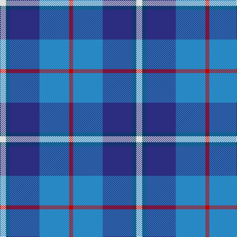

In pattern [RBBBW](/patterns/rbbbw/).

This was sourced from register-of-tartans.  It is a [5 stripes tartan](/stripes/stripes5/).

Original link https://www.tartanregister.gov.uk/tartanDetails.aspx?ref=11564

## Register references

External register numbers recorded for this tartan.

- Scottish Register of Tartans: [11564](https://www.tartanregister.gov.uk/tartanDetails.aspx?ref=11564)

## Thread count
LN/12 DBa8 DB60 B60 R/8

## Palette
Each colour and its ΔE from the base-6 reference it is a variant of.

| Colour | Shade | Base | ΔE (OKLab) |
|---|---|---|---|
| B | <code style="background-color:#2888C4;">#2888C4</code> `#2888C4` | B <code style="background-color:#2A418A;">#2A418A</code> | 0.21 |
| DB | <code style="background-color:#2C2C80;">#2C2C80</code> `#2C2C80` | B <code style="background-color:#2A418A;">#2A418A</code> | 0.06 |
| DBa | <code style="background-color:#003C64;">#003C64</code> `#003C64` | B <code style="background-color:#2A418A;">#2A418A</code> | 0.08 |
| LN | <code style="background-color:#E0E0E0;">#E0E0E0</code> `#E0E0E0` | W <code style="background-color:#F7F7F7;">#F7F7F7</code> | 0.07 |
| R | <code style="background-color:#C80000;">#C80000</code> `#C80000` | R <code style="background-color:#CC0000;">#CC0000</code> | 0.01 |

# Sample pattern

## Nearest tartans

The nearest existing variants by ΔTartan distance.

1. [RSCDS Australia? (Corporate)](/setts/s5/r2b12k5ba16w2~b2c2c80-ba2888c4-k101010-rc80000-wfcfcfc~x4/) — ΔT 0.81
1. [Bryson (1988)](/setts/s5/g16r8b57ba56w8~b2474e8-ba1c0070-g8b6508-re3170d-wa8ace8/) — ΔT 0.88
1. [Bryson (1988) (Name)](/setts/s5/y2r1b7ba7w1~b78849c-ba000064-rc80000-wc8d8dc-ya0a0a0~x8/) — ΔT 1.13
1. [Icelandair](/setts/s7/b3ba24k11b20w2b5y3~b2c4084-ba2888c4-k101010-wffffff-yd87c00~x2/) — ΔT 1.16
1. [Aberdeen Academy of Performing Art](/setts/s6/b4ba2bb3b24bc24w3~b2c2c80-ba780078-bb440044-bc5c8ca8-wfcfcfc~x2/) — ΔT 1.17
1. [Georgian Bay, Waters of](/setts/s6/b35w3b8ba36g9r3~b1b3f8b-ba009acd-g002618-rbb7168-wffffff~x2/) — ΔT 1.18
1. [Jamieson, Robert (Personal)](/setts/s5/w6y6b21ba32r3~b1474b4-ba003c64-rc8002c-wc0c0c0-ybc8c00~x2/) — ΔT 1.21
1. [Aberdeen Academy of Performing Arts](/setts/s6/b4ba2bb3b24bc24w3~b1c1c50-ba9058d8-bb440044-bc1870a4-wffffff~x2/) — ΔT 1.38
1. [Lands of Liberty](/setts/s5/r10w5b30ba20r3~b2c4084-ba0596fa-rc80000-wffffff~x4/) — ΔT 1.43
1. [Mina Perhonen Japanese Corporate Tartan Tartan Number: 5797. Earliest known date: pre 2003 Designed by Fiona Hall of Lochcarron as a corporate tartan for the Mina Company of Tokyo whose logo is a butterfly. The blues are from the company's colours and represent the sky, the yellow represents the butterfly and the white is for the clouds.'Perhonen' is Finnish for butterfly and chosen because the Japanese design world has a great affinity with some Scandinavian countries. See products available Copyright © Blair Urquhart, Comrie, 2015](/setts/s7/w4b24y2ba24bb5b4y4~b202060-ba2c2c80-bb5c8ca8-we0e0e0-ye8c000~x2/) — ΔT 1.48

## Neighbour map

Every grey dot is one of 15726 variants placed by the first two principal components of the ΔTartan feature space (44% of its variance). Red is this tartan; blue dots are its nearest — click one to open its page.

<svg viewBox="0 0 640 380" role="img" style="max-width:100%;height:auto;border:1px solid #e0e0e0;border-radius:4px;display:block" xmlns="http://www.w3.org/2000/svg"><image href="/nn/cloud.v1.png" width="640" height="380"/><a href="/setts/s5/r2b12k5ba16w2~b2c2c80-ba2888c4-k101010-rc80000-wfcfcfc~x4/"><circle cx="178.8" cy="213.4" r="4" fill="#3465a4"><title>RSCDS Australia? (Corporate)</title></circle></a><a href="/setts/s5/g16r8b57ba56w8~b2474e8-ba1c0070-g8b6508-re3170d-wa8ace8/"><circle cx="173.5" cy="218.2" r="4" fill="#3465a4"><title>Bryson (1988)</title></circle></a><a href="/setts/s5/y2r1b7ba7w1~b78849c-ba000064-rc80000-wc8d8dc-ya0a0a0~x8/"><circle cx="157.8" cy="211.8" r="4" fill="#3465a4"><title>Bryson (1988) (Name)</title></circle></a><a href="/setts/s7/b3ba24k11b20w2b5y3~b2c4084-ba2888c4-k101010-wffffff-yd87c00~x2/"><circle cx="203.3" cy="184.1" r="4" fill="#3465a4"><title>Icelandair</title></circle></a><a href="/setts/s6/b4ba2bb3b24bc24w3~b2c2c80-ba780078-bb440044-bc5c8ca8-wfcfcfc~x2/"><circle cx="263.0" cy="181.4" r="4" fill="#3465a4"><title>Aberdeen Academy of Performing Art</title></circle></a><a href="/setts/s6/b35w3b8ba36g9r3~b1b3f8b-ba009acd-g002618-rbb7168-wffffff~x2/"><circle cx="244.3" cy="192.1" r="4" fill="#3465a4"><title>Georgian Bay, Waters of</title></circle></a><a href="/setts/s5/w6y6b21ba32r3~b1474b4-ba003c64-rc8002c-wc0c0c0-ybc8c00~x2/"><circle cx="238.1" cy="210.2" r="4" fill="#3465a4"><title>Jamieson, Robert (Personal)</title></circle></a><a href="/setts/s6/b4ba2bb3b24bc24w3~b1c1c50-ba9058d8-bb440044-bc1870a4-wffffff~x2/"><circle cx="261.2" cy="185.5" r="4" fill="#3465a4"><title>Aberdeen Academy of Performing Arts</title></circle></a><a href="/setts/s5/r10w5b30ba20r3~b2c4084-ba0596fa-rc80000-wffffff~x4/"><circle cx="207.8" cy="216.5" r="4" fill="#3465a4"><title>Lands of Liberty</title></circle></a><a href="/setts/s7/w4b24y2ba24bb5b4y4~b202060-ba2c2c80-bb5c8ca8-we0e0e0-ye8c000~x2/"><circle cx="209.5" cy="173.7" r="4" fill="#3465a4"><title>Mina Perhonen Japanese Corporate Tartan Tartan Number: 5797. Earliest known date: pre 2003 Designed by Fiona Hall of Lochcarron as a corporate tartan for the Mina Company of Tokyo whose logo is a butterfly. The blues are from the company's colours and represent the sky, the yellow represents the butterfly and the white is for the clouds.'Perhonen' is Finnish for butterfly and chosen because the Japanese design world has a great affinity with some Scandinavian countries. See products available Copyright © Blair Urquhart, Comrie, 2015</title></circle></a><circle cx="199.8" cy="215.5" r="5" fill="#c00000"/></svg>

ID: /setts/s5/w3b2ba15bb15r2~b003c64-ba2c2c80-bb2888c4-rc80000-we0e0e0~x4/
