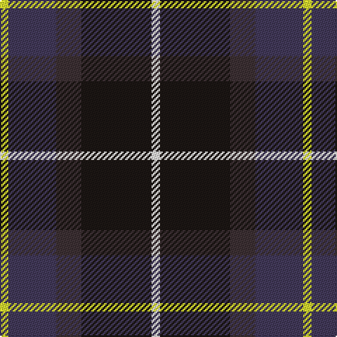

This page is one **sett** — a single exact thread-count. It belongs to the [tartan](/tartans/w3k25do9dp17ly3/)
(the same proportion at any scale), whose colour order is pattern [WKBBY](/stripes/wkbby/).

Sourced from register-of-tartans.  It is a [5 stripe tartan](/stripes/stripes5/).

Original link https://www.tartanregister.gov.uk/tartanDetails.aspx?ref=10792

## Register references

External register numbers recorded for this tartan.

- Scottish Register of Tartans: [10792](https://www.tartanregister.gov.uk/tartanDetails.aspx?ref=10792)

## Thread count
Y/6 N34 T18 K50 W/6

## Palette

Palette: <strong>Tartan Dictionary</strong> <small style="color:#888">(1 of 5 colours)</small>
<table><thead><tr><th>Colour</th><th>Threads</th><th>Shade</th><th>Base</th><th>OKLCh</th></tr></thead><tbody><tr><td>Y/</td><td style="text-align:right;font-variant-numeric:tabular-nums">6</td><td><code style="background-color:#E1F231;">#E1F231</code> <small style="color:#888">#E1F231</small></td><td>Y <code style="background-color:#F2BF00;">#F2BF00</code></td><td><small style="color:#888">oklch(91.8% 0.197 114.9)</small></td></tr><tr><td>N</td><td style="text-align:right;font-variant-numeric:tabular-nums">34</td><td><code style="background-color:#433A5A;">#433A5A</code> <small style="color:#888">#433A5A</small></td><td>B <code style="background-color:#2A418A;">#2A418A</code></td><td><small style="color:#888">oklch(37.2% 0.055 296.6)</small></td></tr><tr><td>T</td><td style="text-align:right;font-variant-numeric:tabular-nums">18</td><td><code style="background-color:#3D3134;">#3D3134</code> <small style="color:#888">#3D3134</small></td><td>B <code style="background-color:#2A418A;">#2A418A</code></td><td><small style="color:#888">oklch(32.7% 0.018 1.4)</small></td></tr><tr><td>K</td><td style="text-align:right;font-variant-numeric:tabular-nums">50</td><td><code style="background-color:#1C1714;">#1C1714</code> <small style="color:#888">#1C1714</small></td><td>K <code style="background-color:#000000;">#000000</code></td><td><small style="color:#888">oklch(20.9% 0.010 52.9)</small></td></tr><tr><td>W/</td><td style="text-align:right;font-variant-numeric:tabular-nums">6</td><td><code style="background-color:#F9F5EF;">#F9F5EF</code> <small style="color:#888">#F9F5EF</small></td><td>W <code style="background-color:#F7F7F7;">#F7F7F7</code></td><td><small style="color:#888">oklch(97.2% 0.009 78.3)</small></td></tr></tbody></table>

# Sample pattern

## Nearest tartans

The nearest existing variants by ΔTartan distance, with this tartan at the top so the swatches line up against it.

ΔTartan

Tartan

Sett

—

<a href="/ttd/edit/#slug=w3k25do9dp17ly3~x2">Teylu Coleman (Cornwall)</a> <a class="nn-out" href="/setts/s5/w3k25do9dp17ly3~x2/" title="open its dictionary page">↗</a>

0.61

<a href="/ttd/edit/#slug=ly3dt17n9k25lb3~x2">Teylu Coleman (Name)</a> <a class="nn-out" href="/setts/s5/ly3dt17n9k25lb3~x2/" title="open its dictionary page">↗</a>

0.71

<a href="/ttd/edit/#slug=db15r6dg8k2w2k2~x6">Stovell (2015)</a> <a class="nn-out" href="/setts/s6/db15r6dg8k2w2k2~x6/" title="open its dictionary page">↗</a>

0.94

<a href="/ttd/edit/#slug=k7t3o30dt30w3~x2">Douglas, brown</a> <a class="nn-out" href="/setts/s5/k7t3o30dt30w3~x2/" title="open its dictionary page">↗</a>

1.03

<a href="/ttd/edit/#slug=r4db24k12g14k4lb3~x2">MacPhail Hunting #2</a> <a class="nn-out" href="/setts/s6/r4db24k12g14k4lb3~x2/" title="open its dictionary page">↗</a>

1.06

<a href="/ttd/edit/#slug=k4t3dp11dg14w2~x2">Wellington No 229</a> <a class="nn-out" href="/setts/s5/k4t3dp11dg14w2~x2/" title="open its dictionary page">↗</a>

1.10

<a href="/ttd/edit/#slug=k4w1g10k10db10r2~x4">Rose Hunting</a> <a class="nn-out" href="/setts/s6/k4w1g10k10db10r2~x4/" title="open its dictionary page">↗</a>

1.11

<a href="/ttd/edit/#slug=dg5db2dg9dbi19dr9ly2~x2">Lyle and Scott</a> <a class="nn-out" href="/setts/s6/dg5db2dg9dbi19dr9ly2~x2/" title="open its dictionary page">↗</a>

1.12

<a href="/ttd/edit/#slug=db22w2k10g11r3g4~x2">Paterson Blue (Personal)</a> <a class="nn-out" href="/setts/s6/db22w2k10g11r3g4~x2/" title="open its dictionary page">↗</a>

1.13

<a href="/ttd/edit/#slug=k4w1g10k10db10r2~x2">Rose Hunting Clan Tartan Tartan Number: 1226. Earliest known date: 1831 First recorded in James Logan's, 'The Scottish Gael' in 1831. See products available Copyright © Blair Urquhart, Comrie, 2015</a> <a class="nn-out" href="/setts/s6/k4w1g10k10db10r2~x2/" title="open its dictionary page">↗</a>

1.15

<a href="/ttd/edit/#slug=db18r3k9r3g23ly3~x2">Royal College of Physicians (Corp)</a> <a class="nn-out" href="/setts/s6/db18r3k9r3g23ly3~x2/" title="open its dictionary page">↗</a>

## Neighbour map

Every grey dot is one of 14359 variants placed by the first two principal components of the ΔTartan feature space (44% of its variance). Red is this tartan; blue dots are its nearest — click one to open its page.

<svg viewBox="0 0 640 380" role="img" style="max-width:100%;height:auto;border:1px solid #e0e0e0;border-radius:4px;display:block" xmlns="http://www.w3.org/2000/svg"><image href="/nn/cloud.v1.png" width="640" height="380"/><a href="/setts/s5/ly3dt17n9k25lb3~x2/"><circle cx="192.0" cy="222.9" r="4" fill="#3465a4"><title>Teylu Coleman (Name)</title></circle></a><a href="/setts/s6/db15r6dg8k2w2k2~x6/"><circle cx="182.0" cy="211.7" r="4" fill="#3465a4"><title>Stovell (2015)</title></circle></a><a href="/setts/s5/k7t3o30dt30w3~x2/"><circle cx="216.1" cy="202.8" r="4" fill="#3465a4"><title>Douglas, brown</title></circle></a><a href="/setts/s6/r4db24k12g14k4lb3~x2/"><circle cx="172.4" cy="222.0" r="4" fill="#3465a4"><title>MacPhail Hunting #2</title></circle></a><a href="/setts/s5/k4t3dp11dg14w2~x2/"><circle cx="172.9" cy="232.3" r="4" fill="#3465a4"><title>Wellington No 229</title></circle></a><a href="/setts/s6/k4w1g10k10db10r2~x4/"><circle cx="166.4" cy="224.4" r="4" fill="#3465a4"><title>Rose Hunting</title></circle></a><a href="/setts/s6/dg5db2dg9dbi19dr9ly2~x2/"><circle cx="202.9" cy="222.8" r="4" fill="#3465a4"><title>Lyle and Scott</title></circle></a><a href="/setts/s6/db22w2k10g11r3g4~x2/"><circle cx="203.8" cy="205.9" r="4" fill="#3465a4"><title>Paterson Blue (Personal)</title></circle></a><a href="/setts/s6/k4w1g10k10db10r2~x2/"><circle cx="170.5" cy="226.5" r="4" fill="#3465a4"><title>Rose Hunting Clan Tartan Tartan Number: 1226. Earliest known date: 1831 First recorded in James Logan's, 'The Scottish Gael' in 1831. See products available Copyright © Blair Urquhart, Comrie, 2015</title></circle></a><a href="/setts/s6/db18r3k9r3g23ly3~x2/"><circle cx="168.5" cy="212.0" r="4" fill="#3465a4"><title>Royal College of Physicians (Corp)</title></circle></a><circle cx="198.2" cy="223.0" r="5" fill="#c00000"/></svg>

ID: /setts/s5/w3k25do9dp17ly3~x2/
