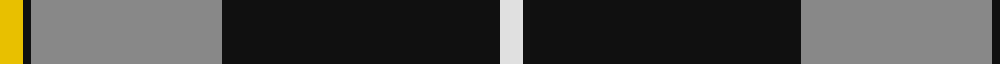
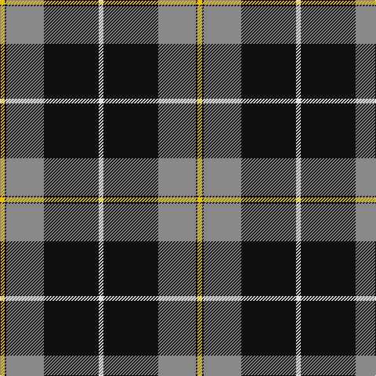

In pattern [WKRKY](/stripes/wkrky/).

This was sourced from register-of-tartans.  It is a [5 stripe tartan](/stripes/stripes5/).

Original link https://www.tartanregister.gov.uk/tartanDetails.aspx?ref=1331

## Register references

External register numbers recorded for this tartan.

- Scottish Register of Tartans: [1331](https://www.tartanregister.gov.uk/tartanDetails.aspx?ref=1331)
- Scottish Tartans Authority (ITI): 3995
- Scottish Tartans World Register: 2707

## Thread count
Y/6 K2 N48 K70 LN/6

## Palette
Each colour and the base-6 reference it is a variant of.

| Colour | Shade | Base |
|---|---|---|
| K | <code style="background-color:#101010;">#101010</code> `oklch(17.3% 0.000 89.9)` <small>#101010</small> | K <code style="background-color:#000000;">#000000</code> |
| LN | <code style="background-color:#E0E0E0;">#E0E0E0</code> `oklch(90.7% 0.000 89.9)` <small>#E0E0E0</small> | W <code style="background-color:#F7F7F7;">#F7F7F7</code> |
| N | <code style="background-color:#888888;">#888888</code> `oklch(62.7% 0.000 89.9)` <small>#888888</small> | R <code style="background-color:#CC0000;">#CC0000</code> |
| Y | <code style="background-color:#E8C000;">#E8C000</code> `oklch(81.9% 0.168 93.7)` <small>#E8C000</small> | Y <code style="background-color:#F2BF00;">#F2BF00</code> |

# Sample pattern

## Nearest tartans

The nearest existing variants by ΔTartan distance, with this tartan at the top so the swatches line up against it.

ΔTartan

Tartan

Sett

—

<a href="/ttd/edit/#slug=w3k35o24k1ly3~x2">George Heriots</a> <a class="nn-out" href="/setts/s5/w3k35o24k1ly3~x2/" title="open its dictionary page">↗</a>

1.05

<a href="/ttd/edit/#slug=lr3r1lr30k20lr3k9ly1~x2">MacPherson Dress</a> <a class="nn-out" href="/setts/s7/lr3r1lr30k20lr3k9ly1~x2/" title="open its dictionary page">↗</a>

1.05

<a href="/ttd/edit/#slug=lr3r1lr30k20lr3k9ly1">MacPherson Dress</a> <a class="nn-out" href="/setts/s7/lr3r1lr30k20lr3k9ly1/" title="open its dictionary page">↗</a>

1.32

<a href="/ttd/edit/#slug=lb3r1lb30k20lb3k9ly1">MacPherson Dress</a> <a class="nn-out" href="/setts/s7/lb3r1lb30k20lb3k9ly1/" title="open its dictionary page">↗</a>

1.32

<a href="/ttd/edit/#slug=k4lg3k30lg33r1lg4~x2">Intergen (Corporate)</a> <a class="nn-out" href="/setts/s6/k4lg3k30lg33r1lg4~x2/" title="open its dictionary page">↗</a>

1.36

<a href="/ttd/edit/#slug=w4k30r1k1r3w12ly3~x2">Richecourt, Baron of (Personal)</a> <a class="nn-out" href="/setts/s7/w4k30r1k1r3w12ly3~x2/" title="open its dictionary page">↗</a>

1.45

<a href="/ttd/edit/#slug=w3o10k38w11o6k2w3~x2">Phantom</a> <a class="nn-out" href="/setts/s7/w3o10k38w11o6k2w3~x2/" title="open its dictionary page">↗</a>

1.49

<a href="/ttd/edit/#slug=k76dt11k3ly6k3dt13k11o76">Kunbi</a> <a class="nn-out" href="/setts/s8/k76dt11k3ly6k3dt13k11o76/" title="open its dictionary page">↗</a>

1.49

<a href="/ttd/edit/#slug=r4g40k21lo2k21g2~x2">Unidentified Furnishing #2</a> <a class="nn-out" href="/setts/s6/r4g40k21lo2k21g2~x2/" title="open its dictionary page">↗</a>

1.50

<a href="/ttd/edit/#slug=k4y4w35y1k36y4k2~x2">Gleneagles, Hotel</a> <a class="nn-out" href="/setts/s7/k4y4w35y1k36y4k2~x2/" title="open its dictionary page">↗</a>

1.51

<a href="/ttd/edit/#slug=k4lo4lb32lo1k32lo4k2~x4">Gleneagles Gold (Dalgleish)</a> <a class="nn-out" href="/setts/s7/k4lo4lb32lo1k32lo4k2~x4/" title="open its dictionary page">↗</a>

## Neighbour map

Every grey dot is one of 14299 variants placed by the first two principal components of the ΔTartan feature space (44% of its variance). Red is this tartan; blue dots are its nearest — click one to open its page.

<svg viewBox="0 0 640 380" role="img" style="max-width:100%;height:auto;border:1px solid #e0e0e0;border-radius:4px;display:block" xmlns="http://www.w3.org/2000/svg"><image href="/nn/cloud.v1.png" width="640" height="380"/><a href="/setts/s7/lr3r1lr30k20lr3k9ly1~x2/"><circle cx="329.3" cy="131.5" r="4" fill="#3465a4"><title>MacPherson Dress</title></circle></a><a href="/setts/s7/lr3r1lr30k20lr3k9ly1/"><circle cx="329.3" cy="131.5" r="4" fill="#3465a4"><title>MacPherson Dress</title></circle></a><a href="/setts/s7/lb3r1lb30k20lb3k9ly1/"><circle cx="322.7" cy="125.3" r="4" fill="#3465a4"><title>MacPherson Dress</title></circle></a><a href="/setts/s6/k4lg3k30lg33r1lg4~x2/"><circle cx="323.4" cy="147.0" r="4" fill="#3465a4"><title>Intergen (Corporate)</title></circle></a><a href="/setts/s7/w4k30r1k1r3w12ly3~x2/"><circle cx="329.8" cy="112.6" r="4" fill="#3465a4"><title>Richecourt, Baron of (Personal)</title></circle></a><a href="/setts/s7/w3o10k38w11o6k2w3~x2/"><circle cx="286.7" cy="140.2" r="4" fill="#3465a4"><title>Phantom</title></circle></a><a href="/setts/s8/k76dt11k3ly6k3dt13k11o76/"><circle cx="298.7" cy="139.4" r="4" fill="#3465a4"><title>Kunbi</title></circle></a><a href="/setts/s6/r4g40k21lo2k21g2~x2/"><circle cx="298.8" cy="185.1" r="4" fill="#3465a4"><title>Unidentified Furnishing #2</title></circle></a><a href="/setts/s7/k4y4w35y1k36y4k2~x2/"><circle cx="315.1" cy="128.3" r="4" fill="#3465a4"><title>Gleneagles, Hotel</title></circle></a><a href="/setts/s7/k4lo4lb32lo1k32lo4k2~x4/"><circle cx="313.8" cy="135.2" r="4" fill="#3465a4"><title>Gleneagles Gold (Dalgleish)</title></circle></a><circle cx="343.2" cy="150.5" r="5" fill="#c00000"/></svg>

ID: /setts/s5/w3k35o24k1ly3~x2/
