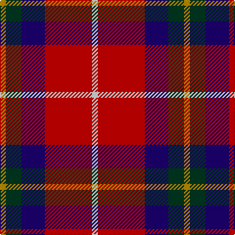

**Bands:** [YGBRW](/stripes/ygbrw/) · **Stripes:** [LO DG DB R W](/stripes/stripes5/) LO DG DB R W

This was sourced from tartans-authority.  It is a [5 band tartan](/bands/bands5/).

Original link http://www.tartansauthority.com/tartan-ferret/display/10755/

## Thread count
DY/6 DG16 DB24 R48 LN/6

## Palette
Each colour and its ΔE from the base-6 reference it is a variant of.

| Colour | Shade | Base | ΔE (OKLab) |
|---|---|---|---|
| DB | <code style="background-color:#1C0070;">#1C0070</code> `#1C0070` | B <code style="background-color:#2A418A;">#2A418A</code> | 0.14 |
| DG | <code style="background-color:#003820;">#003820</code> `#003820` | G <code style="background-color:#006100;">#006100</code> | 0.15 |
| DY | <code style="background-color:#BC8C00;">#BC8C00</code> `#BC8C00` | Y <code style="background-color:#F2BF00;">#F2BF00</code> | 0.16 |
| LN | <code style="background-color:#E0E0E0;">#E0E0E0</code> `#E0E0E0` | W <code style="background-color:#F7F7F7;">#F7F7F7</code> | 0.07 |
| R | <code style="background-color:#C80000;">#C80000</code> `#C80000` | R <code style="background-color:#CC0000;">#CC0000</code> | 0.01 |

# Sample pattern

## Nearest tartans

The nearest existing variants by ΔTartan distance.

1. [McGill University](/setts/s5/w3r24db12dg8ly3~x2/) — ΔT 0.85
1. [Baillie of Polkemmet Red](/setts/s5/w3b12k12r20g2~x2/) — ΔT 0.99
1. [Aberdeen University (1992)](/setts/s5/ly4r27k12db15ly4~x2/) — ΔT 1.03
1. [Hoffman Texas German](/setts/s7/k23r27db3r5w3k14ly6~x2/) — ΔT 1.16
1. [Siddle, New (Corporate)](/setts/s5/r30db20w15lb3ly3/) — ΔT 1.19
1. [Aberdeen University](/setts/s5/ly2r15k7db8ly2~x4/) — ΔT 1.20
1. [Ballater Victoria Week](/setts/s5/dp8ly6k2o1w1~x8/) — ΔT 1.21
1. [Ryan/Fehder (Personal)](/setts/s6/w4r7lo5b13r18g3~x2/) — ΔT 1.21
1. [Afternoon Tea / Assam](/setts/s6/r15r98db72t25db8w15/) — ΔT 1.21
1. [Baillie of Polkemett](/setts/s5/w3db12k12r20g2~x2/) — ΔT 1.22

## Neighbour map

Every grey dot is one of 14299 variants placed by the first two principal components of the ΔTartan feature space (44% of its variance). Red is this tartan; blue dots are its nearest — click one to open its page.

<svg viewBox="0 0 640 380" role="img" style="max-width:100%;height:auto;border:1px solid #e0e0e0;border-radius:4px;display:block" xmlns="http://www.w3.org/2000/svg"><image href="/nn/cloud.v1.png" width="640" height="380"/><a href="/setts/s5/w3r24db12dg8ly3~x2/"><circle cx="197.2" cy="181.7" r="4" fill="#3465a4"><title>McGill University</title></circle></a><a href="/setts/s5/w3b12k12r20g2~x2/"><circle cx="170.6" cy="198.3" r="4" fill="#3465a4"><title>Baillie of Polkemmet Red</title></circle></a><a href="/setts/s5/ly4r27k12db15ly4~x2/"><circle cx="188.0" cy="222.2" r="4" fill="#3465a4"><title>Aberdeen University (1992)</title></circle></a><a href="/setts/s7/k23r27db3r5w3k14ly6~x2/"><circle cx="207.4" cy="173.1" r="4" fill="#3465a4"><title>Hoffman Texas German</title></circle></a><a href="/setts/s5/r30db20w15lb3ly3/"><circle cx="171.7" cy="178.3" r="4" fill="#3465a4"><title>Siddle, New (Corporate)</title></circle></a><a href="/setts/s5/ly2r15k7db8ly2~x4/"><circle cx="185.9" cy="213.6" r="4" fill="#3465a4"><title>Aberdeen University</title></circle></a><a href="/setts/s5/dp8ly6k2o1w1~x8/"><circle cx="177.9" cy="180.6" r="4" fill="#3465a4"><title>Ballater Victoria Week</title></circle></a><a href="/setts/s6/w4r7lo5b13r18g3~x2/"><circle cx="197.1" cy="214.9" r="4" fill="#3465a4"><title>Ryan/Fehder (Personal)</title></circle></a><a href="/setts/s6/r15r98db72t25db8w15/"><circle cx="216.9" cy="174.2" r="4" fill="#3465a4"><title>Afternoon Tea / Assam</title></circle></a><a href="/setts/s5/w3db12k12r20g2~x2/"><circle cx="160.6" cy="194.9" r="4" fill="#3465a4"><title>Baillie of Polkemett</title></circle></a><circle cx="210.0" cy="194.9" r="5" fill="#c00000"/></svg>

ID: /setts/s5/w3r24db12dg8lo3~x2/
