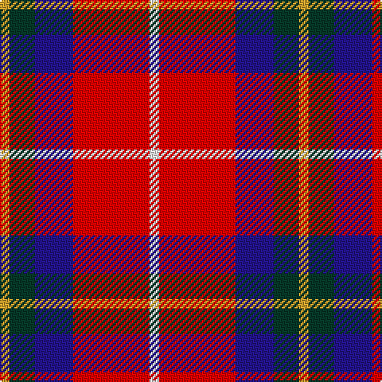

This page is one **sett** — a single exact thread-count. It belongs to the [tartan](/tartans/w3r24db12dg8ly3/)
(the same proportion at any scale), whose colour order is pattern [WRBGY](/stripes/wrbgy/).

Sourced from register-of-tartans.  It is a [5 stripe tartan](/stripes/stripes5/).

Original link https://www.tartanregister.gov.uk/tartanDetails.aspx?ref=10755

## Register references

External register numbers recorded for this tartan.

- Scottish Register of Tartans: [10755](https://www.tartanregister.gov.uk/tartanDetails.aspx?ref=10755)

## Thread count
Y/6 DG16 DB24 R48 W/6

## Palette

Palette: <strong>Tartan Register</strong> <small style="color:#888">(2 of 5 colours)</small>
<table><thead><tr><th>Colour</th><th>Threads</th><th>Shade</th><th>Base</th><th>OKLCh</th></tr></thead><tbody><tr><td>Y/</td><td style="text-align:right;font-variant-numeric:tabular-nums">6</td><td><code style="background-color:#CEA12C;">#CEA12C</code> <small style="color:#888">#CEA12C</small></td><td>Y <code style="background-color:#F2BF00;">#F2BF00</code></td><td><small style="color:#888">oklch(73.1% 0.136 86.1)</small></td></tr><tr><td>DG</td><td style="text-align:right;font-variant-numeric:tabular-nums">16</td><td><code style="background-color:#063928;">#063928</code> <small style="color:#888">#063928</small></td><td>G <code style="background-color:#006100;">#006100</code></td><td><small style="color:#888">oklch(30.7% 0.060 165.2)</small></td></tr><tr><td>DB</td><td style="text-align:right;font-variant-numeric:tabular-nums">24</td><td><code style="background-color:#23138D;">#23138D</code> <small style="color:#888">#23138D</small></td><td>B <code style="background-color:#2A418A;">#2A418A</code></td><td><small style="color:#888">oklch(32.2% 0.182 274.8)</small></td></tr><tr><td>R</td><td style="text-align:right;font-variant-numeric:tabular-nums">48</td><td><code style="background-color:#FF0000;">#FF0000</code> <small style="color:#888">#FF0000</small></td><td>R <code style="background-color:#CC0000;">#CC0000</code></td><td><small style="color:#888">oklch(62.8% 0.258 29.2)</small></td></tr><tr><td>W/</td><td style="text-align:right;font-variant-numeric:tabular-nums">6</td><td><code style="background-color:#FFFFFF;">#FFFFFF</code> <small style="color:#888">#FFFFFF</small></td><td>W <code style="background-color:#F7F7F7;">#F7F7F7</code></td><td><small style="color:#888">oklch(100.0% 0.000 89.9)</small></td></tr></tbody></table>

# Sample pattern

## Nearest tartans

The nearest existing variants by ΔTartan distance, with this tartan at the top so the swatches line up against it.

ΔTartan

Tartan

Sett

—

<a href="/ttd/edit/#slug=w3r24db12dg8ly3~x2">McGill University</a> <a class="nn-out" href="/setts/s5/w3r24db12dg8ly3~x2/" title="open its dictionary page">↗</a>

0.84

<a href="/ttd/edit/#slug=r30db20w15lb3ly3">Siddle, New (Corporate)</a> <a class="nn-out" href="/setts/s5/r30db20w15lb3ly3/" title="open its dictionary page">↗</a>

0.85

<a href="/ttd/edit/#slug=w3r24db12dg8lo3~x2">McGill University (Corporate)</a> <a class="nn-out" href="/setts/s5/w3r24db12dg8lo3~x2/" title="open its dictionary page">↗</a>

0.95

<a href="/ttd/edit/#slug=dp8ly6k2o1w1~x8">Ballater Victoria Week</a> <a class="nn-out" href="/setts/s5/dp8ly6k2o1w1~x8/" title="open its dictionary page">↗</a>

1.12

<a href="/ttd/edit/#slug=r32db6k6g6w18k3">Rose, White dress</a> <a class="nn-out" href="/setts/s6/r32db6k6g6w18k3/" title="open its dictionary page">↗</a>

1.27

<a href="/ttd/edit/#slug=r20k5g5r5w5n3g3~x4">Mangles, Peter and Annette (Personal)</a> <a class="nn-out" href="/setts/s7/r20k5g5r5w5n3g3~x4/" title="open its dictionary page">↗</a>

1.27

<a href="/ttd/edit/#slug=k6r20w2r9w3lb2~x2">Thermos Un-named (aretefact)</a> <a class="nn-out" href="/setts/s6/k6r20w2r9w3lb2~x2/" title="open its dictionary page">↗</a>

1.27

<a href="/ttd/edit/#slug=r7db2k2ly1k2r2k1w1~x2">Royal Stuart/Stewart</a> <a class="nn-out" href="/setts/s8/r7db2k2ly1k2r2k1w1~x2/" title="open its dictionary page">↗</a>

1.30

<a href="/ttd/edit/#slug=dg4lb4k2r15ly4~x4">Benedict (Personal)</a> <a class="nn-out" href="/setts/s5/dg4lb4k2r15ly4~x4/" title="open its dictionary page">↗</a>

1.30

<a href="/ttd/edit/#slug=ly4r27k12db15ly4~x2">Aberdeen University (1992)</a> <a class="nn-out" href="/setts/s5/ly4r27k12db15ly4~x2/" title="open its dictionary page">↗</a>

1.31

<a href="/ttd/edit/#slug=w15do8m25do72r98ly15">Afternoon Tea / Apple Tea</a> <a class="nn-out" href="/setts/s6/w15do8m25do72r98ly15/" title="open its dictionary page">↗</a>

## Neighbour map

Every grey dot is one of 14299 variants placed by the first two principal components of the ΔTartan feature space (44% of its variance). Red is this tartan; blue dots are its nearest — click one to open its page.

<svg viewBox="0 0 640 380" role="img" style="max-width:100%;height:auto;border:1px solid #e0e0e0;border-radius:4px;display:block" xmlns="http://www.w3.org/2000/svg"><image href="/nn/cloud.v1.png" width="640" height="380"/><a href="/setts/s5/r30db20w15lb3ly3/"><circle cx="171.7" cy="178.3" r="4" fill="#3465a4"><title>Siddle, New (Corporate)</title></circle></a><a href="/setts/s5/w3r24db12dg8lo3~x2/"><circle cx="210.0" cy="194.9" r="4" fill="#3465a4"><title>McGill University (Corporate)</title></circle></a><a href="/setts/s5/dp8ly6k2o1w1~x8/"><circle cx="177.9" cy="180.6" r="4" fill="#3465a4"><title>Ballater Victoria Week</title></circle></a><a href="/setts/s6/r32db6k6g6w18k3/"><circle cx="180.3" cy="154.9" r="4" fill="#3465a4"><title>Rose, White dress</title></circle></a><a href="/setts/s7/r20k5g5r5w5n3g3~x4/"><circle cx="222.4" cy="170.4" r="4" fill="#3465a4"><title>Mangles, Peter and Annette (Personal)</title></circle></a><a href="/setts/s6/k6r20w2r9w3lb2~x2/"><circle cx="226.7" cy="162.2" r="4" fill="#3465a4"><title>Thermos Un-named (aretefact)</title></circle></a><a href="/setts/s8/r7db2k2ly1k2r2k1w1~x2/"><circle cx="208.3" cy="168.5" r="4" fill="#3465a4"><title>Royal Stuart/Stewart</title></circle></a><a href="/setts/s5/dg4lb4k2r15ly4~x4/"><circle cx="226.7" cy="189.1" r="4" fill="#3465a4"><title>Benedict (Personal)</title></circle></a><a href="/setts/s5/ly4r27k12db15ly4~x2/"><circle cx="188.0" cy="222.2" r="4" fill="#3465a4"><title>Aberdeen University (1992)</title></circle></a><a href="/setts/s6/w15do8m25do72r98ly15/"><circle cx="221.2" cy="162.3" r="4" fill="#3465a4"><title>Afternoon Tea / Apple Tea</title></circle></a><circle cx="197.2" cy="181.7" r="5" fill="#c00000"/></svg>

ID: /setts/s5/w3r24db12dg8ly3~x2/
