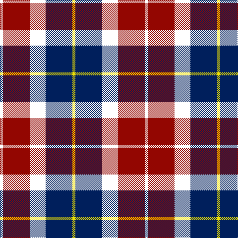

In pattern [WRWBY](/patterns/wrwby/).

This was sourced from register-of-tartans.  It is a [5 stripes tartan](/stripes/stripes5/).

Original link https://www.tartanregister.gov.uk/tartanDetails.aspx?ref=10579

## Register references

External register numbers recorded for this tartan.

- Scottish Register of Tartans: [10579](https://www.tartanregister.gov.uk/tartanDetails.aspx?ref=10579)

## Thread count
W/6 DR54 W32 DB54 Y/6

## Palette
Each colour and its ΔE from the base-6 reference it is a variant of.

| Colour | Shade | Base | ΔE (OKLab) |
|---|---|---|---|
| DB | <code style="background-color:#001F5C;">#001F5C</code> `#001F5C` | B <code style="background-color:#2A418A;">#2A418A</code> | 0.14 |
| DR | <code style="background-color:#930601;">#930601</code> `#930601` | R <code style="background-color:#CC0000;">#CC0000</code> | 0.12 |
| W | <code style="background-color:#FFFFFF;">#FFFFFF</code> `#FFFFFF` | W <code style="background-color:#F7F7F7;">#F7F7F7</code> | 0.02 |
| Y | <code style="background-color:#F0E200;">#F0E200</code> `#F0E200` | Y <code style="background-color:#F2BF00;">#F2BF00</code> | 0.09 |

# Sample pattern

## Nearest tartans

The nearest existing variants by ΔTartan distance.

1. [Common Ground Dress (Fashion)](/setts/s5/w3r27w16b27y3~b2c2c80-r880000-we0e0e0-ybc8c00~x2/) — ΔT 0.61
1. [Meg Merrilees Fancy Tartan Tartan Number: 1602. Earliest known date: 1831 Miss McDougall, Inverness library, says in her notes:The first mention I had of this tartan was in an advertisment by D MacDougall, Draper, 27 High St., Inverness in 1831 . . . Meg Merrilees and other winter shawls. From Dalgety Archives. STS notes that it was sold by Forsyth's in Glasgow in 1840. Meg Merrilees was a character in one of Scotts novels, Guy Mannering. BU See products available Copyright © Blair Urquhart, Comrie, 2015](/setts/s6/w23b6w6r5k35r10~b2c2c80-k101010-rc80000-we0e0e0~x2/) — ΔT 0.87
1. [Merrilees](/setts/s6/w23b6w6r5k35r10~b5c8ca8-k101010-rc80000-wf8f8f8~x2/) — ΔT 0.91
1. [Thompson Grey Family Tartan Tartan Number: 1611. Earliest known date: pre 2003 Designed for Lord Thomson of Fleet in 1958 based on a sample in the Moy Hall collection dating from the mid 19th century. The tartan is also suitable for MacTavishs and Thompsons, who claim descent from the Clan MacIntosh. See products available Copyright © Blair Urquhart, Comrie, 2015](/setts/s6/r2ra20k5w10k10r2~k101010-rc80000-ra888888-we0e0e0~x2/) — ΔT 0.97
1. [Merrilees Dress (Dance)](/setts/s6/k23b6k6r5w35r10~b1474b4-k101010-rc80000-wf8f8f8~x2/) — ΔT 1.03
1. [Thom(p)son, Grey](/setts/s6/r2g20k5w10k10r2~g808080-k000000-rc00000-we0e0e0~x2/) — ΔT 1.03
1. [Because You Care](/setts/s7/g16b4g8b13k3w26b10~b440044-g005020-k101010-wffffff~x2/) — ΔT 1.07
1. [Thompson Grey Dress](/setts/s6/r1ra6k1w3k3r1~k101010-r880000-ra888888-we0e0e0~x8/) — ΔT 1.12
1. [Thompson Navy Trade Tartan Tartan Number: 1443. Earliest known date: Oregon Possibly designed by Councillor John Hannay himself. No other information is available. See products available Copyright © Blair Urquhart, Comrie, 2015](/setts/s7/r3b15w13g6b2g2r2~b202060-g604000-ra00048-we0e0e0~x2/) — ΔT 1.16
1. [Oban Grey District Tartan Tartan Number: 1237. Earliest known date: pre 2003 Not an official district but a name chosen by the weavers. See products available Copyright © Blair Urquhart, Comrie, 2015](/setts/s5/k4w3k4r9ra1~k101010-r888888-rac80000-we0e0e0~x4/) — ΔT 1.17

## Neighbour map

Every grey dot is one of 15726 variants placed by the first two principal components of the ΔTartan feature space (44% of its variance). Red is this tartan; blue dots are its nearest — click one to open its page.

<svg viewBox="0 0 640 380" role="img" style="max-width:100%;height:auto;border:1px solid #e0e0e0;border-radius:4px;display:block" xmlns="http://www.w3.org/2000/svg"><image href="/nn/cloud.v1.png" width="640" height="380"/><a href="/setts/s5/w3r27w16b27y3~b2c2c80-r880000-we0e0e0-ybc8c00~x2/"><circle cx="163.2" cy="211.8" r="4" fill="#3465a4"><title>Common Ground Dress (Fashion)</title></circle></a><a href="/setts/s6/w23b6w6r5k35r10~b2c2c80-k101010-rc80000-we0e0e0~x2/"><circle cx="160.4" cy="202.6" r="4" fill="#3465a4"><title>Meg Merrilees Fancy Tartan Tartan Number: 1602. Earliest known date: 1831 Miss McDougall, Inverness library, says in her notes:The first mention I had of this tartan was in an advertisment by D MacDougall, Draper, 27 High St., Inverness in 1831 . . . Meg Merrilees and other winter shawls. From Dalgety Archives. STS notes that it was sold by Forsyth's in Glasgow in 1840. Meg Merrilees was a character in one of Scotts novels, Guy Mannering. BU See products available Copyright © Blair Urquhart, Comrie, 2015</title></circle></a><a href="/setts/s6/w23b6w6r5k35r10~b5c8ca8-k101010-rc80000-wf8f8f8~x2/"><circle cx="155.0" cy="199.0" r="4" fill="#3465a4"><title>Merrilees</title></circle></a><a href="/setts/s6/r2ra20k5w10k10r2~k101010-rc80000-ra888888-we0e0e0~x2/"><circle cx="172.2" cy="195.7" r="4" fill="#3465a4"><title>Thompson Grey Family Tartan Tartan Number: 1611. Earliest known date: pre 2003 Designed for Lord Thomson of Fleet in 1958 based on a sample in the Moy Hall collection dating from the mid 19th century. The tartan is also suitable for MacTavishs and Thompsons, who claim descent from the Clan MacIntosh. See products available Copyright © Blair Urquhart, Comrie, 2015</title></circle></a><a href="/setts/s6/k23b6k6r5w35r10~b1474b4-k101010-rc80000-wf8f8f8~x2/"><circle cx="152.3" cy="196.1" r="4" fill="#3465a4"><title>Merrilees Dress (Dance)</title></circle></a><a href="/setts/s6/r2g20k5w10k10r2~g808080-k000000-rc00000-we0e0e0~x2/"><circle cx="162.2" cy="194.8" r="4" fill="#3465a4"><title>Thom(p)son, Grey</title></circle></a><a href="/setts/s7/g16b4g8b13k3w26b10~b440044-g005020-k101010-wffffff~x2/"><circle cx="117.0" cy="202.2" r="4" fill="#3465a4"><title>Because You Care</title></circle></a><a href="/setts/s6/r1ra6k1w3k3r1~k101010-r880000-ra888888-we0e0e0~x8/"><circle cx="142.4" cy="217.2" r="4" fill="#3465a4"><title>Thompson Grey Dress</title></circle></a><a href="/setts/s7/r3b15w13g6b2g2r2~b202060-g604000-ra00048-we0e0e0~x2/"><circle cx="156.9" cy="192.0" r="4" fill="#3465a4"><title>Thompson Navy Trade Tartan Tartan Number: 1443. Earliest known date: Oregon Possibly designed by Councillor John Hannay himself. No other information is available. See products available Copyright © Blair Urquhart, Comrie, 2015</title></circle></a><a href="/setts/s5/k4w3k4r9ra1~k101010-r888888-rac80000-we0e0e0~x4/"><circle cx="183.3" cy="226.2" r="4" fill="#3465a4"><title>Oban Grey District Tartan Tartan Number: 1237. Earliest known date: pre 2003 Not an official district but a name chosen by the weavers. See products available Copyright © Blair Urquhart, Comrie, 2015</title></circle></a><circle cx="147.3" cy="206.7" r="5" fill="#c00000"/></svg>

ID: /setts/s5/w3r27w16b27y3~b001f5c-r930601-wffffff-yf0e200~x2/
