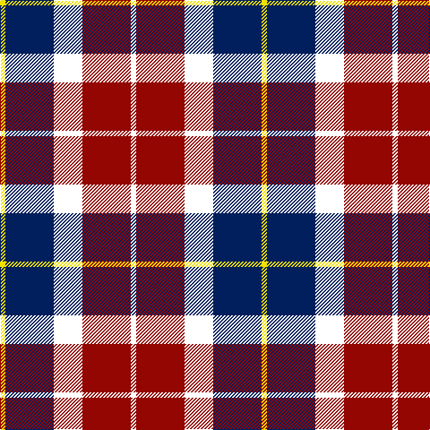

This page is one **sett** — a single exact thread-count. It belongs to the [tartan](/tartans/w3r27w16db27ly3/)
(the same proportion at any scale), whose colour order is pattern [WRWBY](/stripes/wrwby/).

Sourced from register-of-tartans.  It is a [5 stripe tartan](/stripes/stripes5/).

Original link https://www.tartanregister.gov.uk/tartanDetails.aspx?ref=10579

## Register references

External register numbers recorded for this tartan.

- Scottish Register of Tartans: [10579](https://www.tartanregister.gov.uk/tartanDetails.aspx?ref=10579)

## Thread count
Y/6 DB54 W32 DR54 W/6

## Palette

Palette: <strong>Tartan Register</strong> <small style="color:#888">(1 of 4 colours)</small>
<table><thead><tr><th>Colour</th><th>Threads</th><th>Shade</th><th>Base</th><th>OKLCh</th></tr></thead><tbody><tr><td>Y/</td><td style="text-align:right;font-variant-numeric:tabular-nums">6</td><td><code style="background-color:#F0E200;">#F0E200</code> <small style="color:#888">#F0E200</small></td><td>Y <code style="background-color:#F2BF00;">#F2BF00</code></td><td><small style="color:#888">oklch(89.5% 0.190 105.1)</small></td></tr><tr><td>DB</td><td style="text-align:right;font-variant-numeric:tabular-nums">54</td><td><code style="background-color:#001F5C;">#001F5C</code> <small style="color:#888">#001F5C</small></td><td>B <code style="background-color:#2A418A;">#2A418A</code></td><td><small style="color:#888">oklch(26.6% 0.115 261.1)</small></td></tr><tr><td>W</td><td style="text-align:right;font-variant-numeric:tabular-nums">32</td><td><code style="background-color:#FFFFFF;">#FFFFFF</code> <small style="color:#888">#FFFFFF</small></td><td>W <code style="background-color:#F7F7F7;">#F7F7F7</code></td><td><small style="color:#888">oklch(100.0% 0.000 89.9)</small></td></tr><tr><td>DR</td><td style="text-align:right;font-variant-numeric:tabular-nums">54</td><td><code style="background-color:#930601;">#930601</code> <small style="color:#888">#930601</small></td><td>R <code style="background-color:#CC0000;">#CC0000</code></td><td><small style="color:#888">oklch(41.9% 0.169 29.7)</small></td></tr><tr><td>W/</td><td style="text-align:right;font-variant-numeric:tabular-nums">6</td><td><code style="background-color:#FFFFFF;">#FFFFFF</code> <small style="color:#888">#FFFFFF</small></td><td>W <code style="background-color:#F7F7F7;">#F7F7F7</code></td><td><small style="color:#888">oklch(100.0% 0.000 89.9)</small></td></tr></tbody></table>

# Sample pattern

## Nearest tartans

The nearest existing variants by ΔTartan distance, with this tartan at the top so the swatches line up against it.

ΔTartan

Tartan

Sett

—

<a href="/ttd/edit/#slug=w3r27w16db27ly3~x2">Common Ground (Dress)</a> <a class="nn-out" href="/setts/s5/w3r27w16db27ly3~x2/" title="open its dictionary page">↗</a>

0.60

<a href="/ttd/edit/#slug=w3r27w16db27lo3~x2">Common Ground Dress (Fashion)</a> <a class="nn-out" href="/setts/s5/w3r27w16db27lo3~x2/" title="open its dictionary page">↗</a>

0.91

<a href="/ttd/edit/#slug=w23t6w6r5k35r10~x2">Merrilees</a> <a class="nn-out" href="/setts/s6/w23t6w6r5k35r10~x2/" title="open its dictionary page">↗</a>

0.97

<a href="/ttd/edit/#slug=r2o20k5w10k10r2~x2">Thompson Grey Family Tartan Tartan Number: 1611. Earliest known date: pre 2003 Designed for Lord Thomson of Fleet in 1958 based on a sample in the Moy Hall collection dating from the mid 19th century. The tartan is also suitable for MacTavishs and Thompsons, who claim descent from the Clan MacIntosh. See products available Copyright © Blair Urquhart, Comrie, 2015</a> <a class="nn-out" href="/setts/s6/r2o20k5w10k10r2~x2/" title="open its dictionary page">↗</a>

1.03

<a href="/ttd/edit/#slug=k23b6k6r5w35r10~x2">Merrilees Dress (Dance)</a> <a class="nn-out" href="/setts/s6/k23b6k6r5w35r10~x2/" title="open its dictionary page">↗</a>

1.04

<a href="/ttd/edit/#slug=r2y20k5w10k10r2~x2">Thom(p)son, Grey</a> <a class="nn-out" href="/setts/s6/r2y20k5w10k10r2~x2/" title="open its dictionary page">↗</a>

1.07

<a href="/ttd/edit/#slug=dg16dp4dg8dp13k3w26dp10~x2">Because You Care</a> <a class="nn-out" href="/setts/s7/dg16dp4dg8dp13k3w26dp10~x2/" title="open its dictionary page">↗</a>

1.12

<a href="/ttd/edit/#slug=r1o6k1w3k3r1~x8">Thompson Grey Dress</a> <a class="nn-out" href="/setts/s6/r1o6k1w3k3r1~x8/" title="open its dictionary page">↗</a>

1.15

<a href="/ttd/edit/#slug=m3db15w13dy6db2dy2m2~x2">Thompson Navy Trade Tartan Tartan Number: 1443. Earliest known date: Oregon Possibly designed by Councillor John Hannay himself. No other information is available. See products available Copyright © Blair Urquhart, Comrie, 2015</a> <a class="nn-out" href="/setts/s7/m3db15w13dy6db2dy2m2~x2/" title="open its dictionary page">↗</a>

1.17

<a href="/ttd/edit/#slug=k4w3k4o9r1~x4">Oban Grey District Tartan Tartan Number: 1237. Earliest known date: pre 2003 Not an official district but a name chosen by the weavers. See products available Copyright © Blair Urquhart, Comrie, 2015</a> <a class="nn-out" href="/setts/s5/k4w3k4o9r1~x4/" title="open its dictionary page">↗</a>

1.18

<a href="/ttd/edit/#slug=w8k2y12k11w1r6y4~x2">Unidentified</a> <a class="nn-out" href="/setts/s7/w8k2y12k11w1r6y4~x2/" title="open its dictionary page">↗</a>

## Neighbour map

Every grey dot is one of 14359 variants placed by the first two principal components of the ΔTartan feature space (44% of its variance). Red is this tartan; blue dots are its nearest — click one to open its page.

<svg viewBox="0 0 640 380" role="img" style="max-width:100%;height:auto;border:1px solid #e0e0e0;border-radius:4px;display:block" xmlns="http://www.w3.org/2000/svg"><image href="/nn/cloud.v1.png" width="640" height="380"/><a href="/setts/s5/w3r27w16db27lo3~x2/"><circle cx="164.6" cy="209.6" r="4" fill="#3465a4"><title>Common Ground Dress (Fashion)</title></circle></a><a href="/setts/s6/w23t6w6r5k35r10~x2/"><circle cx="156.5" cy="194.8" r="4" fill="#3465a4"><title>Merrilees</title></circle></a><a href="/setts/s6/r2o20k5w10k10r2~x2/"><circle cx="173.9" cy="193.5" r="4" fill="#3465a4"><title>Thompson Grey Family Tartan Tartan Number: 1611. Earliest known date: pre 2003 Designed for Lord Thomson of Fleet in 1958 based on a sample in the Moy Hall collection dating from the mid 19th century. The tartan is also suitable for MacTavishs and Thompsons, who claim descent from the Clan MacIntosh. See products available Copyright © Blair Urquhart, Comrie, 2015</title></circle></a><a href="/setts/s6/k23b6k6r5w35r10~x2/"><circle cx="153.6" cy="191.6" r="4" fill="#3465a4"><title>Merrilees Dress (Dance)</title></circle></a><a href="/setts/s6/r2y20k5w10k10r2~x2/"><circle cx="164.2" cy="191.8" r="4" fill="#3465a4"><title>Thom(p)son, Grey</title></circle></a><a href="/setts/s7/dg16dp4dg8dp13k3w26dp10~x2/"><circle cx="119.3" cy="199.8" r="4" fill="#3465a4"><title>Because You Care</title></circle></a><a href="/setts/s6/r1o6k1w3k3r1~x8/"><circle cx="144.2" cy="215.5" r="4" fill="#3465a4"><title>Thompson Grey Dress</title></circle></a><a href="/setts/s7/m3db15w13dy6db2dy2m2~x2/"><circle cx="159.0" cy="190.3" r="4" fill="#3465a4"><title>Thompson Navy Trade Tartan Tartan Number: 1443. Earliest known date: Oregon Possibly designed by Councillor John Hannay himself. No other information is available. See products available Copyright © Blair Urquhart, Comrie, 2015</title></circle></a><a href="/setts/s5/k4w3k4o9r1~x4/"><circle cx="185.2" cy="223.8" r="4" fill="#3465a4"><title>Oban Grey District Tartan Tartan Number: 1237. Earliest known date: pre 2003 Not an official district but a name chosen by the weavers. See products available Copyright © Blair Urquhart, Comrie, 2015</title></circle></a><a href="/setts/s7/w8k2y12k11w1r6y4~x2/"><circle cx="142.9" cy="194.4" r="4" fill="#3465a4"><title>Unidentified</title></circle></a><circle cx="148.8" cy="203.2" r="5" fill="#c00000"/></svg>

ID: /setts/s5/w3r27w16db27ly3~x2/
