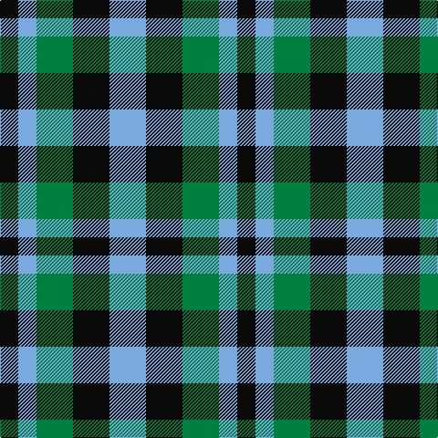

In pattern [KWGKW](/patterns/kwgkw/).

This was sourced from register-of-tartans.  It is a [5 stripes tartan](/stripes/stripes5/).

Original link https://www.tartanregister.gov.uk/tartanDetails.aspx?ref=10169

## Thread count
K/20 LB20 G40 K40 LB/40

## Palette
Each colour and its ΔE from the base-6 reference it is a variant of.

| Colour | Shade | Base | ΔE (OKLab) |
|---|---|---|---|
| G | <code style="background-color:#008040;">#008040</code> `#008040` | G <code style="background-color:#006400;">#006400</code> | 0.09 |
| K | <code style="background-color:#0A0A0A;">#0A0A0A</code> `#0A0A0A` | K <code style="background-color:#000000;">#000000</code> | 0.14 |
| LB | <code style="background-color:#7AA9DD;">#7AA9DD</code> `#7AA9DD` | W <code style="background-color:#F4F4F0;">#F4F4F0</code> | 0.26 |

# Sample pattern

## Nearest tartans

The nearest existing variants by ΔTartan distance.

1. [Bedford Check](/setts/s4/b6r12k8b4-b2888c4-k101010-r888888/) — ΔT 1.53
1. [Equity Vision Ltd](/setts/s4/b24k16ba30w16-b2e2528-ba5f749c-k101010-wffffff/) — ΔT 1.57
1. [Hage-West (Personal)](/setts/s6/g16k16g16y12k6y12-g23321b-k1c1714-yf8e38c/) — ΔT 1.63
1. [Glenlyon #2](/setts/s3/g12k8b8-b0000cd-g008b00-k101010/) — ΔT 1.69
1. [Wilson's, No 52](/setts/s3/g14k8b8-b5480b0-g008000-k000000/) — ΔT 1.79
1. [Hage-West (Personal)](/setts/s6/g16k16g16y12k6y12-g003820-k101010-ye8c000/) — ΔT 1.79
1. [Glen Lyon](/setts/s3/g12k8b8-b304080-g30a010-k000000/) — ΔT 1.83
1. [Austin (Wilson's No 173)](/setts/s5/b6k6b6g12y4-b5a008c-g005020-k101010-ye8c000/) — ΔT 1.84
1. [Glen Lyon (District)](/setts/s3/k10g8b6-b2888c4-g006818-k101010/) — ΔT 1.84
1. [Kazakhstan Relic (Artefact)](/setts/s3/y20b20k12-b202060-k101010-ybc8c00/) — ΔT 1.84

## Neighbour map

Every grey dot is one of 15726 variants placed by the first two principal components of the ΔTartan feature space (44% of its variance). Red is this tartan; blue dots are its nearest — click one to open its page.

<svg viewBox="0 0 640 380" role="img" style="max-width:100%;height:auto;border:1px solid #e0e0e0;border-radius:4px;display:block" xmlns="http://www.w3.org/2000/svg"><image href="/nn/cloud.v1.png" width="640" height="380"/><a href="/setts/s4/b6r12k8b4-b2888c4-k101010-r888888/"><circle cx="149.3" cy="333.0" r="4" fill="#3465a4"><title>Bedford Check</title></circle></a><a href="/setts/s4/b24k16ba30w16-b2e2528-ba5f749c-k101010-wffffff/"><circle cx="24.7" cy="334.6" r="4" fill="#3465a4"><title>Equity Vision Ltd</title></circle></a><a href="/setts/s6/g16k16g16y12k6y12-g23321b-k1c1714-yf8e38c/"><circle cx="91.9" cy="322.5" r="4" fill="#3465a4"><title>Hage-West (Personal)</title></circle></a><a href="/setts/s3/g12k8b8-b0000cd-g008b00-k101010/"><circle cx="90.0" cy="366.0" r="4" fill="#3465a4"><title>Glenlyon #2</title></circle></a><a href="/setts/s3/g14k8b8-b5480b0-g008000-k000000/"><circle cx="119.0" cy="366.0" r="4" fill="#3465a4"><title>Wilson's, No 52</title></circle></a><a href="/setts/s6/g16k16g16y12k6y12-g003820-k101010-ye8c000/"><circle cx="97.3" cy="328.2" r="4" fill="#3465a4"><title>Hage-West (Personal)</title></circle></a><a href="/setts/s3/g12k8b8-b304080-g30a010-k000000/"><circle cx="78.4" cy="366.0" r="4" fill="#3465a4"><title>Glen Lyon</title></circle></a><a href="/setts/s5/b6k6b6g12y4-b5a008c-g005020-k101010-ye8c000/"><circle cx="92.6" cy="303.7" r="4" fill="#3465a4"><title>Austin (Wilson's No 173)</title></circle></a><a href="/setts/s3/k10g8b6-b2888c4-g006818-k101010/"><circle cx="112.9" cy="366.0" r="4" fill="#3465a4"><title>Glen Lyon (District)</title></circle></a><a href="/setts/s3/y20b20k12-b202060-k101010-ybc8c00/"><circle cx="96.5" cy="366.0" r="4" fill="#3465a4"><title>Kazakhstan Relic (Artefact)</title></circle></a><circle cx="81.4" cy="343.5" r="5" fill="#c00000"/></svg>

ID: /setts/s5/w40k40g40w20k20-g008040-k0a0a0a-w7aa9dd/
