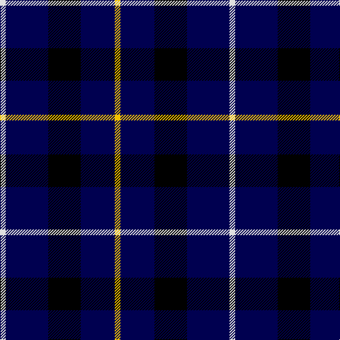

In pattern [WBKBY](/patterns/wbkby/).

This was sourced from weddslist.  It is a [5 stripes tartan](/stripes/stripes5/).

Original link http://www.weddslist.com/cgi-bin/tartans/pg.pl?source=sts

## Thread count
LN/8 DB60 K46 DB48 Y/8

## Palette
Each colour and its ΔE from the base-6 reference it is a variant of.

| Colour | Shade | Base | ΔE (OKLab) |
|---|---|---|---|
| DB | <code style="background-color:#000050;">#000050</code> `#000050` | B <code style="background-color:#2A418A;">#2A418A</code> | 0.21 |
| K | <code style="background-color:#000000;">#000000</code> `#000000` | K <code style="background-color:#000000;">#000000</code> | 0.00 |
| LN | <code style="background-color:#E0E0E0;">#E0E0E0</code> `#E0E0E0` | W <code style="background-color:#F7F7F7;">#F7F7F7</code> | 0.07 |
| Y | <code style="background-color:#F0C000;">#F0C000</code> `#F0C000` | Y <code style="background-color:#F2BF00;">#F2BF00</code> | 0.00 |

# Sample pattern

## Nearest tartans

The nearest existing variants by ΔTartan distance.

1. [Bank of Scotland (1995)](/setts/s5/w1b6k5b6y1x6~b2c2c80-k000000-wc8c8c8-yc88c00/) — ΔT 1.00
1. [Bank of Scotland Corporate Tartan Tartan Number: 2462. Earliest known date: 1994 Commemorating the founding of the bank in 1695 See products available Copyright © Blair Urquhart, Comrie, 2015](/setts/s5/w4b30k23b24y4x2~b202060-k101010-we0e0e0-ye8c000/) — ΔT 1.32
1. [College of Radiographers](/setts/s5/k15y2k10b18w3x2~b00008c-k101010-wc8c8c8-yc88c00/) — ΔT 1.42
1. [College of Radiographers](/setts/s5/k15g2k10b18w3x2~b304080-g908000-k000000-we0e0e0/) — ΔT 1.47
1. [Allen, Nicholas (Personal)](/setts/s6/r8k24b10k5b10k5x2~b0000cd-k000000-rc8002c/) — ΔT 1.57
1. [College of Radiographers Corporate Tartan Tartan Number: 1274. Earliest known date: 1988 Marketed in Edinburgh around 1930s but no longer seen. See products available Copyright © Blair Urquhart, Comrie, 2015](/setts/s5/k15y2k10b18w3x2~b2c2c80-k101010-we0e0e0-ye8c000/) — ΔT 1.65
1. [Carrick High School](/setts/s7/k6y2k16b6k3ba18k2x2~b788cb4-ba00008c-k000000-yc88c00/) — ΔT 1.66
1. [St. Eloi](/setts/s6/r3y2k10w1k10y2x6~k00002c-r880000-we0e0e0-yd09800/) — ΔT 1.68
1. [Marchmont](/setts/s7/k1b12k12g1k12b12w1x4~b304080-g407050-k000000-we0e0e0/) — ΔT 1.69
1. [Davidson of Tulloch Clan Tartan Tartan Number: 1360. Earliest known date: 1984 The Davidsons or Clan Dhai maintained a constant battle for precedence within Clan Chattan. The Davidsons of Tulloch in Ross-shire are one of the main branches of the Davidson family. See products available Copyright © Blair Urquhart, Comrie, 2015](/setts/s5/r6b35k36b36w6~b2c2c80-k101010-rc80000-we0e0e0/) — ΔT 1.72

## Neighbour map

Every grey dot is one of 15726 variants placed by the first two principal components of the ΔTartan feature space (44% of its variance). Red is this tartan; blue dots are its nearest — click one to open its page.

<svg viewBox="0 0 640 380" role="img" style="max-width:100%;height:auto;border:1px solid #e0e0e0;border-radius:4px;display:block" xmlns="http://www.w3.org/2000/svg"><image href="/nn/cloud.v1.png" width="640" height="380"/><a href="/setts/s5/w1b6k5b6y1x6~b2c2c80-k000000-wc8c8c8-yc88c00/"><circle cx="293.2" cy="266.1" r="4" fill="#3465a4"><title>Bank of Scotland (1995)</title></circle></a><a href="/setts/s5/w4b30k23b24y4x2~b202060-k101010-we0e0e0-ye8c000/"><circle cx="330.4" cy="264.2" r="4" fill="#3465a4"><title>Bank of Scotland Corporate Tartan Tartan Number: 2462. Earliest known date: 1994 Commemorating the founding of the bank in 1695 See products available Copyright © Blair Urquhart, Comrie, 2015</title></circle></a><a href="/setts/s5/k15y2k10b18w3x2~b00008c-k101010-wc8c8c8-yc88c00/"><circle cx="270.4" cy="252.6" r="4" fill="#3465a4"><title>College of Radiographers</title></circle></a><a href="/setts/s5/k15g2k10b18w3x2~b304080-g908000-k000000-we0e0e0/"><circle cx="247.2" cy="243.3" r="4" fill="#3465a4"><title>College of Radiographers</title></circle></a><a href="/setts/s6/r8k24b10k5b10k5x2~b0000cd-k000000-rc8002c/"><circle cx="249.0" cy="279.8" r="4" fill="#3465a4"><title>Allen, Nicholas (Personal)</title></circle></a><a href="/setts/s5/k15y2k10b18w3x2~b2c2c80-k101010-we0e0e0-ye8c000/"><circle cx="264.5" cy="246.0" r="4" fill="#3465a4"><title>College of Radiographers Corporate Tartan Tartan Number: 1274. Earliest known date: 1988 Marketed in Edinburgh around 1930s but no longer seen. See products available Copyright © Blair Urquhart, Comrie, 2015</title></circle></a><a href="/setts/s7/k6y2k16b6k3ba18k2x2~b788cb4-ba00008c-k000000-yc88c00/"><circle cx="245.9" cy="218.8" r="4" fill="#3465a4"><title>Carrick High School</title></circle></a><a href="/setts/s6/r3y2k10w1k10y2x6~k00002c-r880000-we0e0e0-yd09800/"><circle cx="374.1" cy="221.2" r="4" fill="#3465a4"><title>St. Eloi</title></circle></a><a href="/setts/s7/k1b12k12g1k12b12w1x4~b304080-g407050-k000000-we0e0e0/"><circle cx="281.2" cy="219.2" r="4" fill="#3465a4"><title>Marchmont</title></circle></a><a href="/setts/s5/r6b35k36b36w6~b2c2c80-k101010-rc80000-we0e0e0/"><circle cx="303.2" cy="273.9" r="4" fill="#3465a4"><title>Davidson of Tulloch Clan Tartan Tartan Number: 1360. Earliest known date: 1984 The Davidsons or Clan Dhai maintained a constant battle for precedence within Clan Chattan. The Davidsons of Tulloch in Ross-shire are one of the main branches of the Davidson family. See products available Copyright © Blair Urquhart, Comrie, 2015</title></circle></a><circle cx="307.8" cy="262.8" r="5" fill="#c00000"/></svg>

ID: /setts/s5/w4b30k23b24y4x2~b000050-k000000-we0e0e0-yf0c000/
