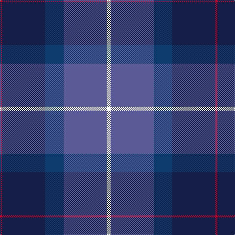

In pattern [RBBBW](/patterns/rbbbw/).

This was sourced from register-of-tartans.  It is a [5 stripes tartan](/stripes/stripes5/).

Original link https://www.tartanregister.gov.uk/tartanDetails.aspx?ref=4782

## Thread count
R/4 DB88 DBa38 B88 W/8

## Palette
Each colour and its ΔE from the base-6 reference it is a variant of.

| Colour | Shade | Base | ΔE (OKLab) |
|---|---|---|---|
| B | <code style="background-color:#5A5A96;">#5A5A96</code> `#5A5A96` | B <code style="background-color:#2A418A;">#2A418A</code> | 0.10 |
| DB | <code style="background-color:#141E46;">#141E46</code> `#141E46` | B <code style="background-color:#2A418A;">#2A418A</code> | 0.16 |
| DBa | <code style="background-color:#0F3C6E;">#0F3C6E</code> `#0F3C6E` | B <code style="background-color:#2A418A;">#2A418A</code> | 0.06 |
| R | <code style="background-color:#C80028;">#C80028</code> `#C80028` | R <code style="background-color:#CC0000;">#CC0000</code> | 0.02 |
| W | <code style="background-color:#FFFFFF;">#FFFFFF</code> `#FFFFFF` | W <code style="background-color:#F7F7F7;">#F7F7F7</code> | 0.02 |

# Sample pattern

## Nearest tartans

The nearest existing variants by ΔTartan distance.

1. [Riley's Theme (Fashion)](/setts/s6/b20k4g5ba14w1b2~b2c2c80-ba440044-g006818-k101010-wfcfcfc~x2/) — ΔT 1.15
1. [U.S. 2001 Air Force (Military?)](/setts/s7/b49g3k22r2ba33bb3ba7~b2c2c80-ba1474b4-bb1c0070-g006818-k101010-rc80000~x2/) — ΔT 1.40
1. [Nicolson of Harris (Clan?)](/setts/s6/r3b15ba8g5k2w1~b1c1c50-ba2c2c80-g006818-k101010-rc80000-we0e0e0~x2/) — ΔT 1.49
1. [MacFadzean](/setts/s6/b48w2k20g22r3g4~b2c4084-g005020-k101010-rdc0000-we0e0e0~x2/) — ΔT 1.49
1. [Diaspora (Fashion)](/setts/s5/w3b28k12r22g1~b003478-g003800-k000034-r8c0000-wc8c8c8~x2/) — ΔT 1.51
1. [Unidentified #50](/setts/s5/b19k8w1g10r3~b1c0070-g006818-k101010-r9c68a4-wc0c0c0~x2/) — ΔT 1.51
1. [Diaspora](/setts/s6/b3g1r22k12b28w3~b003478-g003800-k000034-r8c0000-wc8c8c8~x2/) — ΔT 1.53
1. [MacCord (Personal)](/setts/s7/g6r2b1r3b16ba20w2~b202060-ba506878-g285800-rc80000-we0e0e0~x2/) — ΔT 1.55
1. [Hutchesons' Grammar (Corporate)](/setts/s6/b8r4ba30bb30ra3bb4~b5c8ca8-ba2c2c80-bb14283c-r888888-rac80000~x2/) — ΔT 1.56
1. [Scottish Open Squash (Corporate)](/setts/s5/b23ba2g11ba24w3~b1c0070-ba440044-g006818-wc0c0c0~x2/) — ΔT 1.57

## Neighbour map

Every grey dot is one of 15726 variants placed by the first two principal components of the ΔTartan feature space (44% of its variance). Red is this tartan; blue dots are its nearest — click one to open its page.

<svg viewBox="0 0 640 380" role="img" style="max-width:100%;height:auto;border:1px solid #e0e0e0;border-radius:4px;display:block" xmlns="http://www.w3.org/2000/svg"><image href="/nn/cloud.v1.png" width="640" height="380"/><a href="/setts/s6/b20k4g5ba14w1b2~b2c2c80-ba440044-g006818-k101010-wfcfcfc~x2/"><circle cx="309.0" cy="189.8" r="4" fill="#3465a4"><title>Riley's Theme (Fashion)</title></circle></a><a href="/setts/s7/b49g3k22r2ba33bb3ba7~b2c2c80-ba1474b4-bb1c0070-g006818-k101010-rc80000~x2/"><circle cx="259.3" cy="150.1" r="4" fill="#3465a4"><title>U.S. 2001 Air Force (Military?)</title></circle></a><a href="/setts/s6/r3b15ba8g5k2w1~b1c1c50-ba2c2c80-g006818-k101010-rc80000-we0e0e0~x2/"><circle cx="219.5" cy="178.5" r="4" fill="#3465a4"><title>Nicolson of Harris (Clan?)</title></circle></a><a href="/setts/s6/b48w2k20g22r3g4~b2c4084-g005020-k101010-rdc0000-we0e0e0~x2/"><circle cx="311.9" cy="176.3" r="4" fill="#3465a4"><title>MacFadzean</title></circle></a><a href="/setts/s5/w3b28k12r22g1~b003478-g003800-k000034-r8c0000-wc8c8c8~x2/"><circle cx="262.1" cy="177.2" r="4" fill="#3465a4"><title>Diaspora (Fashion)</title></circle></a><a href="/setts/s5/b19k8w1g10r3~b1c0070-g006818-k101010-r9c68a4-wc0c0c0~x2/"><circle cx="245.1" cy="197.8" r="4" fill="#3465a4"><title>Unidentified #50</title></circle></a><a href="/setts/s6/b3g1r22k12b28w3~b003478-g003800-k000034-r8c0000-wc8c8c8~x2/"><circle cx="279.5" cy="162.6" r="4" fill="#3465a4"><title>Diaspora</title></circle></a><a href="/setts/s7/g6r2b1r3b16ba20w2~b202060-ba506878-g285800-rc80000-we0e0e0~x2/"><circle cx="245.7" cy="160.0" r="4" fill="#3465a4"><title>MacCord (Personal)</title></circle></a><a href="/setts/s6/b8r4ba30bb30ra3bb4~b5c8ca8-ba2c2c80-bb14283c-r888888-rac80000~x2/"><circle cx="277.2" cy="218.8" r="4" fill="#3465a4"><title>Hutchesons' Grammar (Corporate)</title></circle></a><a href="/setts/s5/b23ba2g11ba24w3~b1c0070-ba440044-g006818-wc0c0c0~x2/"><circle cx="256.0" cy="235.4" r="4" fill="#3465a4"><title>Scottish Open Squash (Corporate)</title></circle></a><circle cx="262.1" cy="195.4" r="5" fill="#c00000"/></svg>

ID: /setts/s5/w4b44ba19bb44r2~b5a5a96-ba0f3c6e-bb141e46-rc80028-wffffff~x2/
