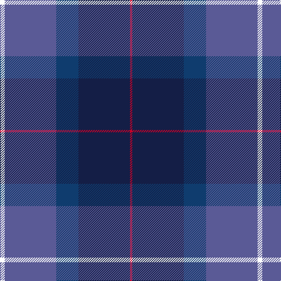

In pattern [RBBBW](/stripes/rbbbw/).

This was sourced from register-of-tartans.  It is a [5 stripe tartan](/stripes/stripes5/).

Original link https://www.tartanregister.gov.uk/tartanDetails.aspx?ref=4782

## Register references

External register numbers recorded for this tartan.

- Scottish Register of Tartans: [4782](https://www.tartanregister.gov.uk/tartanDetails.aspx?ref=4782)
- Scottish Tartans Authority (ITI): 2699
- Scottish Tartans World Register: 2699

## Thread count
W/8 B88 DBa38 DB88 R/4

## Palette
Each colour and the base-6 reference it is a variant of.

| Colour | Shade | Base |
|---|---|---|
| B | <code style="background-color:#5A5A96;">#5A5A96</code> `oklch(49.5% 0.095 282.4)` <small>#5A5A96</small> | B <code style="background-color:#2A418A;">#2A418A</code> |
| DB | <code style="background-color:#141E46;">#141E46</code> `oklch(25.2% 0.076 269.7)` <small>#141E46</small> | B <code style="background-color:#2A418A;">#2A418A</code> |
| DBa | <code style="background-color:#0F3C6E;">#0F3C6E</code> `oklch(35.6% 0.099 254.3)` <small>#0F3C6E</small> | B <code style="background-color:#2A418A;">#2A418A</code> |
| R | <code style="background-color:#C80028;">#C80028</code> `oklch(52.5% 0.212 23.0)` <small>#C80028</small> | R <code style="background-color:#CC0000;">#CC0000</code> |
| W | <code style="background-color:#FFFFFF;">#FFFFFF</code> `oklch(100.0% 0.000 89.9)` <small>#FFFFFF</small> | W <code style="background-color:#F7F7F7;">#F7F7F7</code> |

# Sample pattern

## Nearest tartans

The nearest existing variants by ΔTartan distance, with this tartan at the top so the swatches line up against it.

ΔTartan

Tartan

Sett

—

<a href="/ttd/edit/#slug=w4b44db19db44r2~x2">World Federation of Building Contractors</a> <a class="nn-out" href="/setts/s5/w4b44db19db44r2~x2/" title="open its dictionary page">↗</a>

1.15

<a href="/ttd/edit/#slug=db20k4g5dp14w1db2~x2">Riley's Theme (Fashion)</a> <a class="nn-out" href="/setts/s6/db20k4g5dp14w1db2~x2/" title="open its dictionary page">↗</a>

1.40

<a href="/ttd/edit/#slug=db49g3k22r2b33db3b7~x2">U.S. 2001 Air Force (Military?)</a> <a class="nn-out" href="/setts/s7/db49g3k22r2b33db3b7~x2/" title="open its dictionary page">↗</a>

1.49

<a href="/ttd/edit/#slug=r3db15db8g5k2w1~x2">Nicolson of Harris (Clan?)</a> <a class="nn-out" href="/setts/s6/r3db15db8g5k2w1~x2/" title="open its dictionary page">↗</a>

1.49

<a href="/ttd/edit/#slug=db48w2k20dg22r3dg4~x2">MacFadzean</a> <a class="nn-out" href="/setts/s6/db48w2k20dg22r3dg4~x2/" title="open its dictionary page">↗</a>

1.50

<a href="/ttd/edit/#slug=lb3db28k12r22dg1~x2">Diaspora (Fashion)</a> <a class="nn-out" href="/setts/s5/lb3db28k12r22dg1~x2/" title="open its dictionary page">↗</a>

1.51

<a href="/ttd/edit/#slug=db19k8lb1g10m3~x2">Unidentified #50</a> <a class="nn-out" href="/setts/s5/db19k8lb1g10m3~x2/" title="open its dictionary page">↗</a>

1.53

<a href="/ttd/edit/#slug=db3dg1r22k12db28lb3~x2">Diaspora</a> <a class="nn-out" href="/setts/s6/db3dg1r22k12db28lb3~x2/" title="open its dictionary page">↗</a>

1.55

<a href="/ttd/edit/#slug=dg6r2db1r3db16n20w2~x2">MacCord (Personal)</a> <a class="nn-out" href="/setts/s7/dg6r2db1r3db16n20w2~x2/" title="open its dictionary page">↗</a>

1.56

<a href="/ttd/edit/#slug=t8o4db30dt30r3dt4~x2">Hutchesons' Grammar (Corporate)</a> <a class="nn-out" href="/setts/s6/t8o4db30dt30r3dt4~x2/" title="open its dictionary page">↗</a>

1.58

<a href="/ttd/edit/#slug=db23dp2g11dp24lb3~x2">Scottish Open Squash (Corporate)</a> <a class="nn-out" href="/setts/s5/db23dp2g11dp24lb3~x2/" title="open its dictionary page">↗</a>

## Neighbour map

Every grey dot is one of 14299 variants placed by the first two principal components of the ΔTartan feature space (44% of its variance). Red is this tartan; blue dots are its nearest — click one to open its page.

<svg viewBox="0 0 640 380" role="img" style="max-width:100%;height:auto;border:1px solid #e0e0e0;border-radius:4px;display:block" xmlns="http://www.w3.org/2000/svg"><image href="/nn/cloud.v1.png" width="640" height="380"/><a href="/setts/s6/db20k4g5dp14w1db2~x2/"><circle cx="311.4" cy="197.1" r="4" fill="#3465a4"><title>Riley's Theme (Fashion)</title></circle></a><a href="/setts/s7/db49g3k22r2b33db3b7~x2/"><circle cx="262.6" cy="158.7" r="4" fill="#3465a4"><title>U.S. 2001 Air Force (Military?)</title></circle></a><a href="/setts/s6/r3db15db8g5k2w1~x2/"><circle cx="222.3" cy="184.8" r="4" fill="#3465a4"><title>Nicolson of Harris (Clan?)</title></circle></a><a href="/setts/s6/db48w2k20dg22r3dg4~x2/"><circle cx="314.7" cy="182.8" r="4" fill="#3465a4"><title>MacFadzean</title></circle></a><a href="/setts/s5/lb3db28k12r22dg1~x2/"><circle cx="264.5" cy="179.8" r="4" fill="#3465a4"><title>Diaspora (Fashion)</title></circle></a><a href="/setts/s5/db19k8lb1g10m3~x2/"><circle cx="248.5" cy="201.3" r="4" fill="#3465a4"><title>Unidentified #50</title></circle></a><a href="/setts/s6/db3dg1r22k12db28lb3~x2/"><circle cx="282.0" cy="165.6" r="4" fill="#3465a4"><title>Diaspora</title></circle></a><a href="/setts/s7/dg6r2db1r3db16n20w2~x2/"><circle cx="248.3" cy="165.1" r="4" fill="#3465a4"><title>MacCord (Personal)</title></circle></a><a href="/setts/s6/t8o4db30dt30r3dt4~x2/"><circle cx="279.8" cy="227.9" r="4" fill="#3465a4"><title>Hutchesons' Grammar (Corporate)</title></circle></a><a href="/setts/s5/db23dp2g11dp24lb3~x2/"><circle cx="258.7" cy="239.4" r="4" fill="#3465a4"><title>Scottish Open Squash (Corporate)</title></circle></a><circle cx="264.9" cy="202.0" r="5" fill="#c00000"/></svg>

ID: /setts/s5/w4b44db19db44r2~x2/
