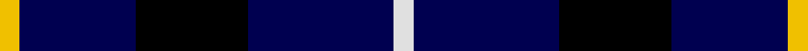
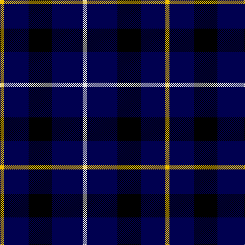

In pattern [WBKBY](/stripes/wbkby/).

This was sourced from weddslist.  It is a [5 stripe tartan](/stripes/stripes5/).

Original link http://www.weddslist.com/cgi-bin/tartans/pg.pl?source=sts

## Attestations

This cloth appears in 2 source records; the oldest owns this page.

- undated — Bank of Scotland (weddslist, [record](http://www.weddslist.com/cgi-bin/tartans/pg.pl?source=sts))
- undated — Bank of Scotland Corporate Tartan Tartan Number: 2462. Earliest known date: 1994 Commemorating the founding of the bank in 1695 See products available Copyright © Blair Urquhart, Comrie, 2015 (house-of-tartan, [record](http://www.house-of-tartan.scotland.net/house/TartanViewjs.asp?colr=Def&tnam=2462))

## Thread count
Y/8 DB48 K46 DB60 LN/8

## Palette
Each colour and the base-6 reference it is a variant of.

| Colour | Shade | Base |
|---|---|---|
| DB | <code style="background-color:#000050;">#000050</code> `oklch(19.5% 0.135 264.1)` <small>#000050</small> | B <code style="background-color:#2A418A;">#2A418A</code> |
| K | <code style="background-color:#000000;">#000000</code> `oklch(0.0% 0.000 0.0)` <small>#000000</small> | K <code style="background-color:#000000;">#000000</code> |
| LN | <code style="background-color:#E0E0E0;">#E0E0E0</code> `oklch(90.7% 0.000 89.9)` <small>#E0E0E0</small> | W <code style="background-color:#F7F7F7;">#F7F7F7</code> |
| Y | <code style="background-color:#F0C000;">#F0C000</code> `oklch(82.7% 0.169 90.5)` <small>#F0C000</small> | Y <code style="background-color:#F2BF00;">#F2BF00</code> |

# Sample pattern

## Nearest tartans

The nearest existing variants by ΔTartan distance.

1. [Bank of Scotland (1995)](/setts/s5/lo1db6k5db6lb1~x6/) — ΔT 1.01
1. [College of Radiographers](/setts/s5/k15lo2k10db18lb3~x2/) — ΔT 1.41
1. [College of Radiographers](/setts/s5/k15y2k10db18w3~x2/) — ΔT 1.47
1. [Allen, Nicholas (Personal)](/setts/s6/r8k24db10k5db10k5~x2/) — ΔT 1.57
1. [College of Radiographers Corporate Tartan Tartan Number: 1274. Earliest known date: 1988 Marketed in Edinburgh around 1930s but no longer seen. See products available Copyright © Blair Urquhart, Comrie, 2015](/setts/s5/k15ly2k10db18w3~x2/) — ΔT 1.65
1. [Carrick High School](/setts/s7/k6lo2k16t6k3db18k2~x2/) — ΔT 1.66
1. [Marchmont](/setts/s7/k1db12k12g1k12db12w1~x4/) — ΔT 1.68
1. [St. Eloi](/setts/s6/r3lo2k10w1~x6/) — ΔT 1.68
1. [H.M.S. DUNCAN](/setts/s6/o3k15r2k15n15p3~x2/) — ΔT 1.72
1. [Burberry Blue](/setts/s5/lr3k3lr3k10r1~x6/) — ΔT 1.73

## Neighbour map

Every grey dot is one of 14299 variants placed by the first two principal components of the ΔTartan feature space (44% of its variance). Red is this tartan; blue dots are its nearest — click one to open its page.

<svg viewBox="0 0 640 380" role="img" style="max-width:100%;height:auto;border:1px solid #e0e0e0;border-radius:4px;display:block" xmlns="http://www.w3.org/2000/svg"><image href="/nn/cloud.v1.png" width="640" height="380"/><a href="/setts/s5/lo1db6k5db6lb1~x6/"><circle cx="296.2" cy="262.7" r="4" fill="#3465a4"><title>Bank of Scotland (1995)</title></circle></a><a href="/setts/s5/k15lo2k10db18lb3~x2/"><circle cx="273.8" cy="252.7" r="4" fill="#3465a4"><title>College of Radiographers</title></circle></a><a href="/setts/s5/k15y2k10db18w3~x2/"><circle cx="250.7" cy="240.1" r="4" fill="#3465a4"><title>College of Radiographers</title></circle></a><a href="/setts/s6/r8k24db10k5db10k5~x2/"><circle cx="252.6" cy="276.4" r="4" fill="#3465a4"><title>Allen, Nicholas (Personal)</title></circle></a><a href="/setts/s5/k15ly2k10db18w3~x2/"><circle cx="267.5" cy="244.6" r="4" fill="#3465a4"><title>College of Radiographers Corporate Tartan Tartan Number: 1274. Earliest known date: 1988 Marketed in Edinburgh around 1930s but no longer seen. See products available Copyright © Blair Urquhart, Comrie, 2015</title></circle></a><a href="/setts/s7/k6lo2k16t6k3db18k2~x2/"><circle cx="249.9" cy="217.8" r="4" fill="#3465a4"><title>Carrick High School</title></circle></a><a href="/setts/s7/k1db12k12g1k12db12w1~x4/"><circle cx="284.8" cy="218.0" r="4" fill="#3465a4"><title>Marchmont</title></circle></a><a href="/setts/s6/r3lo2k10w1~x6/"><circle cx="376.7" cy="215.7" r="4" fill="#3465a4"><title>St. Eloi</title></circle></a><a href="/setts/s6/o3k15r2k15n15p3~x2/"><circle cx="252.0" cy="221.0" r="4" fill="#3465a4"><title>H.M.S. DUNCAN</title></circle></a><a href="/setts/s5/lr3k3lr3k10r1~x6/"><circle cx="351.7" cy="236.2" r="4" fill="#3465a4"><title>Burberry Blue</title></circle></a><circle cx="311.3" cy="260.3" r="5" fill="#c00000"/></svg>

ID: /setts/s5/w4db30k23db24ly4~x2/
