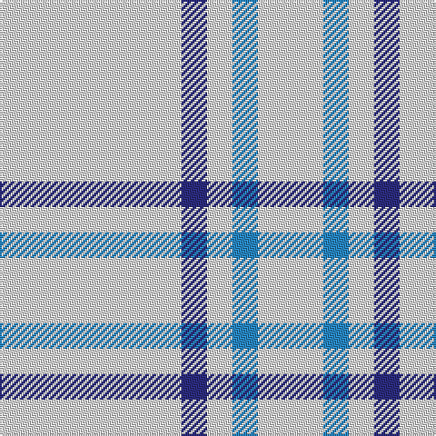

This page is one **sett** — a single exact thread-count. It belongs to the [tartan](/tartans/ln50db7ln7b7ln18/)
(the same proportion at any scale), whose colour order is pattern [WBWBW](/stripes/wbwbw/).

Sourced from tartans-authority.  It is a [5 stripe tartan](/stripes/stripes5/).

Original link http://www.tartansauthority.com/tartan-ferret/display/8135/

## Thread count
LN/100 DB14 LN14 B14 LN/36

## Palette
Each colour and the base-6 reference it is a variant of.

| Colour | Shade | Base |
|---|---|---|
| B | <code style="background-color:#2888C4;">#2888C4</code> `oklch(60.1% 0.125 241.5)` <small>#2888C4</small> | B <code style="background-color:#2A418A;">#2A418A</code> |
| DB | <code style="background-color:#2C2C80;">#2C2C80</code> `oklch(35.0% 0.138 276.6)` <small>#2C2C80</small> | B <code style="background-color:#2A418A;">#2A418A</code> |
| LN | <code style="background-color:#E0E0E0;">#E0E0E0</code> `oklch(90.7% 0.000 89.9)` <small>#E0E0E0</small> | W <code style="background-color:#F7F7F7;">#F7F7F7</code> |

# Sample pattern

## Nearest tartans

The nearest existing variants by ΔTartan distance, with this tartan at the top so the swatches line up against it.

ΔTartan

Tartan

Sett

—

<a href="/ttd/edit/#slug=w50db7w7t7w18~x2">Sephardim (Corporate)</a> <a class="nn-out" href="/setts/s5/w50db7w7t7w18~x2/" title="open its dictionary page">↗</a>

2.10

<a href="/ttd/edit/#slug=w81dg6lo8dg8~x2">Young in Australia</a> <a class="nn-out" href="/setts/s4/w81dg6lo8dg8~x2/" title="open its dictionary page">↗</a>

2.22

<a href="/ttd/edit/#slug=w45b2w4b15w7~x2">Asahi (Estimated threadcount)</a> <a class="nn-out" href="/setts/s5/w45b2w4b15w7~x2/" title="open its dictionary page">↗</a>

2.29

<a href="/ttd/edit/#slug=lr20db1lr4db3~x4">Loevenstein Castle #2</a> <a class="nn-out" href="/setts/s4/lr20db1lr4db3~x4/" title="open its dictionary page">↗</a>

2.29

<a href="/ttd/edit/#slug=ly6b38k3b38ly6~x2">The Poulain League</a> <a class="nn-out" href="/setts/s5/ly6b38k3b38ly6~x2/" title="open its dictionary page">↗</a>

2.46

<a href="/ttd/edit/#slug=w93lr6w13b35w12lr6">Butties</a> <a class="nn-out" href="/setts/s6/w93lr6w13b35w12lr6/" title="open its dictionary page">↗</a>

2.47

<a href="/ttd/edit/#slug=w1y1y4y7p1w1~x4">Lochnagar</a> <a class="nn-out" href="/setts/s6/w1y1y4y7p1w1~x4/" title="open its dictionary page">↗</a>

2.47

<a href="/ttd/edit/#slug=w20k2w20lo5k3w3lo4k2">Guzzo Dress (Personal)</a> <a class="nn-out" href="/setts/s8/w20k2w20lo5k3w3lo4k2/" title="open its dictionary page">↗</a>

2.61

<a href="/ttd/edit/#slug=lr10k2w5k4lr50b2~x2">London Fog Safari (Fashion)</a> <a class="nn-out" href="/setts/s6/lr10k2w5k4lr50b2~x2/" title="open its dictionary page">↗</a>

2.65

<a href="/ttd/edit/#slug=lr3lb2lr18t9lr18lb2lr18k9lr18lb2">London Fog Camel 2 (Fashion)</a> <a class="nn-out" href="/setts/s10/lr3lb2lr18t9lr18lb2lr18k9lr18lb2/" title="open its dictionary page">↗</a>

2.69

<a href="/ttd/edit/#slug=w20k2w20ly5k3w3ly4k2">Guzzo Dress (Montreal, Canada) (Personal)</a> <a class="nn-out" href="/setts/s8/w20k2w20ly5k3w3ly4k2/" title="open its dictionary page">↗</a>

## Neighbour map

Every grey dot is one of 14299 variants placed by the first two principal components of the ΔTartan feature space (44% of its variance). Red is this tartan; blue dots are its nearest — click one to open its page.

<svg viewBox="0 0 640 380" role="img" style="max-width:100%;height:auto;border:1px solid #e0e0e0;border-radius:4px;display:block" xmlns="http://www.w3.org/2000/svg"><image href="/nn/cloud.v1.png" width="640" height="380"/><a href="/setts/s4/w81dg6lo8dg8~x2/"><circle cx="497.4" cy="183.8" r="4" fill="#3465a4"><title>Young in Australia</title></circle></a><a href="/setts/s5/w45b2w4b15w7~x2/"><circle cx="534.4" cy="196.2" r="4" fill="#3465a4"><title>Asahi (Estimated threadcount)</title></circle></a><a href="/setts/s4/lr20db1lr4db3~x4/"><circle cx="600.9" cy="214.9" r="4" fill="#3465a4"><title>Loevenstein Castle #2</title></circle></a><a href="/setts/s5/ly6b38k3b38ly6~x2/"><circle cx="540.9" cy="225.6" r="4" fill="#3465a4"><title>The Poulain League</title></circle></a><a href="/setts/s6/w93lr6w13b35w12lr6/"><circle cx="423.4" cy="162.3" r="4" fill="#3465a4"><title>Butties</title></circle></a><a href="/setts/s6/w1y1y4y7p1w1~x4/"><circle cx="525.1" cy="253.5" r="4" fill="#3465a4"><title>Lochnagar</title></circle></a><a href="/setts/s8/w20k2w20lo5k3w3lo4k2/"><circle cx="400.8" cy="174.1" r="4" fill="#3465a4"><title>Guzzo Dress (Personal)</title></circle></a><a href="/setts/s6/lr10k2w5k4lr50b2~x2/"><circle cx="552.1" cy="138.8" r="4" fill="#3465a4"><title>London Fog Safari (Fashion)</title></circle></a><a href="/setts/s10/lr3lb2lr18t9lr18lb2lr18k9lr18lb2/"><circle cx="394.1" cy="193.4" r="4" fill="#3465a4"><title>London Fog Camel 2 (Fashion)</title></circle></a><a href="/setts/s8/w20k2w20ly5k3w3ly4k2/"><circle cx="386.0" cy="164.9" r="4" fill="#3465a4"><title>Guzzo Dress (Montreal, Canada) (Personal)</title></circle></a><circle cx="513.5" cy="228.3" r="5" fill="#c00000"/></svg>

ID: /setts/s5/w50db7w7t7w18~x2/
