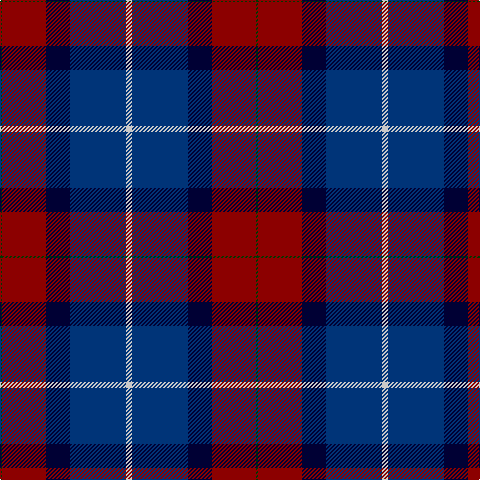

In pattern [GRKBW](/patterns/grkbw/).

This was sourced from tartans-authority.  It is a [5 stripes tartan](/stripes/stripes5/).

Original link http://www.tartansauthority.com/tartan-ferret/display/2690/

## Thread count
G/2 DR44 DB24 DBa56 N/6

## Palette
Each colour and its ΔE from the base-6 reference it is a variant of.

| Colour | Shade | Base | ΔE (OKLab) |
|---|---|---|---|
| DB | <code style="background-color:#000034;">#000034</code> `#000034` | K <code style="background-color:#000000;">#000000</code> | 0.18 |
| DBa | <code style="background-color:#003478;">#003478</code> `#003478` | B <code style="background-color:#2C4084;">#2C4084</code> | 0.06 |
| DR | <code style="background-color:#8C0000;">#8C0000</code> `#8C0000` | R <code style="background-color:#C80000;">#C80000</code> | 0.13 |
| G | <code style="background-color:#003800;">#003800</code> `#003800` | G <code style="background-color:#006400;">#006400</code> | 0.15 |
| N | <code style="background-color:#C8C8C8;">#C8C8C8</code> `#C8C8C8` | W <code style="background-color:#F4F4F0;">#F4F4F0</code> | 0.13 |

# Sample pattern

ID: /setts/s5/w6b56k24r44g2-b003478-g003800-k000034-r8c0000-wc8c8c8/
