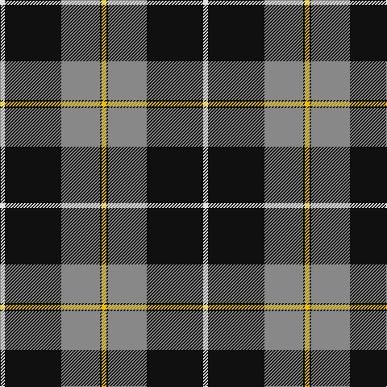

In pattern [WKRKY](/patterns/wkrky/).

This was sourced from register-of-tartans.  It is a [5 stripes tartan](/stripes/stripes5/).

Original link https://www.tartanregister.gov.uk/tartanDetails.aspx?ref=1331

## Thread count
LN/6 K70 N48 K2 Y/6

## Palette
Each colour and its ΔE from the base-6 reference it is a variant of.

| Colour | Shade | Base | ΔE (OKLab) |
|---|---|---|---|
| K | <code style="background-color:#101010;">#101010</code> `#101010` | K <code style="background-color:#000000;">#000000</code> | 0.17 |
| LN | <code style="background-color:#E0E0E0;">#E0E0E0</code> `#E0E0E0` | W <code style="background-color:#F4F4F0;">#F4F4F0</code> | 0.06 |
| N | <code style="background-color:#888888;">#888888</code> `#888888` | R <code style="background-color:#C80000;">#C80000</code> | 0.24 |
| Y | <code style="background-color:#E8C000;">#E8C000</code> `#E8C000` | Y <code style="background-color:#E8C000;">#E8C000</code> | 0.00 |

# Sample pattern

## Nearest tartans

The nearest existing variants by ΔTartan distance.

1. [MacPherson Dress](/setts/s7/y6r2y60k40y6k18ya2-k000000-raa0000-yaaaaaa-yaaaaa00/) — ΔT 1.05
1. [MacPherson Dress](/setts/s7/w3r1w30k20w3k9y1-k000000-rc80000-wd0d0d0-yffc800/) — ΔT 1.32
1. [Intergen (Corporate)](/setts/s6/k8y6k60y66r2y8-k101010-rc8002c-y48a4c0/) — ΔT 1.32
1. [Richecourt, Baron of (Personal)](/setts/s7/w8k60r2k2r6w24y6-k101010-rc80000-wfcfcfc-ye8c000/) — ΔT 1.35
1. [Phantom](/setts/s7/w6r20k76wa22r12k4w6-k101010-r945067-wf7feee-waeeeeec/) — ΔT 1.45
1. [MacPherson 6](/setts/s7/w6r2w60k40w6k18y2-k000000-rc00000-we0e0e0-yf0c000/) — ΔT 1.46
1. [Unidentified Furnishing #2](/setts/s6/r8g80k42y4k42g4-g50783c-k000034-rc82800-yc88c00/) — ΔT 1.49
1. [Kunbi](/setts/s8/k76b11k3y6k3b13k11r76-b003c64-k101010-r888888-ye8c000/) — ΔT 1.49
1. [Gleneagles, Hotel](/setts/s7/k8g8w70g2k72g8k4-g908000-k000000-we0e0e0/) — ΔT 1.49
1. [Gleneagles Gold (Dalgleish)](/setts/s7/k16y16w128y4k128y16k8-k101010-wc0c0c0-ybc8c00/) — ΔT 1.51

## Neighbour map

Every grey dot is one of 15726 variants placed by the first two principal components of the ΔTartan feature space (44% of its variance). Red is this tartan; blue dots are its nearest — click one to open its page.

<svg viewBox="0 0 640 380" role="img" style="max-width:100%;height:auto;border:1px solid #e0e0e0;border-radius:4px;display:block" xmlns="http://www.w3.org/2000/svg"><image href="/nn/cloud.v1.png" width="640" height="380"/><a href="/setts/s7/y6r2y60k40y6k18ya2-k000000-raa0000-yaaaaaa-yaaaaa00/"><circle cx="326.6" cy="133.1" r="4" fill="#3465a4"><title>MacPherson Dress</title></circle></a><a href="/setts/s7/w3r1w30k20w3k9y1-k000000-rc80000-wd0d0d0-yffc800/"><circle cx="320.3" cy="127.6" r="4" fill="#3465a4"><title>MacPherson Dress</title></circle></a><a href="/setts/s6/k8y6k60y66r2y8-k101010-rc8002c-y48a4c0/"><circle cx="319.6" cy="146.4" r="4" fill="#3465a4"><title>Intergen (Corporate)</title></circle></a><a href="/setts/s7/w8k60r2k2r6w24y6-k101010-rc80000-wfcfcfc-ye8c000/"><circle cx="327.4" cy="114.8" r="4" fill="#3465a4"><title>Richecourt, Baron of (Personal)</title></circle></a><a href="/setts/s7/w6r20k76wa22r12k4w6-k101010-r945067-wf7feee-waeeeeec/"><circle cx="284.2" cy="141.7" r="4" fill="#3465a4"><title>Phantom</title></circle></a><a href="/setts/s7/w6r2w60k40w6k18y2-k000000-rc00000-we0e0e0-yf0c000/"><circle cx="318.2" cy="125.7" r="4" fill="#3465a4"><title>MacPherson 6</title></circle></a><a href="/setts/s6/r8g80k42y4k42g4-g50783c-k000034-rc82800-yc88c00/"><circle cx="295.4" cy="183.6" r="4" fill="#3465a4"><title>Unidentified Furnishing #2</title></circle></a><a href="/setts/s8/k76b11k3y6k3b13k11r76-b003c64-k101010-r888888-ye8c000/"><circle cx="294.6" cy="138.0" r="4" fill="#3465a4"><title>Kunbi</title></circle></a><a href="/setts/s7/k8g8w70g2k72g8k4-g908000-k000000-we0e0e0/"><circle cx="312.2" cy="130.1" r="4" fill="#3465a4"><title>Gleneagles, Hotel</title></circle></a><a href="/setts/s7/k16y16w128y4k128y16k8-k101010-wc0c0c0-ybc8c00/"><circle cx="311.2" cy="136.8" r="4" fill="#3465a4"><title>Gleneagles Gold (Dalgleish)</title></circle></a><circle cx="340.6" cy="150.9" r="5" fill="#c00000"/></svg>

ID: /setts/s5/w6k70r48k2y6-k101010-r888888-we0e0e0-ye8c000/
