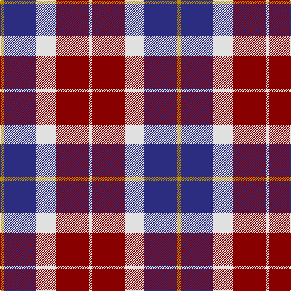

In pattern [WRWBY](/patterns/wrwby/).

This was sourced from tartans-authority.  It is a [5 stripes tartan](/stripes/stripes5/).

Original link http://www.tartansauthority.com/tartan-ferret/display/10579/

## Thread count
DY/6 DB54 LN32 DR54 LN/6

## Palette
Each colour and its ΔE from the base-6 reference it is a variant of.

| Colour | Shade | Base | ΔE (OKLab) |
|---|---|---|---|
| DB | <code style="background-color:#2C2C80;">#2C2C80</code> `#2C2C80` | B <code style="background-color:#2A418A;">#2A418A</code> | 0.06 |
| DR | <code style="background-color:#880000;">#880000</code> `#880000` | R <code style="background-color:#CC0000;">#CC0000</code> | 0.15 |
| DY | <code style="background-color:#BC8C00;">#BC8C00</code> `#BC8C00` | Y <code style="background-color:#F2BF00;">#F2BF00</code> | 0.16 |
| LN | <code style="background-color:#E0E0E0;">#E0E0E0</code> `#E0E0E0` | W <code style="background-color:#F7F7F7;">#F7F7F7</code> | 0.07 |

# Sample pattern

## Nearest tartans

The nearest existing variants by ΔTartan distance.

1. [Common Ground (Dress)](/setts/s5/w6r54w32b54y6-b001f5c-r930601-wffffff-yf0e200/) — ΔT 0.60
1. [Little's (Corporate)](/setts/s6/b6r48w6b24ra48w6-b1c1c50-r888888-ra901c38-we0e0e0/) — ΔT 1.11
1. [Thompson Navy Trade Tartan Tartan Number: 1443. Earliest known date: Oregon Possibly designed by Councillor John Hannay himself. No other information is available. See products available Copyright © Blair Urquhart, Comrie, 2015](/setts/s7/r6b30w26g12b4g4r4-b202060-g604000-ra00048-we0e0e0/) — ΔT 1.15
1. [Meg Merrilees Fancy Tartan Tartan Number: 1602. Earliest known date: 1831 Miss McDougall, Inverness library, says in her notes:The first mention I had of this tartan was in an advertisment by D MacDougall, Draper, 27 High St., Inverness in 1831 . . . Meg Merrilees and other winter shawls. From Dalgety Archives. STS notes that it was sold by Forsyth's in Glasgow in 1840. Meg Merrilees was a character in one of Scotts novels, Guy Mannering. BU See products available Copyright © Blair Urquhart, Comrie, 2015](/setts/s6/w46b12w12r10k70r20-b2c2c80-k101010-rc80000-we0e0e0/) — ΔT 1.16
1. [Thompson/Thomson/MacTavish](/setts/s6/b8r48ba8b24k24b4-b3c82af-ba2c4084-k101010-rdc0000/) — ΔT 1.18
1. [Thompson Grey Family Tartan Tartan Number: 1611. Earliest known date: pre 2003 Designed for Lord Thomson of Fleet in 1958 based on a sample in the Moy Hall collection dating from the mid 19th century. The tartan is also suitable for MacTavishs and Thompsons, who claim descent from the Clan MacIntosh. See products available Copyright © Blair Urquhart, Comrie, 2015](/setts/s6/r4ra40k10w20k20r4-k101010-rc80000-ra888888-we0e0e0/) — ΔT 1.20
1. [Furman University](/setts/s5/b4w28k30b28w4-b880088-k101010-wfcfcfc/) — ΔT 1.22
1. [Ballater Victoria Week](/setts/s5/b64y48k16g8w8-b5a008c-g808080-k101010-wf9f5ef-ye8c000/) — ΔT 1.24
1. [Highland Spring Dress (2004) (Corp)](/setts/s5/w8b60g20r50w4-b2c2c80-g289c18-r880000-wfcfcfc/) — ΔT 1.25
1. [Dutch District Tartan Tartan Number: 1134. Earliest known date: 1965 The late Sir Iain Moncrieffe of that Ilk, Albany Herald said, "It should be based on Mackay tartan because of the association with the Chiefs of the Clan Mackay. Baron Aeneas Mackay was Prime Minister of the Netherlands in 1889 and his great grandson Lord Reay, the present Chief, is also a Dutch Baron." The sett chosen was John Cargill's proposal of a simple colour change in respect of the two tartans, Dutch and Dutch Dress. See products available Copyright © Blair Urquhart, Comrie, 2015](/setts/s6/w4b24y2k24y24k2-b2c2c80-k101010-we0e0e0-yd87c00/) — ΔT 1.27

## Neighbour map

Every grey dot is one of 15726 variants placed by the first two principal components of the ΔTartan feature space (44% of its variance). Red is this tartan; blue dots are its nearest — click one to open its page.

<svg viewBox="0 0 640 380" role="img" style="max-width:100%;height:auto;border:1px solid #e0e0e0;border-radius:4px;display:block" xmlns="http://www.w3.org/2000/svg"><image href="/nn/cloud.v1.png" width="640" height="380"/><a href="/setts/s5/w6r54w32b54y6-b001f5c-r930601-wffffff-yf0e200/"><circle cx="148.3" cy="204.7" r="4" fill="#3465a4"><title>Common Ground (Dress)</title></circle></a><a href="/setts/s6/b6r48w6b24ra48w6-b1c1c50-r888888-ra901c38-we0e0e0/"><circle cx="182.0" cy="208.2" r="4" fill="#3465a4"><title>Little's (Corporate)</title></circle></a><a href="/setts/s7/r6b30w26g12b4g4r4-b202060-g604000-ra00048-we0e0e0/"><circle cx="157.2" cy="190.5" r="4" fill="#3465a4"><title>Thompson Navy Trade Tartan Tartan Number: 1443. Earliest known date: Oregon Possibly designed by Councillor John Hannay himself. No other information is available. See products available Copyright © Blair Urquhart, Comrie, 2015</title></circle></a><a href="/setts/s6/w46b12w12r10k70r20-b2c2c80-k101010-rc80000-we0e0e0/"><circle cx="161.4" cy="200.3" r="4" fill="#3465a4"><title>Meg Merrilees Fancy Tartan Tartan Number: 1602. Earliest known date: 1831 Miss McDougall, Inverness library, says in her notes:The first mention I had of this tartan was in an advertisment by D MacDougall, Draper, 27 High St., Inverness in 1831 . . . Meg Merrilees and other winter shawls. From Dalgety Archives. STS notes that it was sold by Forsyth's in Glasgow in 1840. Meg Merrilees was a character in one of Scotts novels, Guy Mannering. BU See products available Copyright © Blair Urquhart, Comrie, 2015</title></circle></a><a href="/setts/s6/b8r48ba8b24k24b4-b3c82af-ba2c4084-k101010-rdc0000/"><circle cx="215.5" cy="192.8" r="4" fill="#3465a4"><title>Thompson/Thomson/MacTavish</title></circle></a><a href="/setts/s6/r4ra40k10w20k20r4-k101010-rc80000-ra888888-we0e0e0/"><circle cx="172.8" cy="194.0" r="4" fill="#3465a4"><title>Thompson Grey Family Tartan Tartan Number: 1611. Earliest known date: pre 2003 Designed for Lord Thomson of Fleet in 1958 based on a sample in the Moy Hall collection dating from the mid 19th century. The tartan is also suitable for MacTavishs and Thompsons, who claim descent from the Clan MacIntosh. See products available Copyright © Blair Urquhart, Comrie, 2015</title></circle></a><a href="/setts/s5/b4w28k30b28w4-b880088-k101010-wfcfcfc/"><circle cx="151.3" cy="230.3" r="4" fill="#3465a4"><title>Furman University</title></circle></a><a href="/setts/s5/b64y48k16g8w8-b5a008c-g808080-k101010-wf9f5ef-ye8c000/"><circle cx="171.4" cy="186.4" r="4" fill="#3465a4"><title>Ballater Victoria Week</title></circle></a><a href="/setts/s5/w8b60g20r50w4-b2c2c80-g289c18-r880000-wfcfcfc/"><circle cx="225.8" cy="194.4" r="4" fill="#3465a4"><title>Highland Spring Dress (2004) (Corp)</title></circle></a><a href="/setts/s6/w4b24y2k24y24k2-b2c2c80-k101010-we0e0e0-yd87c00/"><circle cx="165.1" cy="191.2" r="4" fill="#3465a4"><title>Dutch District Tartan Tartan Number: 1134. Earliest known date: 1965 The late Sir Iain Moncrieffe of that Ilk, Albany Herald said, &quot;It should be based on Mackay tartan because of the association with the Chiefs of the Clan Mackay. Baron Aeneas Mackay was Prime Minister of the Netherlands in 1889 and his great grandson Lord Reay, the present Chief, is also a Dutch Baron.&quot; The sett chosen was John Cargill's proposal of a simple colour change in respect of the two tartans, Dutch and Dutch Dress. See products available Copyright © Blair Urquhart, Comrie, 2015</title></circle></a><circle cx="164.0" cy="210.1" r="5" fill="#c00000"/></svg>

ID: /setts/s5/w6r54w32b54y6-b2c2c80-r880000-we0e0e0-ybc8c00/
