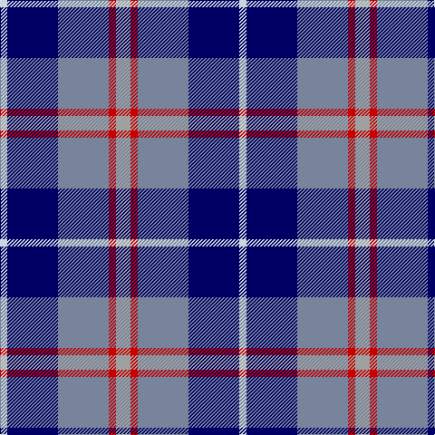

In pattern [WBBRY](/patterns/wbbry/).

This was sourced from tartans-authority.  It is a [5 stripes tartan](/stripes/stripes5/).

Original link http://www.tartansauthority.com/tartan-ferret/display/3746/

## Thread count
LN/8 DB56 B56 R8 N/16

## Palette
Each colour and its ΔE from the base-6 reference it is a variant of.

| Colour | Shade | Base | ΔE (OKLab) |
|---|---|---|---|
| B | <code style="background-color:#78849C;">#78849C</code> `#78849C` | B <code style="background-color:#2C4084;">#2C4084</code> | 0.23 |
| DB | <code style="background-color:#000064;">#000064</code> `#000064` | B <code style="background-color:#2C4084;">#2C4084</code> | 0.17 |
| LN | <code style="background-color:#C8D8DC;">#C8D8DC</code> `#C8D8DC` | W <code style="background-color:#F4F4F0;">#F4F4F0</code> | 0.10 |
| N | <code style="background-color:#A0A0A0;">#A0A0A0</code> `#A0A0A0` | Y <code style="background-color:#E8C000;">#E8C000</code> | 0.20 |
| R | <code style="background-color:#C80000;">#C80000</code> `#C80000` | R <code style="background-color:#C80000;">#C80000</code> | 0.00 |

# Sample pattern

ID: /setts/s5/w8b56ba56r8y16-b000064-ba78849c-rc80000-wc8d8dc-ya0a0a0/
