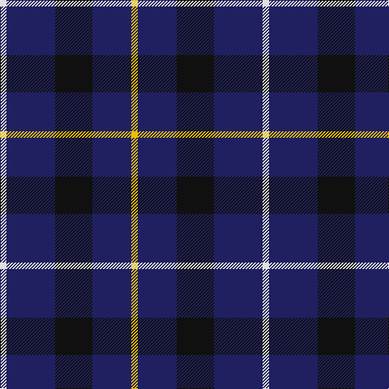

In pattern [WBKBY](/patterns/wbkby/).

This was sourced from house-of-tartan.  It is a [5 stripes tartan](/stripes/stripes5/).

Original link http://www.house-of-tartan.scotland.net/house/TartanViewjs.asp?colr=Def&tnam=2462

## Thread count
LN/8 DB60 K46 DB48 Y/8

## Palette
Each colour and its ΔE from the base-6 reference it is a variant of.

| Colour | Shade | Base | ΔE (OKLab) |
|---|---|---|---|
| DB | <code style="background-color:#202060;">#202060</code> `#202060` | B <code style="background-color:#2C4084;">#2C4084</code> | 0.11 |
| K | <code style="background-color:#101010;">#101010</code> `#101010` | K <code style="background-color:#000000;">#000000</code> | 0.17 |
| LN | <code style="background-color:#E0E0E0;">#E0E0E0</code> `#E0E0E0` | W <code style="background-color:#F4F4F0;">#F4F4F0</code> | 0.06 |
| Y | <code style="background-color:#E8C000;">#E8C000</code> `#E8C000` | Y <code style="background-color:#E8C000;">#E8C000</code> | 0.00 |

# Sample pattern

## Nearest tartans

The nearest existing variants by ΔTartan distance.

1. [Davidson of Tulloch Clan Tartan Tartan Number: 1360. Earliest known date: 1984 The Davidsons or Clan Dhai maintained a constant battle for precedence within Clan Chattan. The Davidsons of Tulloch in Ross-shire are one of the main branches of the Davidson family. See products available Copyright © Blair Urquhart, Comrie, 2015](/setts/s5/r6b35k36b36w6-b2c2c80-k101010-rc80000-we0e0e0/) — ΔT 0.74
1. [Bank of Scotland (1995)](/setts/s5/w6b36k30b36y6-b2c2c80-k000000-wc8c8c8-yc88c00/) — ΔT 0.96
1. [College of Radiographers](/setts/s5/k30y4k20b36w6-b00008c-k101010-wc8c8c8-yc88c00/) — ΔT 1.22
1. [College of Radiographers Corporate Tartan Tartan Number: 1274. Earliest known date: 1988 Marketed in Edinburgh around 1930s but no longer seen. See products available Copyright © Blair Urquhart, Comrie, 2015](/setts/s5/k30y4k20b36w6-b2c2c80-k101010-we0e0e0-ye8c000/) — ΔT 1.26
1. [Scottish Nuclear (Corporate)](/setts/s4/r4b36k16w4-b2c2c80-k101010-rc80000-wc0c0c0/) — ΔT 1.27
1. [Scottish Nuclear](/setts/s6/b36k16w4k16b36r4-b2c2c80-k101010-rc80000-wc0c0c0/) — ΔT 1.30
1. [Bank of Scotland](/setts/s5/w8b60k46b48y8-b000050-k000000-we0e0e0-yf0c000/) — ΔT 1.30
1. [Britannia](/setts/s5/k28r8k50b60w8-b202060-k101010-rc80000-we0e0e0/) — ΔT 1.42
1. [Ancient Atlantic](/setts/s6/w4b24g20k4b24y4-b2c2c80-g604000-k101010-wfcfcfc-ye8c000/) — ΔT 1.45
1. [H.M.S. DUNCAN](/setts/s6/b6ba30k30r4k30ra6-baa00ff-ba656879-k000033-rff0000-raa07c40/) — ΔT 1.45

## Neighbour map

Every grey dot is one of 15726 variants placed by the first two principal components of the ΔTartan feature space (44% of its variance). Red is this tartan; blue dots are its nearest — click one to open its page.

<svg viewBox="0 0 640 380" role="img" style="max-width:100%;height:auto;border:1px solid #e0e0e0;border-radius:4px;display:block" xmlns="http://www.w3.org/2000/svg"><image href="/nn/cloud.v1.png" width="640" height="380"/><a href="/setts/s5/r6b35k36b36w6-b2c2c80-k101010-rc80000-we0e0e0/"><circle cx="304.6" cy="271.4" r="4" fill="#3465a4"><title>Davidson of Tulloch Clan Tartan Tartan Number: 1360. Earliest known date: 1984 The Davidsons or Clan Dhai maintained a constant battle for precedence within Clan Chattan. The Davidsons of Tulloch in Ross-shire are one of the main branches of the Davidson family. See products available Copyright © Blair Urquhart, Comrie, 2015</title></circle></a><a href="/setts/s5/w6b36k30b36y6-b2c2c80-k000000-wc8c8c8-yc88c00/"><circle cx="295.2" cy="262.3" r="4" fill="#3465a4"><title>Bank of Scotland (1995)</title></circle></a><a href="/setts/s5/k30y4k20b36w6-b00008c-k101010-wc8c8c8-yc88c00/"><circle cx="271.3" cy="250.2" r="4" fill="#3465a4"><title>College of Radiographers</title></circle></a><a href="/setts/s5/k30y4k20b36w6-b2c2c80-k101010-we0e0e0-ye8c000/"><circle cx="265.6" cy="243.3" r="4" fill="#3465a4"><title>College of Radiographers Corporate Tartan Tartan Number: 1274. Earliest known date: 1988 Marketed in Edinburgh around 1930s but no longer seen. See products available Copyright © Blair Urquhart, Comrie, 2015</title></circle></a><a href="/setts/s4/r4b36k16w4-b2c2c80-k101010-rc80000-wc0c0c0/"><circle cx="345.0" cy="240.9" r="4" fill="#3465a4"><title>Scottish Nuclear (Corporate)</title></circle></a><a href="/setts/s6/b36k16w4k16b36r4-b2c2c80-k101010-rc80000-wc0c0c0/"><circle cx="380.6" cy="252.6" r="4" fill="#3465a4"><title>Scottish Nuclear</title></circle></a><a href="/setts/s5/w8b60k46b48y8-b000050-k000000-we0e0e0-yf0c000/"><circle cx="309.4" cy="258.8" r="4" fill="#3465a4"><title>Bank of Scotland</title></circle></a><a href="/setts/s5/k28r8k50b60w8-b202060-k101010-rc80000-we0e0e0/"><circle cx="283.6" cy="259.1" r="4" fill="#3465a4"><title>Britannia</title></circle></a><a href="/setts/s6/w4b24g20k4b24y4-b2c2c80-g604000-k101010-wfcfcfc-ye8c000/"><circle cx="270.2" cy="228.0" r="4" fill="#3465a4"><title>Ancient Atlantic</title></circle></a><a href="/setts/s6/b6ba30k30r4k30ra6-baa00ff-ba656879-k000033-rff0000-raa07c40/"><circle cx="249.6" cy="219.8" r="4" fill="#3465a4"><title>H.M.S. DUNCAN</title></circle></a><circle cx="331.8" cy="261.1" r="5" fill="#c00000"/></svg>

ID: /setts/s5/w8b60k46b48y8-b202060-k101010-we0e0e0-ye8c000/
