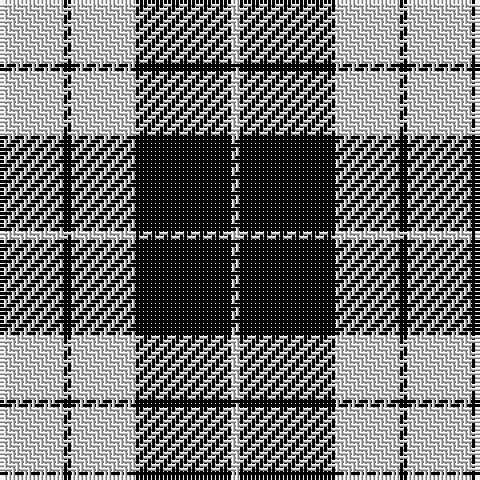

In pattern [WKWKW](/stripes/wkwkw/).

This was sourced from weddslist.  It is a [5 stripe tartan](/stripes/stripes5/).

Original link http://www.weddslist.com/cgi-bin/tartans/pg.pl?source=sts

## Also known as

This cloth is also recorded under:

- MacLeod, Black & White

## Attestations

This cloth appears in 2 source records; the oldest owns this page.

- undated — MacLeod, Black & White (weddslist, [record](http://www.weddslist.com/cgi-bin/tartans/pg.pl?source=sts))
- undated — MacLeod Black & White Clan Tartan Tartan Number: 1828. Earliest known date: 1906 Same sett as MacLeod Black and Red 1591. Similar to Erskine (1185) and very close ro Campbell of Armadie (3481). See products available Copyright © Blair Urquhart, Comrie, 2015 (house-of-tartan, [record](http://www.house-of-tartan.scotland.net/house/TartanViewjs.asp?colr=Def&tnam=1828))

## Thread count
LN/16 K2 LN16 K24 LN/2

## Palette
Each colour and the base-6 reference it is a variant of.

| Colour | Shade | Base |
|---|---|---|
| K | <code style="background-color:#000000;">#000000</code> `oklch(0.0% 0.000 0.0)` <small>#000000</small> | K <code style="background-color:#000000;">#000000</code> |
| LN | <code style="background-color:#E0E0E0;">#E0E0E0</code> `oklch(90.7% 0.000 89.9)` <small>#E0E0E0</small> | W <code style="background-color:#F7F7F7;">#F7F7F7</code> |

# Sample pattern

## Nearest tartans

The nearest existing variants by ΔTartan distance.

1. [Cairn (Marton Mills)](/setts/s5/k2w1k8w8k1~x8/) — ΔT 0.75
1. [Erskine BW MINI Design Tartan Tartan Number: 12466. Earliest known date: Generated for display purposes. Reduced copy of the original 1246 Erskine BW. See products available Copyright © Blair Urquhart, Comrie, 2015](/setts/s6/k2w1k9w9k1w2~x3/) — ΔT 1.01
1. [Erskine (Black and White)](/setts/s6/k2w1k9w9k1w2~x6/) — ΔT 1.13
1. [MacPhee (Black and White)](/setts/s4/k22w3k3w22~x2/) — ΔT 1.18
1. [MacLeod Black & White](/setts/s5/w14k2w14k19w2~x2/) — ΔT 1.26
1. [Valley Forge (Artefact)](/setts/s6/lb5k4lb32k32lb5k4~x2/) — ΔT 1.28
1. [Saks Fifth Avenue (Corp)](/setts/s7/w24k16w1k16w3k8w2~x2/) — ΔT 1.30
1. [Shembe Zulu Church](/setts/s5/k5w25r6k45w4~x2/) — ΔT 1.30
1. [McPartlin (Personal)](/setts/s5/k27w29k5w14r2~x2/) — ΔT 1.31
1. [Cornish Flag (District)](/setts/s5/w5k20w10k1r2~x2/) — ΔT 1.45

## Neighbour map

Every grey dot is one of 14299 variants placed by the first two principal components of the ΔTartan feature space (44% of its variance). Red is this tartan; blue dots are its nearest — click one to open its page.

<svg viewBox="0 0 640 380" role="img" style="max-width:100%;height:auto;border:1px solid #e0e0e0;border-radius:4px;display:block" xmlns="http://www.w3.org/2000/svg"><image href="/nn/cloud.v1.png" width="640" height="380"/><a href="/setts/s5/k2w1k8w8k1~x8/"><circle cx="312.6" cy="237.3" r="4" fill="#3465a4"><title>Cairn (Marton Mills)</title></circle></a><a href="/setts/s6/k2w1k9w9k1w2~x3/"><circle cx="299.2" cy="217.4" r="4" fill="#3465a4"><title>Erskine BW MINI Design Tartan Tartan Number: 12466. Earliest known date: Generated for display purposes. Reduced copy of the original 1246 Erskine BW. See products available Copyright © Blair Urquhart, Comrie, 2015</title></circle></a><a href="/setts/s6/k2w1k9w9k1w2~x6/"><circle cx="294.5" cy="213.5" r="4" fill="#3465a4"><title>Erskine (Black and White)</title></circle></a><a href="/setts/s4/k22w3k3w22~x2/"><circle cx="284.4" cy="248.4" r="4" fill="#3465a4"><title>MacPhee (Black and White)</title></circle></a><a href="/setts/s5/w14k2w14k19w2~x2/"><circle cx="313.1" cy="233.7" r="4" fill="#3465a4"><title>MacLeod Black &amp; White</title></circle></a><a href="/setts/s6/lb5k4lb32k32lb5k4~x2/"><circle cx="304.6" cy="219.1" r="4" fill="#3465a4"><title>Valley Forge (Artefact)</title></circle></a><a href="/setts/s7/w24k16w1k16w3k8w2~x2/"><circle cx="350.8" cy="183.1" r="4" fill="#3465a4"><title>Saks Fifth Avenue (Corp)</title></circle></a><a href="/setts/s5/k5w25r6k45w4~x2/"><circle cx="316.9" cy="198.2" r="4" fill="#3465a4"><title>Shembe Zulu Church</title></circle></a><a href="/setts/s5/k27w29k5w14r2~x2/"><circle cx="299.8" cy="200.8" r="4" fill="#3465a4"><title>McPartlin (Personal)</title></circle></a><a href="/setts/s5/w5k20w10k1r2~x2/"><circle cx="325.2" cy="181.5" r="4" fill="#3465a4"><title>Cornish Flag (District)</title></circle></a><circle cx="320.2" cy="229.4" r="5" fill="#c00000"/></svg>

ID: /setts/s5/w8k1w8k12w1~x2/
