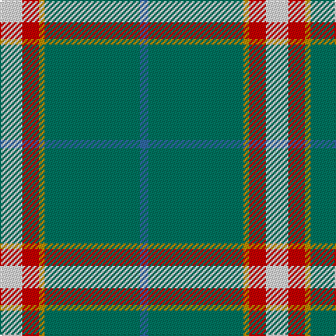

This page is one **sett** — a single exact thread-count. It belongs to the [tartan](/tartans/ln8r6dy2g34b3/)
(the same proportion at any scale), whose colour order is pattern [BGYRW](/stripes/bgyrw/).

Sourced from tartans-authority.  It is a [5 stripe tartan](/stripes/stripes5/).

Original link http://www.tartansauthority.com/tartan-ferret/display/10314/

## Thread count
LN/16 R12 DY4 G68 B/6

## Palette
Each colour and the base-6 reference it is a variant of.

| Colour | Shade | Base |
|---|---|---|
| B | <code style="background-color:#3068A4;">#3068A4</code> `oklch(50.9% 0.112 252.3)` <small>#3068A4</small> | B <code style="background-color:#2A418A;">#2A418A</code> |
| DY | <code style="background-color:#BC8C00;">#BC8C00</code> `oklch(66.8% 0.137 84.1)` <small>#BC8C00</small> | Y <code style="background-color:#F2BF00;">#F2BF00</code> |
| G | <code style="background-color:#007460;">#007460</code> `oklch(49.9% 0.094 175.1)` <small>#007460</small> | G <code style="background-color:#006100;">#006100</code> |
| LN | <code style="background-color:#E0E0E0;">#E0E0E0</code> `oklch(90.7% 0.000 89.9)` <small>#E0E0E0</small> | W <code style="background-color:#F7F7F7;">#F7F7F7</code> |
| R | <code style="background-color:#C80000;">#C80000</code> `oklch(52.3% 0.215 29.2)` <small>#C80000</small> | R <code style="background-color:#CC0000;">#CC0000</code> |

# Sample pattern

## Nearest tartans

The nearest existing variants by ΔTartan distance, with this tartan at the top so the swatches line up against it.

ΔTartan

Tartan

Sett

—

<a href="/ttd/edit/#slug=w8r6lo2g34b3~x2">Milling-Kristensen (Personal)</a> <a class="nn-out" href="/setts/s5/w8r6lo2g34b3~x2/" title="open its dictionary page">↗</a>

0.62

<a href="/ttd/edit/#slug=k2t36dg12w3r2~x2">Cleland (Name)</a> <a class="nn-out" href="/setts/s5/k2t36dg12w3r2~x2/" title="open its dictionary page">↗</a>

0.77

<a href="/ttd/edit/#slug=g55ly4db15w3r3w5~x2">Spencer (2013)</a> <a class="nn-out" href="/setts/s6/g55ly4db15w3r3w5~x2/" title="open its dictionary page">↗</a>

0.95

<a href="/ttd/edit/#slug=k2t28g7w3r2~x2">Cleland Corporate Tartan Tartan Number: 2181. Earliest known date: 1989 The Tartan is based on the Douglas as the Clelands were hereditary foresters to the Douglases. There was a deal of inter-marriage between the Douglases, the Hamiltons and the Clelands. In 1989 John Clelland Hocknull of Casuavina in Australia's Northern Territories made it known that he was the Founder of the Northern Territories Clan Clelland Association Inc. who wanted to have a Clelland tartan designed. the task fell to Harry Lindley of Kinloch Anderson. D.C. Dalgliesh of Selkirk wove the first piece. Lord Lyon may have recorded the sett in the Lyon Court Books, but this is unconfirmed. See products available Copyright © Blair Urquhart, Comrie, 2015</a> <a class="nn-out" href="/setts/s5/k2t28g7w3r2~x2/" title="open its dictionary page">↗</a>

1.10

<a href="/ttd/edit/#slug=k2n36g12w3r2~x2">Cleland</a> <a class="nn-out" href="/setts/s5/k2n36g12w3r2~x2/" title="open its dictionary page">↗</a>

1.20

<a href="/ttd/edit/#slug=k2w1g5r1t18r2~x2">Norris (1998)</a> <a class="nn-out" href="/setts/s6/k2w1g5r1t18r2~x2/" title="open its dictionary page">↗</a>

1.21

<a href="/ttd/edit/#slug=w8r6ly2g34b3~x2">Milling-Christensen</a> <a class="nn-out" href="/setts/s5/w8r6ly2g34b3~x2/" title="open its dictionary page">↗</a>

1.40

<a href="/ttd/edit/#slug=n62w11k4lg17~x2">Thunderlord (Corporate)</a> <a class="nn-out" href="/setts/s4/n62w11k4lg17~x2/" title="open its dictionary page">↗</a>

1.41

<a href="/ttd/edit/#slug=r2b4lb18n2lb2n41w2~x2">Haddrell (2013)</a> <a class="nn-out" href="/setts/s7/r2b4lb18n2lb2n41w2~x2/" title="open its dictionary page">↗</a>

1.48

<a href="/ttd/edit/#slug=k3t2g13w2t24r3~x4">Vance</a> <a class="nn-out" href="/setts/s6/k3t2g13w2t24r3~x4/" title="open its dictionary page">↗</a>

1.50

<a href="/ttd/edit/#slug=dg60ly16m8t2o3~x2">Isle of Raasay</a> <a class="nn-out" href="/setts/s5/dg60ly16m8t2o3~x2/" title="open its dictionary page">↗</a>

## Neighbour map

Every grey dot is one of 14299 variants placed by the first two principal components of the ΔTartan feature space (44% of its variance). Red is this tartan; blue dots are its nearest — click one to open its page.

<svg viewBox="0 0 640 380" role="img" style="max-width:100%;height:auto;border:1px solid #e0e0e0;border-radius:4px;display:block" xmlns="http://www.w3.org/2000/svg"><image href="/nn/cloud.v1.png" width="640" height="380"/><a href="/setts/s5/k2t36dg12w3r2~x2/"><circle cx="400.2" cy="169.6" r="4" fill="#3465a4"><title>Cleland (Name)</title></circle></a><a href="/setts/s6/g55ly4db15w3r3w5~x2/"><circle cx="373.2" cy="143.7" r="4" fill="#3465a4"><title>Spencer (2013)</title></circle></a><a href="/setts/s5/k2t28g7w3r2~x2/"><circle cx="395.9" cy="179.1" r="4" fill="#3465a4"><title>Cleland Corporate Tartan Tartan Number: 2181. Earliest known date: 1989 The Tartan is based on the Douglas as the Clelands were hereditary foresters to the Douglases. There was a deal of inter-marriage between the Douglases, the Hamiltons and the Clelands. In 1989 John Clelland Hocknull of Casuavina in Australia's Northern Territories made it known that he was the Founder of the Northern Territories Clan Clelland Association Inc. who wanted to have a Clelland tartan designed. the task fell to Harry Lindley of Kinloch Anderson. D.C. Dalgliesh of Selkirk wove the first piece. Lord Lyon may have recorded the sett in the Lyon Court Books, but this is unconfirmed. See products available Copyright © Blair Urquhart, Comrie, 2015</title></circle></a><a href="/setts/s5/k2n36g12w3r2~x2/"><circle cx="406.7" cy="177.5" r="4" fill="#3465a4"><title>Cleland</title></circle></a><a href="/setts/s6/k2w1g5r1t18r2~x2/"><circle cx="340.6" cy="134.1" r="4" fill="#3465a4"><title>Norris (1998)</title></circle></a><a href="/setts/s5/w8r6ly2g34b3~x2/"><circle cx="335.6" cy="152.9" r="4" fill="#3465a4"><title>Milling-Christensen</title></circle></a><a href="/setts/s4/n62w11k4lg17~x2/"><circle cx="403.9" cy="210.8" r="4" fill="#3465a4"><title>Thunderlord (Corporate)</title></circle></a><a href="/setts/s7/r2b4lb18n2lb2n41w2~x2/"><circle cx="381.4" cy="133.9" r="4" fill="#3465a4"><title>Haddrell (2013)</title></circle></a><a href="/setts/s6/k3t2g13w2t24r3~x4/"><circle cx="290.2" cy="180.2" r="4" fill="#3465a4"><title>Vance</title></circle></a><a href="/setts/s5/dg60ly16m8t2o3~x2/"><circle cx="425.1" cy="151.6" r="4" fill="#3465a4"><title>Isle of Raasay</title></circle></a><circle cx="368.8" cy="169.4" r="5" fill="#c00000"/></svg>

ID: /setts/s5/w8r6lo2g34b3~x2/
