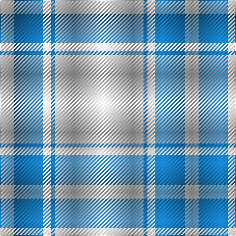

In pattern [WBWBW](/patterns/wbwbw/).

This was sourced from register-of-tartans.  It is a [5 stripes tartan](/stripes/stripes5/).

Original link https://www.tartanregister.gov.uk/tartanDetails.aspx?ref=121

## Thread count
LN/14 Ba30 LN8 Ba4 LN/90

## Palette
Each colour and its ΔE from the base-6 reference it is a variant of.

| Colour | Shade | Base | ΔE (OKLab) |
|---|---|---|---|
| B | <code style="background-color:#5C8CA8;">#5C8CA8</code> `#5C8CA8` | B <code style="background-color:#2C4084;">#2C4084</code> | 0.23 |
| Ba | <code style="background-color:#1474B4;">#1474B4</code> `#1474B4` | B <code style="background-color:#2C4084;">#2C4084</code> | 0.15 |
| DB | <code style="background-color:#2C2C80;">#2C2C80</code> `#2C2C80` | B <code style="background-color:#2C4084;">#2C4084</code> | 0.05 |
| LB | <code style="background-color:#98C8E8;">#98C8E8</code> `#98C8E8` | W <code style="background-color:#F4F4F0;">#F4F4F0</code> | 0.17 |
| LG | <code style="background-color:#789484;">#789484</code> `#789484` | G <code style="background-color:#006400;">#006400</code> | 0.23 |
| LN | <code style="background-color:#E0E0E0;">#E0E0E0</code> `#E0E0E0` | W <code style="background-color:#F4F4F0;">#F4F4F0</code> | 0.06 |

# Sample pattern

## Nearest tartans

The nearest existing variants by ΔTartan distance.

1. [Loevenstein Castle #2](/setts/s4/y80b4y16b12-b00008c-yb0b0b0/) — ΔT 1.81
1. [Butties](/setts/s6/w93y6w13b35w12y6-b3850c8-wffffff-yb0b0b0/) — ΔT 1.84
1. [Young in Australia](/setts/s4/w162g12y16g16-g23321b-we8ddcb-ye0a126/) — ΔT 2.07
1. [Gairloch (Fashion)](/setts/s8/w48w2g18w2w18w4g4k4-g808080-k101010-we0e0e0/) — ΔT 2.17
1. [London Fog Safari (Fashion)](/setts/s6/y20k4w10k8y100b4-b1474b4-k101010-we0e0e0-yb8b8b8/) — ΔT 2.19
1. [Sephardim (Corporate)](/setts/s5/w100b14w14ba14w36-b2c2c80-ba2888c4-we0e0e0/) — ΔT 2.21
1. [Butties](/setts/s6/w93r6w13b35w12r6-b202060-r888888-wfcfcfc/) — ΔT 2.26
1. [The Poulain League](/setts/s5/y12b76k6b76y12-b8080d0-k000000-yf0c000/) — ΔT 2.53
1. [Guzzo Dress (Personal)](/setts/s8/w20k2w20y5k3w3y4k2-k101010-we0e0e0-ydc943c/) — ΔT 2.56
1. [Menzies, Brown & White](/setts/s8/r62w10r4w10r8w6r4w14-r806050-we0e0e0/) — ΔT 2.59

## Neighbour map

Every grey dot is one of 15726 variants placed by the first two principal components of the ΔTartan feature space (44% of its variance). Red is this tartan; blue dots are its nearest — click one to open its page.

<svg viewBox="0 0 640 380" role="img" style="max-width:100%;height:auto;border:1px solid #e0e0e0;border-radius:4px;display:block" xmlns="http://www.w3.org/2000/svg"><image href="/nn/cloud.v1.png" width="640" height="380"/><a href="/setts/s4/y80b4y16b12-b00008c-yb0b0b0/"><circle cx="603.3" cy="216.7" r="4" fill="#3465a4"><title>Loevenstein Castle #2</title></circle></a><a href="/setts/s6/w93y6w13b35w12y6-b3850c8-wffffff-yb0b0b0/"><circle cx="424.0" cy="165.3" r="4" fill="#3465a4"><title>Butties</title></circle></a><a href="/setts/s4/w162g12y16g16-g23321b-we8ddcb-ye0a126/"><circle cx="499.8" cy="187.4" r="4" fill="#3465a4"><title>Young in Australia</title></circle></a><a href="/setts/s8/w48w2g18w2w18w4g4k4-g808080-k101010-we0e0e0/"><circle cx="463.3" cy="131.9" r="4" fill="#3465a4"><title>Gairloch (Fashion)</title></circle></a><a href="/setts/s6/y20k4w10k8y100b4-b1474b4-k101010-we0e0e0-yb8b8b8/"><circle cx="552.5" cy="139.6" r="4" fill="#3465a4"><title>London Fog Safari (Fashion)</title></circle></a><a href="/setts/s5/w100b14w14ba14w36-b2c2c80-ba2888c4-we0e0e0/"><circle cx="516.5" cy="230.8" r="4" fill="#3465a4"><title>Sephardim (Corporate)</title></circle></a><a href="/setts/s6/w93r6w13b35w12r6-b202060-r888888-wfcfcfc/"><circle cx="408.0" cy="160.3" r="4" fill="#3465a4"><title>Butties</title></circle></a><a href="/setts/s5/y12b76k6b76y12-b8080d0-k000000-yf0c000/"><circle cx="542.6" cy="226.1" r="4" fill="#3465a4"><title>The Poulain League</title></circle></a><a href="/setts/s8/w20k2w20y5k3w3y4k2-k101010-we0e0e0-ydc943c/"><circle cx="402.2" cy="177.8" r="4" fill="#3465a4"><title>Guzzo Dress (Personal)</title></circle></a><a href="/setts/s8/r62w10r4w10r8w6r4w14-r806050-we0e0e0/"><circle cx="453.2" cy="178.3" r="4" fill="#3465a4"><title>Menzies, Brown &amp; White</title></circle></a><circle cx="535.9" cy="197.2" r="5" fill="#c00000"/></svg>

ID: /setts/s5/w90b4w8b30w14-b1474b4-we0e0e0/
