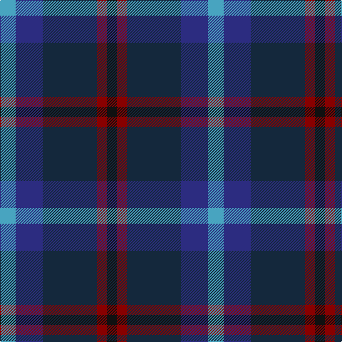

In pattern [KRBBY](/patterns/krbby/).

This was sourced from tartans-authority.  It is a [5 stripes tartan](/stripes/stripes5/).

Original link http://www.tartansauthority.com/tartan-ferret/display/11219/

## Thread count
B/22 DB38 DN76 DR14 K/14

## Palette
Each colour and its ΔE from the base-6 reference it is a variant of.

| Colour | Shade | Base | ΔE (OKLab) |
|---|---|---|---|
| B | <code style="background-color:#48A4C0;">#48A4C0</code> `#48A4C0` | Y <code style="background-color:#F2BF00;">#F2BF00</code> | 0.29 |
| DB | <code style="background-color:#2C2C80;">#2C2C80</code> `#2C2C80` | B <code style="background-color:#2A418A;">#2A418A</code> | 0.06 |
| DN | <code style="background-color:#14283C;">#14283C</code> `#14283C` | B <code style="background-color:#2A418A;">#2A418A</code> | 0.15 |
| DR | <code style="background-color:#880000;">#880000</code> `#880000` | R <code style="background-color:#CC0000;">#CC0000</code> | 0.15 |
| K | <code style="background-color:#101010;">#101010</code> `#101010` | K <code style="background-color:#000000;">#000000</code> | 0.17 |

# Sample pattern

## Nearest tartans

The nearest existing variants by ΔTartan distance.

1. [Forbo Nairn](/setts/s5/b2g8k7ba12r2~b5c8ca8-ba2c2c80-g006818-k101010-rc80000~x4/) — ΔT 1.25
1. [Campbell, Sir Walter Scott](/setts/s6/k2g8b2k9ba7k2~b2c4084-ba5a008c-g005020-k101010~x2/) — ΔT 1.34
1. [Heritage (Corporate)](/setts/s7/g5ga24k24b24k5b8r5~b202060-g789484-ga406054-k101010-rc80000~x2/) — ΔT 1.37
1. [Murray #3](/setts/s6/b2k2b12k8g11r2~b2c4084-g005020-k101010-rdc0000~x2/) — ΔT 1.39
1. [Bareback (Corporate)](/setts/s6/b6k6b21k16ba36y4~b5c5c5c-ba2c2c80-k101010-ye8c000/) — ΔT 1.41
1. [Moray (Corporate)](/setts/s8/b15ba3b30k22g18ba3g3w3~b2c2c80-ba780078-g003820-k101010-we0e0e0~x2/) — ΔT 1.44
1. [Midlothian](/setts/s6/b31ba4b5k19g20y4~b1c0070-ba2474e8-g006818-k101010-yd09800~x2/) — ΔT 1.45
1. [Leslie Hebridean Artifact Tartan Tartan Number: 1111. Earliest known date: 1740 From the Telfer Dunbar collection and said to date to C.1740s. See products available Copyright © Blair Urquhart, Comrie, 2015](/setts/s6/k6g11w2b22r2k4~b403870-g344c2c-k101010-rd05054-we0e0e0~x2/) — ΔT 1.46
1. [Lyle and Scott](/setts/s6/g5b2g9ba19r9y2~b1474b4-ba003c64-g003820-ra00000-yfccc00~x2/) — ΔT 1.46
1. [Glen Erin Canadian Tartan Tartan Number: 1909. Earliest known date: pre 2003 Many new designs have been given district names to promote their Scottish connections. However, these names should not be confused with the District tartans which have earned their title through 'use and wont' and not a little history. See products available Copyright © Blair Urquhart, Comrie, 2015](/setts/s8/b16g8ba8g8b16r3ga3gb3~b202060-ba2c2c80-g006818-ga604000-gb289c18-rc80000~x2/) — ΔT 1.47

## Neighbour map

Every grey dot is one of 15726 variants placed by the first two principal components of the ΔTartan feature space (44% of its variance). Red is this tartan; blue dots are its nearest — click one to open its page.

<svg viewBox="0 0 640 380" role="img" style="max-width:100%;height:auto;border:1px solid #e0e0e0;border-radius:4px;display:block" xmlns="http://www.w3.org/2000/svg"><image href="/nn/cloud.v1.png" width="640" height="380"/><a href="/setts/s5/b2g8k7ba12r2~b5c8ca8-ba2c2c80-g006818-k101010-rc80000~x4/"><circle cx="156.6" cy="252.1" r="4" fill="#3465a4"><title>Forbo Nairn</title></circle></a><a href="/setts/s6/k2g8b2k9ba7k2~b2c4084-ba5a008c-g005020-k101010~x2/"><circle cx="221.3" cy="286.5" r="4" fill="#3465a4"><title>Campbell, Sir Walter Scott</title></circle></a><a href="/setts/s7/g5ga24k24b24k5b8r5~b202060-g789484-ga406054-k101010-rc80000~x2/"><circle cx="151.4" cy="247.4" r="4" fill="#3465a4"><title>Heritage (Corporate)</title></circle></a><a href="/setts/s6/b2k2b12k8g11r2~b2c4084-g005020-k101010-rdc0000~x2/"><circle cx="214.5" cy="265.0" r="4" fill="#3465a4"><title>Murray #3</title></circle></a><a href="/setts/s6/b6k6b21k16ba36y4~b5c5c5c-ba2c2c80-k101010-ye8c000/"><circle cx="230.2" cy="235.6" r="4" fill="#3465a4"><title>Bareback (Corporate)</title></circle></a><a href="/setts/s8/b15ba3b30k22g18ba3g3w3~b2c2c80-ba780078-g003820-k101010-we0e0e0~x2/"><circle cx="252.3" cy="209.1" r="4" fill="#3465a4"><title>Moray (Corporate)</title></circle></a><a href="/setts/s6/b31ba4b5k19g20y4~b1c0070-ba2474e8-g006818-k101010-yd09800~x2/"><circle cx="187.4" cy="222.9" r="4" fill="#3465a4"><title>Midlothian</title></circle></a><a href="/setts/s6/k6g11w2b22r2k4~b403870-g344c2c-k101010-rd05054-we0e0e0~x2/"><circle cx="259.1" cy="202.6" r="4" fill="#3465a4"><title>Leslie Hebridean Artifact Tartan Tartan Number: 1111. Earliest known date: 1740 From the Telfer Dunbar collection and said to date to C.1740s. See products available Copyright © Blair Urquhart, Comrie, 2015</title></circle></a><a href="/setts/s6/g5b2g9ba19r9y2~b1474b4-ba003c64-g003820-ra00000-yfccc00~x2/"><circle cx="217.9" cy="219.4" r="4" fill="#3465a4"><title>Lyle and Scott</title></circle></a><a href="/setts/s8/b16g8ba8g8b16r3ga3gb3~b202060-ba2c2c80-g006818-ga604000-gb289c18-rc80000~x2/"><circle cx="197.8" cy="231.7" r="4" fill="#3465a4"><title>Glen Erin Canadian Tartan Tartan Number: 1909. Earliest known date: pre 2003 Many new designs have been given district names to promote their Scottish connections. However, these names should not be confused with the District tartans which have earned their title through 'use and wont' and not a little history. See products available Copyright © Blair Urquhart, Comrie, 2015</title></circle></a><circle cx="216.3" cy="256.2" r="5" fill="#c00000"/></svg>

ID: /setts/s5/y11b19ba38r7k7~b2c2c80-ba14283c-k101010-r880000-y48a4c0~x2/
